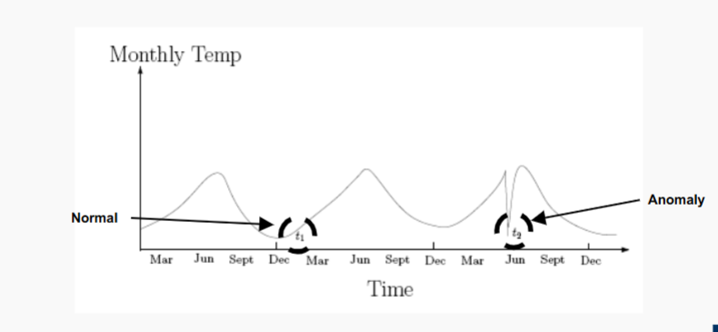
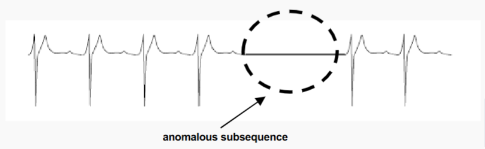
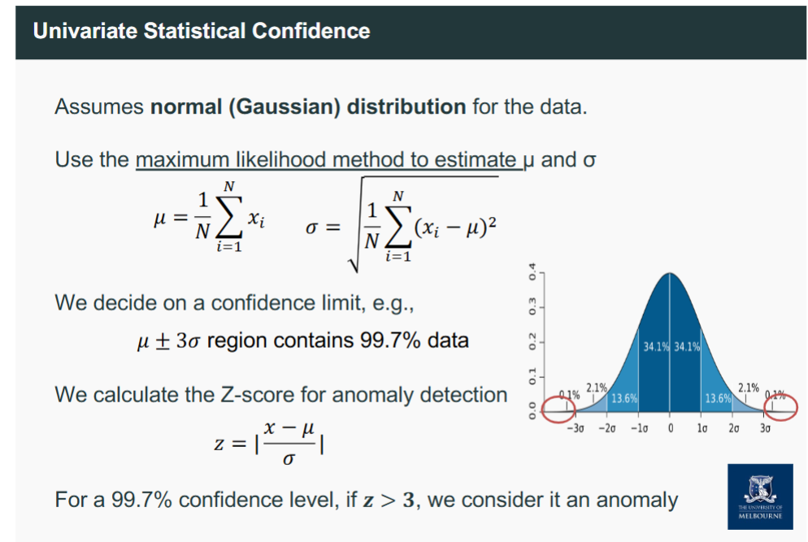
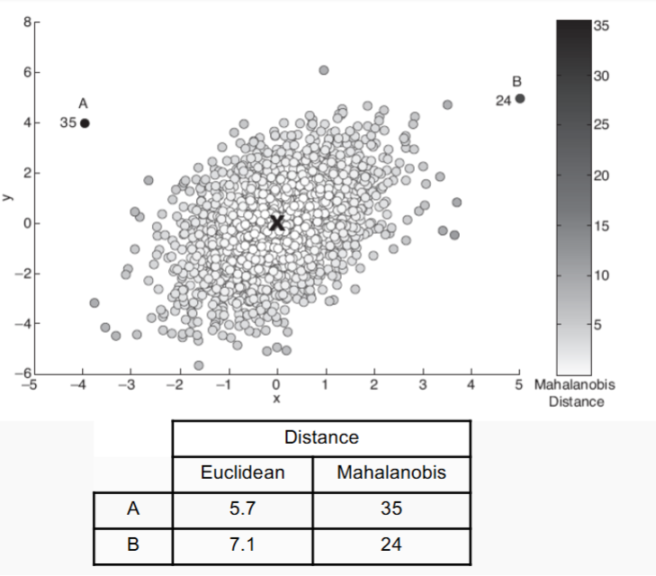
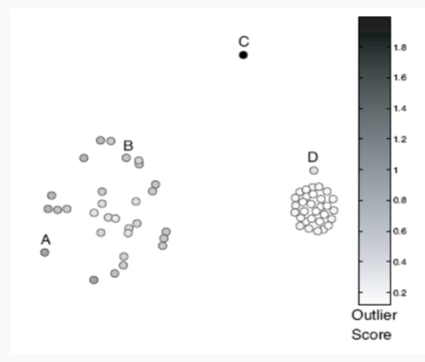
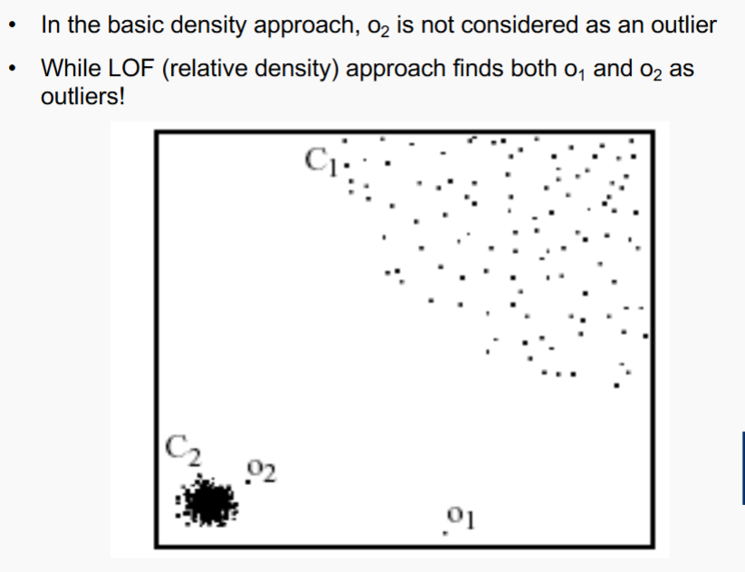
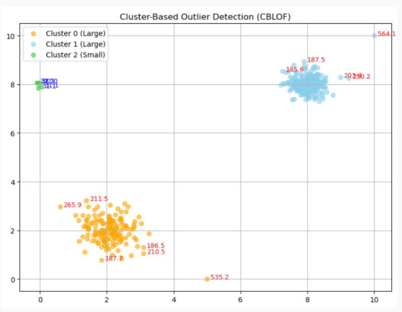

# Anomaly Detection
- Anomaly: 
  - A data object that deviates significantly from the normal
  objects as if it were generated by a different mechanism
  - Ex.: Unusual credit card purchase, ...
- Anomalies are different from noise
  - Noise is random error or variance in a measured variable
  - Noise should be removed before anomaly detection
- Anomalies are interesting:
  - They violate the mechanism that generates the normal data
  - Translate to significant (often critical) real-life problems
  - Cyber intrusions
  - Credit card fraud

## Variety of Anomaly Detection
- Greater than some threshold
- Top-N largest anomaly score
- test point and anomaly score

## Types of Anomaly
### Global Anomaly
- significantly deviates from the rest of the data
### Contextual (conditional) Anomaly
- deviates significantly based on a selected
    context
    - Contextual attributes: define the context, e.g., time &
    location
    - Behavioural attributes: characteristics of the object, used
    in anomaly evaluation, e.g., temperature
    
### Collective Anomaly
- A **subset** of data objects that **collectively deviate** significantly from
    the whole data set, even if the individual data objects may not be
    anomalies
    - Detection -> consider a group of objects
    - Requires relationship among data instances
      - sequential
      - spatial
      - graph
    

## Anomaly Detection Paradigms
### Supervised anomaly detection
  - Labels are available for both normal data and anomalies
  - Samples examined by domain experts used for training & testing
- Challenges
  - Require labels from both the normal and anomaly classes
  - Imbalanced classes, i.e., anomalies, are rare.
    -    Boost the anomaly class and make up some artificial
        anomalies
  - Cannot detect unknown and emerging anomalies
  - Accuracy is misleading. We try to catch as many outliers as
  possible, i.e., increase the recall
    - Optimising for recall can lead to a high rate of false
    positives - normal cases detected as anomalies.

### Semi-Supervised Anomaly Detection
  - Labels are available only for normal data
  - We used only the labelled data to train a classifier (the model
    learns what ‘normal’ looks like)
  - We apply the trained model to both unlabelled and labelled data
  - Any instance that falls outside the learned decision boundary is
    marked as a potential anomaly
- Challenges
  - Require labels from the normal class
  - Possible high false alarm rate - previously unseen (yet
  legitimate) data records may be recognised as anomalies

## Unsupervised anomaly detection
- Assume the normal objects are somewhat "clustered" into multiple
groups, each having some distinct features
- An outlier is expected to be far away from any groups of normal
objects
- General steps
  - Build a profile of “normal” behaviour
  - Summary statistics for the overall population
  - Model of multivariate data distribution
  - Use the “normal” profile to detect anomalies
  - Anomalies are observations whose characteristics
  differ significantly from the normal profile
-  Challenges
   - Normal objects may not share any strong patterns, but the
   collective outliers may share high similarity in a small area
   Ex. In intrusion detection, normal activities are diverse
   - Unsupervised methods may have a high false positive rate but
   still miss many real outliers
- Approaches
  -  Statistical (model-based)
     - Assume that normal data follow some statistical model
  - Proximity-based
    - An object is an outlier if the nearest neighbours of the
  object are far away
  - Density-based
    - Outliers are objects in regions of low density
  - Clustering-based
    - Normal data belong to large and dense clusters

### Statistical (model-based) -> quick reference (p<0.05)
Anomalies are objects that are poorly fit by a statistical model.
- Idea: learn a model fitting the given data set, and then identify the
objects in low probability regions of the model as anomalies
- Assumption: Normal data is generated by a parametric
distribution with parameter θ
  - The probability density function of the parametric distribution
  f(x, θ) gives the probability that object x is generated by the
  distribution
  - The smaller this value, the more likely x is an outlier
- Challenges of Statistical Testing:
  - highly depends on whether the assumption of the statistical
  model holds in the real data

#### multivariate normal distribution
- data points have multiple features that are
normally distributed and potentially correlated
- mean $\mu$ and covariance matrix $\sum$
- use Mahalanobis Distance (MD) to measure the distribution of
the sample instances.
  - how far a point is from the **mean**
    $$
    D_M(x) = \sqrt{(x - \mu)^T \Sigma^{-1} (x - \mu)}
    $$
  - large MD indicates potential outlier
- Use Grubbs’ Test on the Distances to detect a single
univariate outlier
    $$
    G = \frac{\max |x_i - \mu|}{\sigma}
    $$

- Mahalanobis Distance is primarily useful for detecting **global**
anomalies, and is less effective for identifying **local**,
**contextual**, or **collective** anomalies.

#### Pros and Cons
- Pros
  - Statistical tests are well-understood and well-validated.
  - Quantitative measure of the degree to which an object is an
  outlier.
- Cons
  - Data may be hard to model parametrically.
    - Multiple modes
    - Variable density
  - In high dimensions, data may be insufficient to estimate the
  true distribution.

### Proximity-based
- An object is an outlier if the nearest neighbours of the
    object are far away
    - An object is an anomaly if the nearest neighbours of the object
    are far away, i.e., the proximity of the object significantly
    deviates from the proximity of most of the other objects in the
    same data set
    - Common approach:
    - The outlier score is the distance to the k-th nearest
    neighbour.
    - Score sensitive to the choice of k

#### Pros and Cons
- Pros
  - Easier to define a proximity measure for a dataset than to
  determine its statistical distribution.
  - Quantitative measure of the degree to which an object is an
  outlier.
  - Deals naturally with multiple modes.
- Cons
  - O($n^2$ ) complexity.
  - Score sensitive to choice of k.
  - Does not work well if the data has widely variable density.

### Density-based
- Outliers are objects in regions of low density

- How it works
  - The outlier score increases as the density
  around a point decreases.
- Example Density scores:
  - Count the points within a fixed radius d
  - Inverse of average distance to k nearest neighbours:
    $$
    \text{density}(\mathbf{x}, k) = \left( \frac{1}{k} \sum_{\mathbf{y} \in N(\mathbf{x}, k)} \text{distance}(\mathbf{x}, \mathbf{y}) \right)^{-1}
    $$

- Limitation
  - Tend to work **poorly** if the data has **variable density**, as they
  use **absolute density** and cannot adapt to local variations
  
#### Local Density-based outlier detection
- Key Idea:
  - Identifies outliers by comparing local density to
  that of nearby points.
- How it works
  - Calculates the relative density of a point compared
  to the average density of its k-nearest neighbours.
  - A point is considered an outlier if it is in a significantly lower-
  density area than its neighbours, even if that area is not low-
  density globally.
- LOF scores = 
   $$
  \text{relative density}(\mathbf{x}, k) = \left( \frac{\text{density}(\mathbf{x}, k)}{\frac{1}{k} \sum_{\mathbf{y} \in N(\mathbf{x}, k)} \text{density}(\mathbf{y}, k)} \right)^{-1}
  $$

#### Pros and Cons
- Pros
    - Quantitative measure of the degree to which an object is an
    outlier.
    - It can work well even if the data has variable density.
- Cons
    - O(n2 ) complexity
    - Must choose parameters
    - k for nearest neighbours
    - d for distance threshold

### Clustering-based
- Normal data belong to large and dense clusters
Unsupervised Anomaly Detection: Approaches

- Approaches:
    - Assess the degree to which an object belongs to any cluster.
- Issue:
    - Outliers may affect the initial formation of clusters.
- CBLOF Procedure

1. **Cluster the data**:  
   Apply a clustering algorithm (e.g., k-means) based on a similarity metric (e.g., Euclidean Distance).

2. **Label clusters as large or small**:  
   Sort clusters by size. Use parameters:  
   - **α**: cumulative size threshold (e.g., 90% of points)  
   - **β**: minimum size ratio (e.g., 5×)

   To identify:
   - **Large clusters (LC)**: contain most of the data  
   - **Small clusters (SC)**: contain few points (potential anomalies)

3. **Compute CBOF for each point** $t$:

   $$
   \text{CBOF}(t) =
   \begin{cases}
   |C_i| \cdot \text{distance}(t, C_i) & \text{if } C_i \in LC \\
   |C_i| \cdot \min\limits_{C_i \in LC} \text{distance}(t, C_i) & \text{if } C_i \in SC
   \end{cases}
   $$

4. **High CBLOF score → High anomaly likelihood**

   - Points from **small, isolated clusters** or **distant points in large clusters** are flagged as potential anomalies.

Cluster-based anomaly detection uses the **structure of clusters** to
detect anomalies.
A common two-phase approach includes:
- Point-Level Filtering:
    - Iteratively remove points that significantly reduce clustering
    quality — these are treated as individual anomalies.
- Cluster-Level Filtering:
  - Discard small clusters that are far from others — these likely
  represent group anomalies.
- For the example above
  - cluster 2 and (525.2), (564.1) are obvious anomaly
#### Pros and Cons
- Pros:
  - Some clustering techniques have O(n) complexity.
  - Extends the concept of outlier from single objects to
  groups of objects.
- Cons:
  - Requires thresholds for large and small clusters.
  - Sensitive to the number of clusters chosen.
  - Outliers may affect the initial formation of clusters.

## Summary Question
- Anomalies – what are they and why are they important?
- Supervised, semi-supervised, or unsupervised anomaly detection
- Statistical, proximity, density and clustering-based anomaly
detection