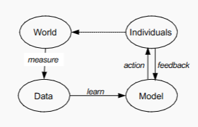

# Ethics and Bias

## Human are Biased
- **Out-group homogeneity** bias (Stereotypes/Prejudice)
  - Humans tend to perceive out-group members as less nuanced than in-group
  members
- Correlation Fallacy
    - Humans have a tendency to mistake correlation (two co-incidentally
co-occurring events) with causation.

## Data is Biased
- Historical Bias
  - A randomly sampled data set, reflects the world as it was
    including existing biases which should not be carried forward
- Representation bias / Reporting bias
  - The data sets do not faithfully represent the whole population
  - Minority groups are underrepresented
  - Obvious facts are underrepresented. Anomalies are overemphasized
- Measurement bias
  1. Noisy measurement → errors or missing data points which are not
  randomly distributed
     - e.g., records of police arrests differ in level of detail across postcode
  areas
  1. Mistaking a (noisy) proxy for a label of interest
     - e.g., ‘hiring decision’ as a proxy for ‘applicant quality’.
  2. Oversimplification of the quantity of interest
     - e.g., classifying political leaning into: ‘Democrat’ vs. ‘Republican’
  (USA)

## Model is Biased
- Model Fit
  - Weak models: high bias – low variance
  - Unjustified model assumptions
- Biased Loss Function
  - Blind to certain types of errors
  - E.g., 0/1 loss will tend to tolerate errors in the minority class for highly
  imbalanced data

## Evaluation bias
- Test set not representative of target population
- Overfit to a test set. Widely used benchmark data sets can reinforce the
problem.
- Evaluation metrics may not capture all quantities of interest (disregard
minority groups or average effects). E.g.,
  - Accuracy
  - Face recognition models largely trained/evaluated on images of
  ethnically white people

## Deployment bias
- Use of systems in ways they were not intended to use. Lack
of education of end-users.

## Machine Learning Pipeline

### Measure 
- Define your variables of interests
- Define your target variable
- Especially critical, if target variable is not measured explicitly.
E.g., hiring decision→applicant quality or income→creditworthiness
### Learn
- We learn models from data
- Data contains “knowledge” (smoking causes cancer)
- Data contains “Stereotypes” (boys like blue, girls like pink)
- What’s the difference? Based on social norms, no clear line!
### Action
- ML concept: regression, classification, information retrieval, ...
- Resulting action: Class prediction (Spam, credit granted), search results,
hotel recommendation, ...
### Feedback
- Approximated from user behavior
- Ex: click-rates

## Quantifying bias
- X non-sensitive features
- A sensitive attributes with discrete labels (male/female, old/young, ...)
- Y true labels
- $\hat{y}$ predicted labels
- Very often instances have a mix of useful, uncontroversial attributes, and
sensitive attributes based on which we do not want to make classification
decisions.
Different attributes lead to different demographic groups of the population
It is rarely clear which attributes are sensitive and which are not. Choice can
have profound impact

## Fairness 
- Approach
    - Hide all sensitive features from the classifier. Only train on X and
remove A
    $$
    P(\hat{Y}_n \mid X_n, A_n) \approx P(\hat{Y}_n \mid X_n)
    $$
## Formal Fairness Criteria
- [Quick recap of metrics](Evaluation.md#evaluation-metrics)

|               | $\hat{y} = 1$         | $\hat{y} = 0$         |
|---------------|-----------------------|------------------------|
| $y = 1$       | true positive (TP)     | false negative (FN)    |
| $y = 0$       | false positive (FP)    | true negative (TN)     |

### **Positive Predictive Value (PPV)** (also: precision):

$$
\text{PPV} = \frac{TP}{TP + FP}
$$

### **True Positive Rate (TPR)** (also: Recall):

$$
\text{TPR} = \frac{TP}{TP + FN}
$$

### **False Negative Rate (FNR)**:

$$
\text{FNR} = \frac{FN}{TP + FN} = 1 - \text{TPR}
$$

### Fairness Criteria

-  Fairness Criterion I: Group Fairness (Demographic Parity)

    - **Definition**: Prediction \( \hat{Y} \) is statistically independent of the sensitive attribute \( A \).
    - **Formula**:  
    $$
    P(\hat{Y} = 1 \mid A = m) = P(\hat{Y} = 1 \mid A = h)
    $$
    - **Goal**: Equal chance for positive prediction across all groups.
    - **Limitation**: Ignores ground truth \( Y \); can reward classifiers that produce more false positives for minority groups.

---

-  Fairness Criterion II: Predictive Parity

  - **Definition**: Positive predictive value (PPV) should be the same across groups.
  - **Formula**:  
    $$
    P(Y = 1 \mid \hat{Y} = 1, A = m) = P(Y = 1 \mid \hat{Y} = 1, A = h)
    $$
  - **Goal**: When the classifier says "yes", it should be equally likely to be correct for any group.
  - **Limitation**: If ground truth is biased, this measure may reinforce that bias.

---

-  Fairness Criterion III: Equal Opportunity

  - **Definition**: Equal true positive rate (TPR) across groups.
  - **Formula**:  
    $$
    P(\hat{Y} = 1 \mid Y = 1, A = m) = P(\hat{Y} = 1 \mid Y = 1, A = h)
    $$
  - **Goal**: Individuals who deserve positive predictions should have equal opportunity regardless of group.
  - **Limitation**: Still depends on the fairness of ground truth labels.

---

-  Fairness Criterion IV: Individual Fairness

    - **Definition**: Similar individuals should be treated similarly.
    - **Formula**:  
    $$
    \text{If } \text{sim}(x_i, x_j) > \theta,\ \text{then } P(\hat{Y}_i = 1) \approx P(\hat{Y}_j = 1)
    $$
    - **Goal**: Focuses on fair treatment at the individual level.
    - **Challenges**:  
    - How to define a good similarity metric  
    - Choosing an appropriate threshold \( \theta \)

- No fair free lunch!
    - Our “Fair” predictions were different under the different fairness criteria
    - It is difficult (and in some cases provably impossible) to satisfy them all
    - Often, there is also a trade-off between fairness and overall performance

### Creating Fairer Classifiers

#### preprocess
- Balancing the data set
    - Up-sample the minority group (martians)
    - Down-sample the majority group (humans)
- Re-weighting data instances

  - Expected distribution (if \( A $\perp$ Y \)):

$$
P_{\text{exp}}(A = a, Y = 1) = P(A = a) \times P(Y = 1) = \frac{\#(A = a)}{|D|} \times \frac{\#(Y = 1)}{|D|}
$$

  - Observed distribution:

$$
P_{\text{obs}}(A = a, Y = 1) = \frac{\#(Y = 1, A = a)}{|D|}
$$

  - Weigh each instance by:

$$
W(X_i = \{x_i, a_i, y_i\}) = \frac{P_{\text{exp}}(A = a_i, Y = y_i)}{P_{\text{obs}}(A = a_i, Y = y_i)}
$$

#### Model training/optimization

- Fairness criteria can be used during model training.

- For example, let \( \mathcal{L}(\theta) \) be the loss function of logistic regression.
- Without fairness:
- We solve the basic optimization:
    minimize  
    $$\mathcal{L}(\theta)$$
- Assume we want to enforce group fairness (demographic parity).
Then we solve this optimization problem:
$$\mathcal{L}(\theta)$$
subject to 
$$P(\hat{Y} = 1 \mid A = m) = P(\hat{Y} = 1 \mid A = h)$$

- Pros
  - Fairness is directly added to the training procedure
- Cons
  - The optimization problem becomes more complex

#### Postprocessing
- Modify the classifier predictions (labels $\hat{y}$)
  - E.g., decide on threshold $\theta$ to change PPV, TPR, FNR:
  $$
  \hat{y}_i = 
  \begin{cases}
  1 & \text{if } \mathbf{w} \cdot \mathbf{x}_i > \theta \\
  0 & \text{if } \mathbf{w} \cdot \mathbf{x}_i \leq \theta
  \end{cases}
  $$
- Pros
    - Model-independent
    - Even works with proprietary / black-box models

- Cons
    - Needs access to protected attribute at test time

---
Hooray!! End of Subject 