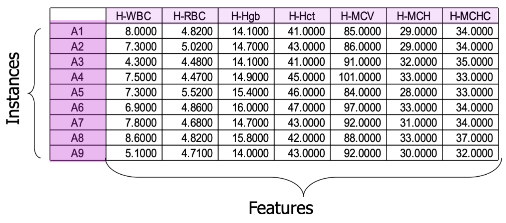
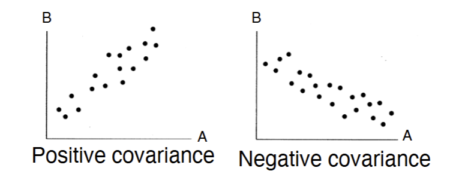
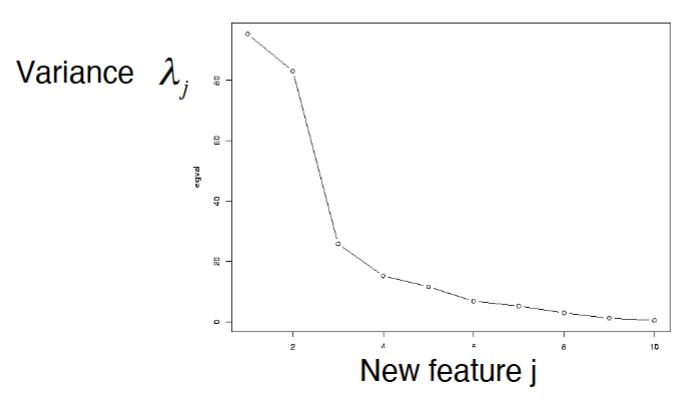

# Dimension Reduction

### Motivation
- when given dataset of massive sample and instance
- It is hard to visualise
- Hard to find correlations

### Goal
- Identify and describe the “dimensions” that underlie the data
    - May be more fundamental than those directly measured but hidden to the
user
- Reduce dimensionality of modeling problem
- Benefit is simplification, it reduces the number of variables you have to
deal with in modeling
- Can identify set of variables with similar behavior

## Methods
- Principal component analysis (PCA)
    - Linear transformation, find orthogonal directions of maximum variance
- Factor analysis
    - Linear combination of small number of latent variables
- Multidimensional scaling (MDS)
    - Project into low-dimensional subspace while preserving distance between
    points (can be non-linear)

## Linear Algebra Revisit

### Eigen Decomposition

- **Symmetric matrix**:
  $$
  \Sigma = U \Lambda U^T
  $$

- **"Orthonormal" matrix**:
  $$
  U^T U = I
  $$

- **Diagonal matrix** $\Lambda$ of eigenvalues

- **Eigenvectors**: columns of \( U \)

### Singular value decomposition (SVD)
- **Matrix**: $X = VSU^T$
- **"Orthonormal" matrices**: $V^T V = I$, $U^T U = I$
- **Diagonal matrix** $S$ contains the **singular values**

### Covariance
- Measures how variables A and B vary together  
    - given a set of $a_n \space and \space b_n$ values

  $$
  \text{Mean}(a) = \frac{1}{n} \sum_{i=1}^{n} a_i
  $$

    - **Covariance** between vectors $a$ and $b$:
  
  $$
  \text{Cov}(a, b) = \frac{1}{n} \sum_{i=1}^{n} (a_i - \text{Mean}(a))(b_i - \text{Mean}(b))
  $$

- Measures linear relationship

### Covariance Matrix
- Assume the matrix with **n** samples and **d** features
- A matrix of n*d
- **Centering**:
    - Calculate the mean of each column(feature) as $\mu_i$
    - Replace each $x_{i,j}$ in the matrix, do $x_{i,j} - \mu_i$ (take i as column and row as j)
    - This will result in a matrix with Mean = 0, and the covariance stay the same. This helps for later computation. This process is called **centering**
- Finally, compute $\sum = \frac{1}{n}X^TX$ to recieve a d*d matrix of covariance

## PCA
- Find a small subspace of all features that keep the most information
- First compute the d*d covariance matrix
- Compute eigenvectors/eigenvalues of covariance matrix:
    - $\sum = U\Lambda U^T$ 
    - $U$ is matrix of eigenvectors
    - $\Lambda$ is diagonal matrix of eigenvalues
- $U$ is **Principle Component** where each $u_j$ is a d*1 column vector of projection weights 

### Learning PCA
- Model Space: set of d orthonomal basis vectors
    - All basis have norm 1
    - Any pair has dot product 0
    - This is proved by the property of eigenVectors of a symmetric matrix. Where eigenvector has norm of 1. and eigenvectors are orthonormal based on the definition.
- Scoring Function
    - $1_{st}$ basis maximize variance of projected data
    - $2_{nd}$ basis again maximize it, but orthonormal to 1. 
 
 - Variance of "new feature" is $\lambda_j$
 - Sum of eigenvalues is equal to the sum of variance of the original attributes 
- "New features” are orthogonal, thus
transformed features have 0 covariance
- **Search**: Eigen decomposition of covariance
corresponds to finding the orthonormal
basis that maximize variance
-  We can more efficiently **singular value decomposition** of the centered data,
$𝑋 = 𝑉𝑆𝑈^T$  leading to the same 𝑈 as the eigen decomposition

### SVD 
- Why does it work
    - **Centered data matrix**: $X \in \mathbb{R}^{n \times d}$  
    (where $d$ is the number of features, $n$ is the number of samples)

    - **Covariance matrix**: $\Sigma = X^T X$  
    (ignoring the $\frac{1}{n}$ scaling for simplicity)

    - **Eigen decomposition**:  
    $\Sigma = UEU^T$  
    where $U$ is an orthonormal matrix, and $E$ is a diagonal matrix of eigenvalues

    - **Singular value decomposition (SVD)**:  
    $X = VSU^T$  
    where $U$ and $V$ are orthonormal matrices, and $S$ is a diagonal matrix of singular values

- Matrix derivation:

$$
X^T X = \Sigma = UEU^T
$$

$$
X^T X = (VSU^T)^T (VSU^T)
= US^T V^T V S U^T
= US^2 U^T \quad \text{so } E = S^2
$$

-  Time Complexity:

    - **SVD** takes: $\mathcal{O}(nd \cdot \min(n, d))$
    - **Computing $X^T X$** takes: $\mathcal{O}(nd^2)$
    - SVD would be faster if n < d

### Applying PCA
- Rearrange the eigenvectors so that $\lambda_1$ is biggest
- times orignal matrix X to U. Each $x_i$ is a row and $u_i$ is a column
- Tranform into new Matrix P where $p_1 = u_1\cdot x$ and $p_m = u_m\cdot x$ m is the row of P
- if m = d, data is transformed, m < d then transformation is lossy -> dimension reduced
- **Warning** This m is a hyperparameter!!

- Choice of m
    - as plot in the scree plot above, where y is variance and x is feature number m.
    - check the **elbow point** in this case is around e and 4. so choose 3, 4 for this one is the best.