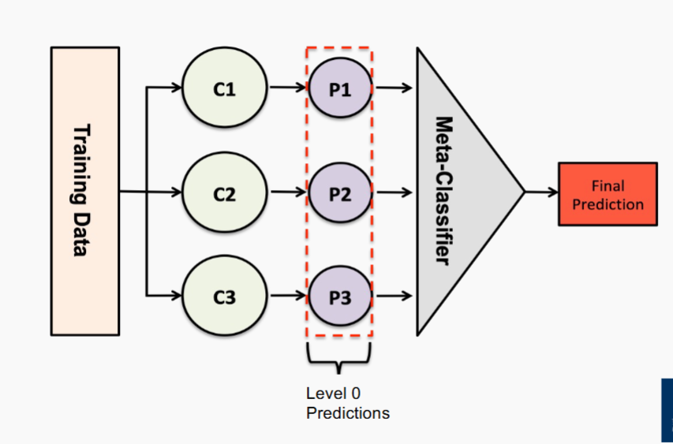
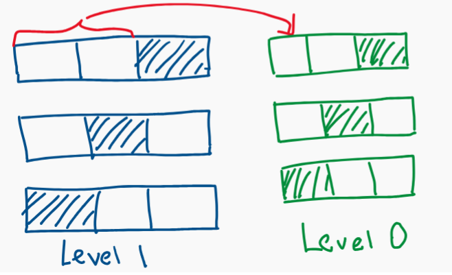

# Ensemble

### Recall linear vs. non-linear classification
- Linear classifiers

    - Naive Bayes  
    - Logistic Regression  
    - Perceptron  
    - SVM (with linear kernel)  

... because their **decision boundary** is a linear function of the input **x**.

---

- Non-linear classifiers

  - K-Nearest Neighbors  
  - Decision Trees  
  - Multi-layer Perceptron (with non-linear activations)  
  - SVM (with non-linear kernel)  

... because their **decision boundary** is *not* a linear function of the input **x**.  
They can learn more complex decision boundaries.

### Recall Parametric vs. Non-parametric models
- Parametric Models

    - Naive Bayes, Logistic Regression, Multi-layer Perceptron, ...

    ... because they have a **constant number of parameters**, irrespective of the amount of training data.

    We can write down the model \( y = f(x; \theta) \), which holds true no matter what \( x \).  
    We fit parameters to a **given model**, and then apply it to each input \( x \):

    - **Logistic Regression**:  
    \( y = \sigma(\theta^T x) \)

    - **Naive Bayes**:  
    \( \log P(y \mid x) \propto \log p(y) + \sum_{i=1}^n \log P(x_i \mid y) \)

- Non-parametric Models

  - K-Nearest Neighbors, Decision Trees, ...

  ... because the **parameters grow with the training data** and are **possibly infinite**.  
  We **learn our model directly from the data**.

  Discussion points:
  - What’s 'non-parametric' about KNN?
  - What’s 'non-parametric' about Decision Trees?
  - What about things like "max depth" for Decision Trees?

## Intuition
- the combination of lots of weak classifiers can be at least as
good as one strong classifier
- the combination of a selection of strong classifiers is
(usually) at least as good as the best of the base classifiers

## When to work

- The classifiers should not make the same mistakes (not the same bias)
- The base classifiers are reasonably accurate (better than chance)

- Ensembles are effective when individual classifiers are slightly
better than random (error < 0.5).

### Simplest Ensemble Voting
- Classification -> run multiple base classifiers over the test data and
select the class predicted by most of base classifiers
    - 😊 😊 ☹ 😊 => 😊
- Regression -> average over the numeric predictions of our base
classifiers
  - 0.8, 0.7, 0.2, 0.9 => 0.65
  
### Approaches
- Instance manipulation (instance-based diversity)
    - generate
    multiple training datasets through sampling, and train a base
    classifier over each dataset
    - similar to
      - Bootstrapping
      - Cross-validation
      - Used in Bagging
- Feature manipulation (feature-based diversity)
  - generate
    multiple training datasets through different feature subsets, and
    train a base classifier over each dataset
    - Features: [‘age’, ‘experience’, ‘education’, ‘state’...]
    - Dataset 1: [‘age’, ‘state’, ...]
    - Dataset 2: [‘experience’, ‘education’...]
- Algorithm manipulation (model-based diversity): “tweak”
    internal parameters within a given algorithm to generate multiple
    base classifiers over a given dataset
    - Similar idea: Dropout regularisation in neural networks
- Class label manipulation (label-based diversity): generate
    multiple training datasets by manipulating the class labels in a
    reversible manner
    - Target classes: [A; B; C; D; E]
    - Dataset 1: [A; not A]
    - Dataset 2: [A or B; C or D or E]
### Three Main Algorithms
- Different classifiers (different models or the same model with
feature manipulation): Stacking
- Same classifier, instance manipulation: Bagging (primarily
targets variance reduction)
- Same classifier, algorithm manipulation: Boosting (primarily
targets bias reduction)

## Stacking 
- Stacking Different classifiers (different models or the same
model with feature manipulation)
- Intuition: “smooth” errors over a range of algorithms with different
biases
- Base Classifiers: train multiple classifiers (different model types,
or the same model over different feature subsets)
- Meta Classifier: train a classifier over the outputs of the base
classifiers
  - Train using nested cross-validation to reduce bias

### Meta Classifier 
- Level 0: Given training dataset (X, y ):
  - Train Neural Network
  - Train Naive Bayes
  - Train Decision Tree
  - ...
- Discard (or keep) X , add new attributes (output of level 0) for each test
instance:
  - Predictions of the classifiers above
  - [Optional] other data as available (e.g., NB confidence scores, etc.)
  - $X_{\text{New}} = [\hat{Y}_{C1}, \hat{Y}_{C2}, \hat{Y}_{C3}, \dots, X_{\text{Old}}]$
- Level 1: Train a meta-classifier. Typically, Logistic Regression
  

### Validation
- Use Nested Cross-validation to prevent L0 classifier see L1 test data
- 

## Bagging: Same classifier, instance manipulation

- **Intuition**:  
  The more data, the better the performance **(lower the variance)**,  
  so how can we get even more data out of a fixed training dataset?

- **Method**:  
  Construct “novel” datasets through a combination of **random sampling and replacement**:

  - Randomly sample the original dataset \( N \) times, **with replacement** (bootstrap)
  - This gives us a new dataset of the same size, where any individual instance is absent (out-of-bag) with probability:

    $$
    \left(1 - \frac{1}{N} \right)^N \approx 0.37
    $$

    (for a reasonably large training set)

  - Construct \( k \) random datasets for \( k \) base classifiers, and aggregate predictions via **voting**
- Use case
    

- User case 2
  - Simple method based on sampling and voting
  - Possibility to parallelise the computation of individual base classifiers
  - Highly effective over noisy datasets (outliers may vanish)
  - Performance is generally significantly better than the base classifiers
  and only occasionally substantially worse

### Bagging - random forest
- Random Tree -> A DT where 
  - At each node, only some of the possible attributes are considered
  - For example, a fixed proportion τ of all of the attributes, except
  the ones used earlier in the tree
  - Attempts to control for unhelpful attributes in the feature set
  - Much faster to build than a “deterministic” Decision Tree, but
  increases model variance
- This is an instance of **Feature Manipulation**
- Random Forest -> Aim to decrease the correlation between each random tree
  - An ensemble of Random Trees (many trees = forest)
  - Each tree is built using a different Bagged training dataset
  - As with Bagging the combined classification is via voting
  - The idea behind them is to minimise overall model variance,
  without introducing (combined) model bias
- Hyperparameters:
  - Number of trees B, which can be tuned based on “out-of-bag” error
  - Like validation set: An instance is only involved in training of
  about 63% of classifiers, for the rest of the classifiers that
  instance will be an out-of-bag (OOB) sample
  - Feature sub-sample size: as it increases, both the strength and the
  correlation increase $(\lfloor \log_2 |F|  + 1\rfloor)$
- Interpretation:
  - The logic behind the prediction of one individual instance can be
  tediously followed through the various trees
  - Logic behind overall model: ???
- Practical Properties of Random Forests:
  - Generally, a very strong performer
  - Parallelisable
  - Surprisingly efficient
  - Robust to overfitting
  - Interpretability sacrificed

## Boosting
- Intuition: tune base classifiers to focus on the “hard to classify”
instances
- Approach: iteratively change the distribution and weights of training
instances to reflect the performance of the classifier on the previous
iteration
  - Start with each training instance having a probability of %
  !
  being included in the sample
  - Over T iterations, train a classifier and update the weight
  of each instance according to whether it is correctly
  classified
  - Combine the base classifiers via weighted voting
## AdaBoost (Adaptive Boosting)

A sequential ensembling method that improves classifier performance by adjusting instance weights.

---

### 🔹 Basic Idea

- Use **base classifiers**: e.g., decision stumps \( C_0 \)
- Training data: \((x_j, y_j)\) for \(j = 1, 2, ..., N\)
- Initialize instance weights:  
  $$
  w_j^{(1)} = \frac{1}{N}
  $$
- Iterate over \(i = 1, 2, ..., T\):

---

### 🔹 Step 1: Build classifier \( C_i \) and compute error

$$
\varepsilon_i = \sum_{j=1}^N w_j^{(i)} \delta(C_i(x_j) \neq y_j)
$$

Where:
- \(\delta(\cdot)\) is the indicator function:  
  - 1 if condition true (misclassified),  
  - 0 otherwise (correctly classified)

---

### 🔹 Step 2: Compute classifier weight \( \alpha_i \)

$$
\alpha_i = \frac{1}{2} \ln \left( \frac{1 - \varepsilon_i}{\varepsilon_i} \right)
$$

- Classifiers with lower error \( \varepsilon_i \) get **higher** \( \alpha_i \)
- Trust only classifiers with \( \varepsilon_i < 0.5 \) (better than random)

---

### 🔹 Step 3: Update instance weights for iteration \( i + 1 \)

$$
w_j^{(i+1)} = \frac{w_j^{(i)}}{Z^{(i)}} \times
\begin{cases}
e^{-\alpha_i} & \text{if } C_i(x_j) = y_j \\
e^{\alpha_i} & \text{if } C_i(x_j) \neq y_j
\end{cases}
$$

- \( Z^{(i)} \) is a normalization factor so weights sum to 1
- Intuition:
  - Misclassified → weight **increases**
  - Correctly classified → weight **decreases**

---

### 🔹 Final Output & Prediction

- Final ensemble:
  $$
  \{(\alpha_1, C_1), (\alpha_2, C_2), ..., (\alpha_T, C_T)\}
  $$

- Final prediction:
  $$
  C^*(x) = \arg\max_y \sum_{i=1}^T \alpha_i \delta(C_i(x) = y)
  $$

✅ If each classifier is better than random, ensemble convergence is guaranteed.

### Boost Summary 
- Base classifiers: decision stumps (OneR) or decision trees
- Mathematically complicated but computationally cheap method
based on iterative sampling and weighted voting
- More computationally expensive than bagging (sequential)
- The method has guaranteed performance in the form of error
bounds
over the training data
- Interesting effect with convergence of the error rate over the
training vs. test data
- In practical applications, boosting has the tendency to overfit

### Bagging vs. Boosting
- Bagging
  - Parallel sampling
  - Simple voting
  - Single classification algorithm
  - Minimise variance
  - Not prone to overfitting
- Boosting
  - Iterative sampling
  - Weighted voting
  - Single classification algorithm
  - Minimise (instance) bias
  - Prone to overfitting

## Summary Question
- What is classifier combination?
- What is bagging and what is the basic thinking behind it?
- What is boosting and what is the basic thinking behind it?
- What is stacking and what is the basic thinking behind it?
- How do bagging and boosting compare?
