# Evaluation

### 3 Main Evaluation Strategy
- Holdout
- Stratification
- Cross-validation

### Holdout 
- Each instance is randomly assigned as either a training instance or test instance
- Data is partitioned, no overlap between datasets

- build the model with only train dataset
- evaluate with only test dataset
- normally 50-50,80-20 or 90-10

- Pros
    - simple to work 
    - Highly reproducible

- Cons
    - size of split may cause issue
    - bias in sampling
    - inefficient resource utilization

- size of split may cause issue
    - with too less train, may not have enough information to build a model
    - with too less test test data may not be representative, estimated performance can be too high or low

- bias in sampling
    - random sampling can lead to different distribution in train and test datasets

### Stratification
- When dealing with imbalanced datasets
- Stratification ensures that each fold or partition of the data    maintains the same class distribution as the original dataset

- Pros
    - Preserves Distribution: Ensures that each stratum (subgroup) in the population is adequately represented in the sample.
    - Ensures Representation: Particularly important when certain subgroups are small but still need to be represented accurately.

- Cons
    - Complexity: Can be more complex to implement compared to simple random sampling.
    - Inefficient Resource Utilization: some data is only used for training and some only for testing

### k-fold Cross-Validation
- We divide the data into multiple parts (folds) iteratively.
- First, we select a desired number of partitions (k) and split the data into k folds.
- In each iteration
    - we use one partition (fold) as the test data
    - the remaining k-1 partitions (folds) are used as the training data
- Finally, we aggregate (average) the evaluation metric across all k iterations.

- Pros
    - Every instance serves as both a training and testing instance, for some partition
    - Evaluation metrics are more reliable as they are calculated with respect to a dataset that looks like the entire dataset (i.e., the entire dataset)
- Cons
    - Takes more time (depending on k)

### How to choose K

- The number of folds directly impacts the runtime and the results:
- Fewer folds: more instances per partition, more variance in performance
estimates
- More folds: fewer instances per partition, less variance but slower
- The most common choice of k: 10 (occasionally, 5)
- Mimics 90–10 Holdout, but far more reliable

### We can have stratified cross-validation

Each partition is created in a way that maintains
the overall class distribution

[Decision Tree Related](DecisionTree.md#evaluation)

### Hyperparameter Tuning
- find the just right hyperparameter

- If the Decision Tree is too short (Depth is too small)
    - The DT would be too simple (Something like 1-R
-  If the Decision Tree is too long (Depth is too big)
    - The DT would be too complex and cannot generalize well

- Constraint
    - need way to measure how well it works
    - if use test, then there is no unseen data to validate model -> **Data Leakage**
    - need a third **validation set**

### Validation data 
- Use merged train-validation data  to fit the model then use test dataset to check the performance
- Instead use a third dataset, use **Cross validation**.

### Cross Validation
- Repeat k-times
- Each time
    - partition into k blocks
    - use k-1 to train
    - 1 to validate 

## Evaluation Metrics

### Classification Metrics
- Confusion Matrix 
    -Possible classification results:
    - Positive case classified as “positive” (true positive, TP)
    - Positive case classified as “negative” (false negative, FN)
    - Negative case classified as “positive” (false positive, FP)
    - Negative case classified as “negative” (true negative, TN)
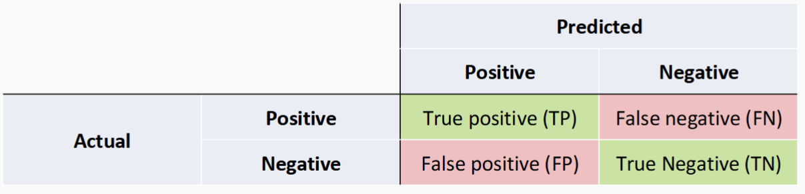

- Accuracy = $(TP+TN)/N$

    - Accuracy alone may not be usefull, need to compare with baseline model to check if it works.
- Recall = $TP/(TP+FN)$ -> Recall = 1, indicates fewer false negative
- Precision = $TP/(TP+FP)$ -> Presicison = 1, indicates fewer false positive

    - Precision and Recall are inverse
    - Unless there is clear goal on what is wanted
    - Try to maximize both

- F1-score
    - $F1 = \frac {2*Precision*Recall}{Precision+Recall}$

### Non-binary Confusion Matrix
- need to assume a intersting class(I) against other unintersting (UI) where we make I as positive. 
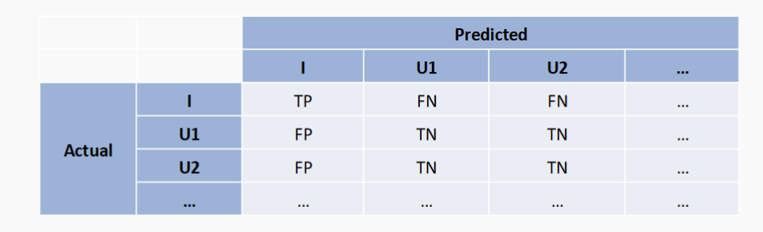
- For each class, make it as a Interesting
- Average the result for each class and get final Evaluation

### Averaging
- Macro
    - calculate metric per class then average them
    - Treats all classes equally
    - Suitable to ensure all classes are treated with the same importance, regardless of their size
    - Emphasizes small classes
    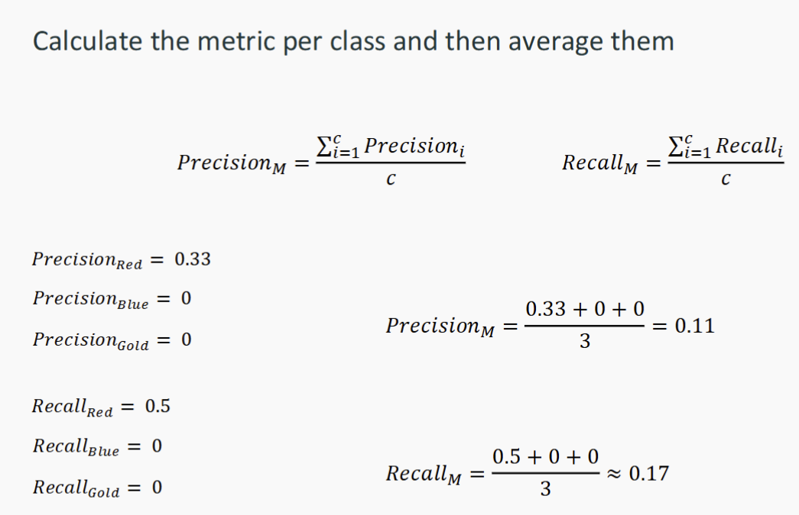
- Micro
    - combine all instance into a single pool 
    - Treats all instances equally
    - Dominated by large classes
    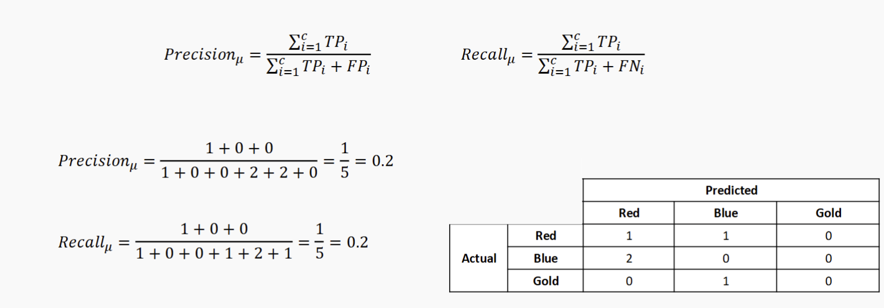
- Weighted 
    - calculate metric per class and then average based on proportion of instance in each class
    - Gives more weight to classes with larger numbers of instances
    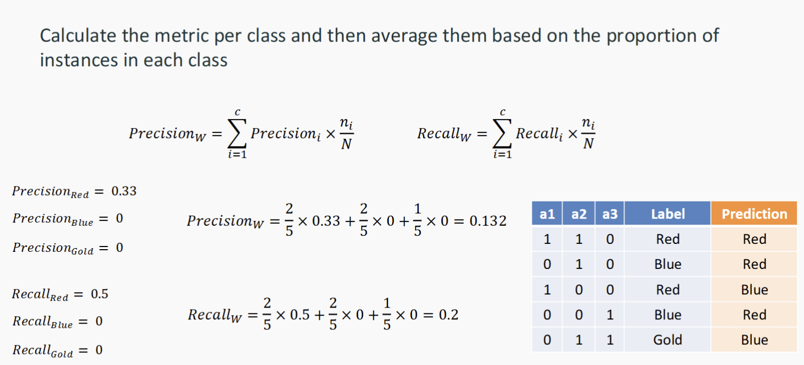

## Regression Metrics
- instead of count, we measure error
- samller error -> better performance

### Sum of Squared Errors (SSE) 
- AKA Residual Sum of Squares (RSS) or Sum of Squared Residuals (SSR)
- $𝐸𝑟𝑟𝑜𝑟_𝑖 = 𝑦𝑖 −\hat{y}_i$
- SSE = $\sum_{i=1}^n (𝑦𝑖 −\hat{y}_i)^2$

### Mean Square Error (MSE)
- Mean Square Error (MSE): MSE measures the average squared difference between the predicted and actual values. It penalizes larger errors more than smaller errors.
- $MSE = \frac{1}{N} \sum_{i=1}^n (𝑦𝑖 −\hat{y}_i)^2$ = $\frac{SSE}{N}$

### Root Mean Square Error (RMSE)
- Root Mean Square Error (RMSE): RMSE is the square root of the MSE and provides the measure of the average magnitude of the errors in the same units as the target variable. It is widely used as it gives a good indication of the model's prediction
accuracy.

- RMSE = $\sqrt(\frac{1}{N} \sum_{i=1}^n (𝑦𝑖 −\hat{y}_i)^2$ = $\frac{SSE}{N})$ = $\sqrt {MSE}$

### Mean Absolute Error (MAE)
- Mean Absolute Error (MAE): MAE measures the average absolute difference between the predicted and actual values. Unlike MSE, it does not square the errors, making it less sensitive to outliers

### Comparing
- MSE emphasizes larger errors due to squaring and is sensitive to outliers.
- RMSE is the square root of MSE, providing a more interpretable metric in the
same units as the target variable.
- MAE treats all errors equally, is less sensitive to outliers, and provides a straightforward average error measure.

- $\text{MAE} = \frac{1}{N} \sum_{i=1}^{N} \left| y_i - \hat{y}_i \right|$

### Summary Questions
- Evaluation strategies: Hold-out, Cross-Validation, Stratification
- Model tuning
- Evaluation Metrics
- Classification:
- Accuracy, Precision, Recall, F1-score
- Confusion Matrix and averaging methods
- Regression
- MSE, RMSE, MAE

## Generalization problem

- Underfitting -> The model is not expressive enough to capture
patterns in the data

- Overfitting -> the model is too complicated; It captures noise in
the data

- appropriate fitting -> captures essential patterns in the
data
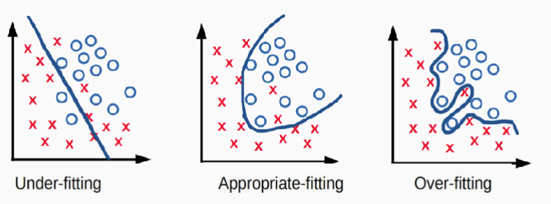

## Learning Curves
For machine learning, we can plot
- y-axis performance measure by accuracy, error rate or other metrics
- x-axis conditions, size of training sets, model complexity, numer of iterations
- Training learning curve: calculated from the training set that
shows how well the model is learning.
- Validation learning curve: calculated from a holdout set that
shows how well the model is generalising.
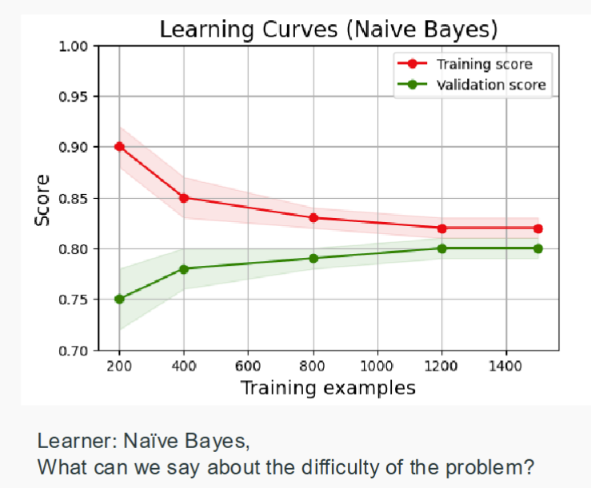

- Example One
    - More training instances → (usually) better model
    - More evaluation instances → more reliable estimate of effectiveness

- Example Two compare models
    - Using the polynomial of order 𝐷 of 𝑥 to increase the flexibility of linear regression
$𝑦 = 𝒘 ∙ 𝜙 𝑥 \\
𝜙 𝑥 = [1, 𝑥, 𝑥2, ... , 𝑥𝐷]$
- Massive Examples Orders of a polynomial model

- Model complexity
    - The number of adjustable parameters in a model

## Overfitting 
- An overly complex model is selected that captures specific
patterns in the training data but fails to learn the true nature of
relationships between attributes and class labels
- Error Rate = 100% - Accuracy
- overfitting -> large gap between training and test performance
- underfitting -> High error rate for both test and training set
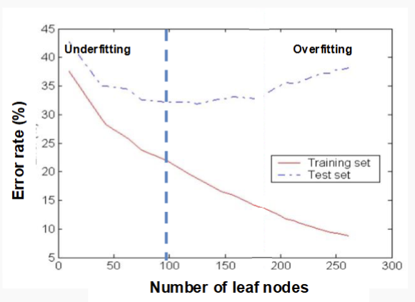

### A bit about expectations
- $\mathbb{E}[X] = \sum_{x} x \, p(x)$ 
- $\mathbb{E}[X] = \int_{x} x \, p(x) \, dx$ 
- Consider a Bernoulli 𝑋 ∈ {0,1} where 𝑝 0 = 1/2, 𝑝 1 = 1/2
- when N reaches infinity, E[X] reaches 0.5

## Bias and Variance

### Bias
- Model bias: the tendency of
our model to make
systematically wrong
predictions
- Evaluation bias: the tendency of our evaluation
strategy to over- or under-estimate the effectiveness of
our model
- Sampling bias: if our training or evaluation dataset
isn’t representative of the population
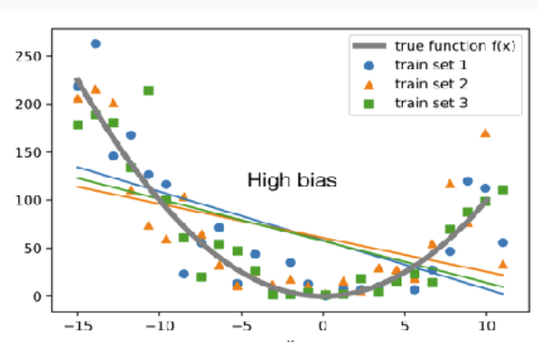

### Variance
- Model variance: Sensitivity of a
machine learning model's
predictions to small changes in
the training data, leading to
different outcomes when the
model is trained on different
subsets of the data.
- Evaluation variance: Variability in the performance
metrics of a model (such as accuracy, precision, or
recall) when evaluated across different test datasets or
under different evaluation conditions.
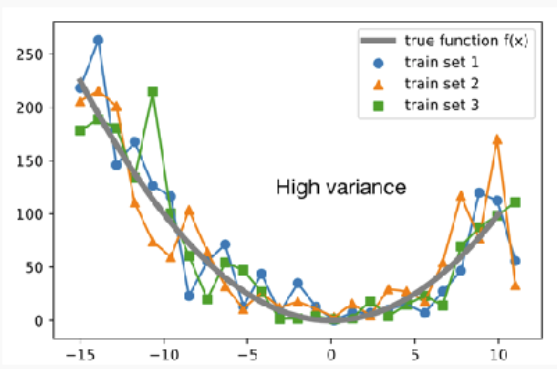

### Model bias in regression:
- For every evaluation instance, the signed error can be calculated
- Assuming every instance is independent, bias is the average of
these signed errors
$\frac{1}{N}\sum_{i=1}^n(y_i-\hat{y}_i)$
- A model is biased if
    - the predictions are systematically higher than the true value, or
    - the predictions are systematically lower than the true value
- A model is unbiased if
    - the predictions are systematically correct, or
    - some of the predictions are too high, and some of the
predictions are too low

### Model Bias in Regression:

- Label predictions is either “too high” or “too low”
    - “biased towards the majority class” means our model predicts
too many instances as the majority class

    $Bias(\hat{f},f) = E[\hat{f}(x)-f(x)]$

### Model Variance in Regression
- relates to the tendency of
different training sets to produce different models or predictions
with the same type of learner
    - A model has high variance if a different randomly sampled
training set leads to very different predictions on the
evaluation set
    - A model has low variance if a different randomly sampled
training set leads to similar predictions, independent of
whether the predictions are correct 

    $Var(\hat{f},f)=E[\hat{f}(x)-E[\hat{f}(x)]^2]$

### Generlisation Error
- We may estimate a model $\hat{f}(x)$ of $𝑓(𝑥)$ using linear regression
- But different training sets → different model weights and outputs
- To remove the dependency → repeat modelling many times (on
different training sets)
-In this case, the expected
squared prediction error
is:
$𝐸𝑟𝑟 = 𝐸[(𝑌 − \hat{f}(x))2]$
- In regression, the generalization error can be decomposed to:
- $𝐸𝑟𝑟 = 𝐵𝑖𝑎𝑠^2 + 𝑉𝑎𝑟𝑖𝑎𝑛𝑐𝑒 + 𝐼𝑟𝑟𝑒𝑑𝑢𝑐𝑖𝑏𝑙𝑒 𝐸𝑟𝑟𝑜𝑟$

- Variance: Captures how much your model changes if you train
on a different training set. How ”over-specialized” is your
classifier to a particular training set?
- Bias: What is the inherent error that you obtain from your
model even with infinite number training instances? This is due
to your model being ”biased” to a particular kind of solution. In
other words, bias is inherent to your model.
- Noise: This error measures ambiguity due to your data
distribution and feature representation. You can never beat
this; it is an aspect of the data
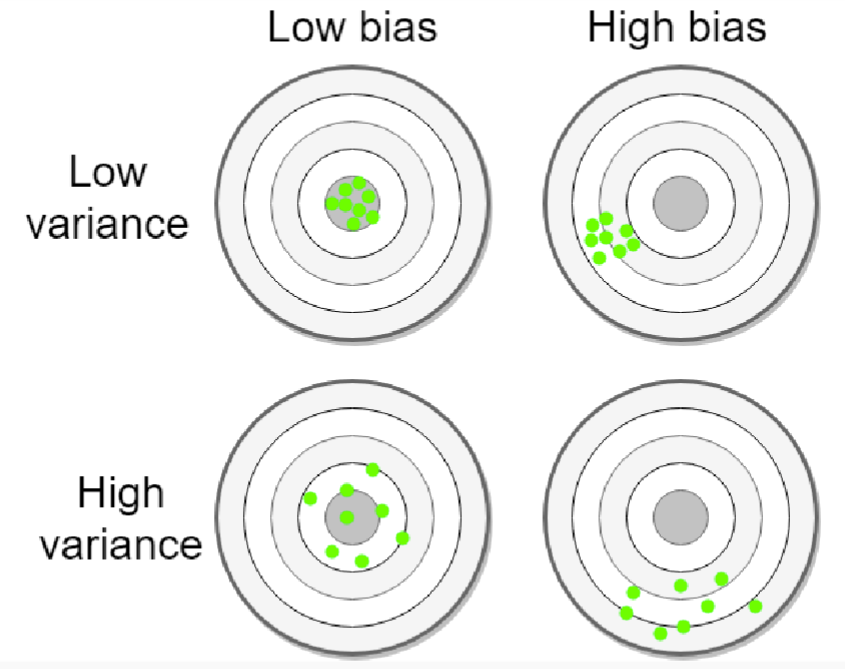

- In generalIn general, both High bias and high variance lead to Poor Generalization
    - For example, Zero-R (see Lecture 5) has zero variance but
    a high bias
    - It is important to keep balance
- Lower bias and lower variance --> better generalisation

### Diagnosing High Bias and Variance
- At its root, dealing with bias and variance is really about dealing with
overfitting and underfitting. Bias is reduced and variance is increased
in relation to model complexity
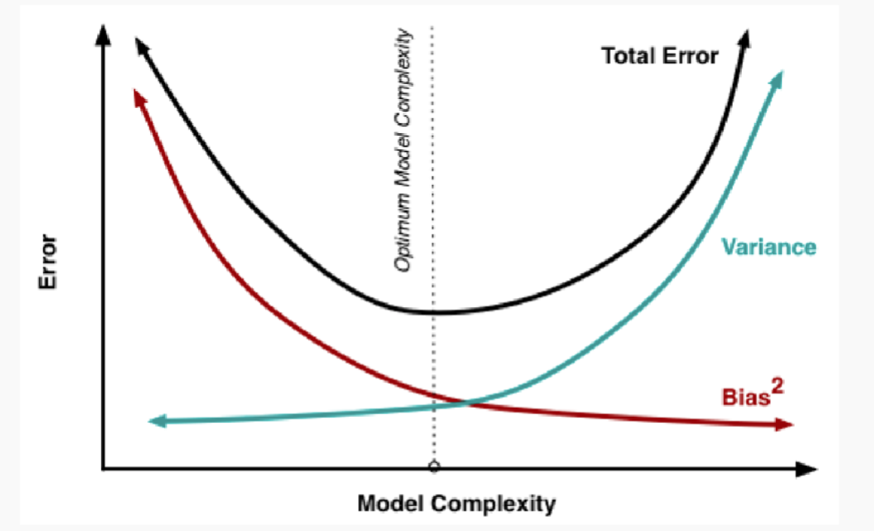
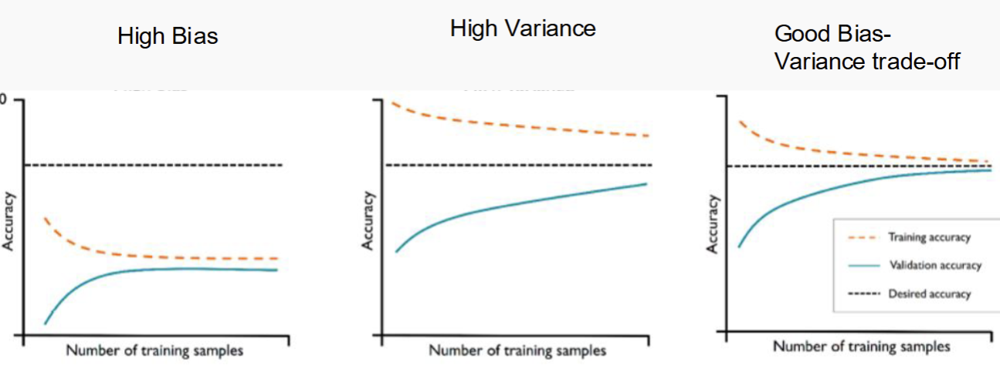

- High Bias
    - More training data by itself does not help
    - learning curve is characterised by high training and test errors
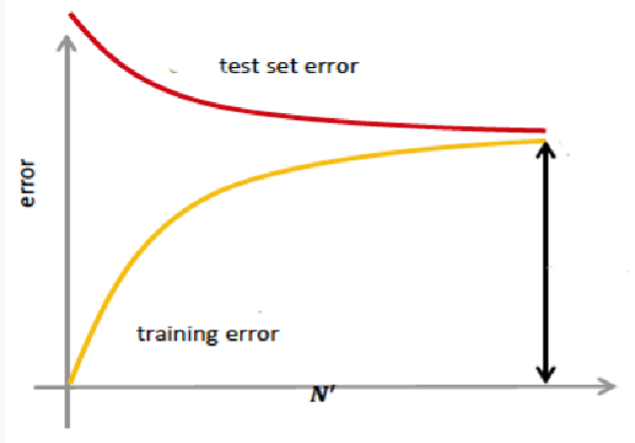
- High Variace
    - Getting more training data is likely to
help
    - The learning curve is characterised by
the gap between the two errors
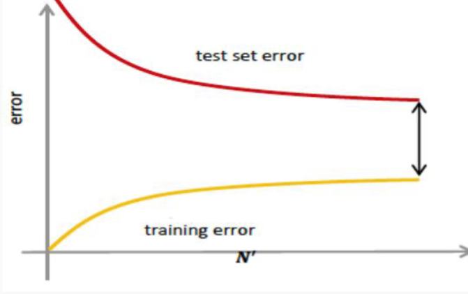

### High Bias Remedy
- Use more complex model (e.g., use nonlinear models)
- Add features

### High Variance Remedy
- Add more training data
- Reduce features
- Reduce model complexity – complex models are prone to high
variance
- Bagging

### Evaluation Bias and Variance
- The evaluation metric is also an estimator
- Desire to know the true error rate of a classifier, but only have
an estimate of the error rate, subject to some particular set of
evaluation instances
- The quality of the estimation is independent of the trained
model
- We extrapolate performance from a finite sample of cases
- With unlimited/infinite number of samples/instances, the
apparent error rate will become the true error rate
- What are the potential problems with our estimated error rate?
    - We have good accuracy with respect to some specific
evaluation sets, but poor accuracy with respect to other
unseen evaluation sets
    - It’s also possible to overfit the validation data, with
respect to our evaluation function

- **Evaluation bias**: Our estimate of the effectiveness of a
model is systematically too high/low

- **Evaluation variance**: Our estimate of the effectiveness
of a model changes a lot, as we alter the instances in the
test set. (This can be hard to distinguish from model
variance)

- control bias and variance in evaluation
    - Holdout partition size
        - More training data, less test data: less model variance, more
        evaluation variance
        - Less training data, more test data: more model variance, less
        evaluation variance
    - K-fold Cross-Validation
        - Less variance than Holdout for model and evaluation
    - Stratification
        - Less model and evaluation bias
    - Leave-one-out Cross-Validation (k-fold with k=# of samples)
        - No sampling bias, lowest bias/variance in general
    - For any evaluation method we can **report average and variance of scores**

## Summary Questions
- What is generalisation and overfitting?
- What is a learning curve, and why is it useful?
- How are bias and variance different?
- How is model bias different to evaluation bias?
- How do we try to control for bias and variance in evaluation?