# Neural Network(NN)

## Perceptron
- Biological motivation: imitating neurons in the brain
- No more probabilities
- Instead: minimize the classification error directly
- 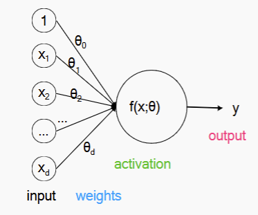
- y = 1 if $\sum \theta \cdot x > 0$ OR -1 otherwise

### Definition
- minimal NN
- NN are composed nuerons
- A neuron defined as 
    - Input: a vector of numeric input [1,$x_1,x_2$...]
    - output: a scalar y
    - hyper-parameter: activation function f
    - parameter($\theta$)
- Math -> y = f($\theta + \theta \cdot x_1 ....$)

- Task: binary classification into 1 and -1
- Model: single neuron aka perceptron
- f is called a step function
- $\theta \cdot x$ is the decision boundary

### Algorithm
- Learning is by altering the parameter $\theta$
- Supervised algorithm
- Simplest idea to learn : compare predicted outputs ̂ 𝑦 against true outputsy and minimize the number of mis-classifications. Unfortunately,
mathematically inconvenient.
- Second simplest idea: Find $\theta$ such that gap between the predicted value $\hat{y}^i = f(\theta \cdot x^i)$ and the true class label y $\in$ {1,-1} is minimized
    - y = 1 $\hat{y}= -1$ -> increase weight $\theta$
- Training stage
$$
\boldsymbol{\theta}^{(k+1)} = \boldsymbol{\theta}^{(k)} + \eta y_i \mathbf{x}_i
$$
$\eta$ is the learning rate
- Use $y_i(\theta^{(k)}\cdot x_i) <= 0$ as error
    - in a correct classify, $\theta x$ should have the same symbol as y

### Convergence
- The Perceptron algorithm is guaranteed to converge for
    linearly-separable data
    - the final parameter will depend on the initialisation
    - the final parameter will depend on the learning rate
    - (no guarantee of the margin being maximised as in
support vector machines)
- No guarantee of convergence over non-linearly separable data

### Perceptron VS Logistic Regression and Gradient Descent
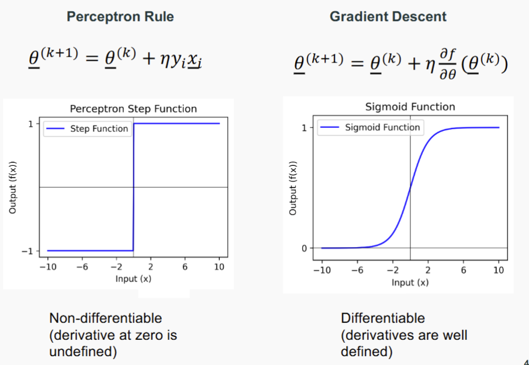

- Activation functions:
A single ‘neuron’ with a sigmoid activation which optimizes the
cross-entropy loss (negative log likelihood) is equivalent to logistic
regression

### Online learning VS Batch Learning
- Perceptron is Online Learning
    - update weights after each training example
- The ones with Gradient Descent is Batch Learning
    - compute statistics of the whole training data set
    - update all parameters at once

- Online learning can be more efficient for large data sets
- Gradient Descent can be converted into an online version: **stochastic gradient descent**

## Neural Network -> Multi layer Perceptron (MLP)
- Multi layer Perceptron MLP
- Input layer -> input units x
- Output layer -> output unit y
- Hidden layer -> units h, all layers in between
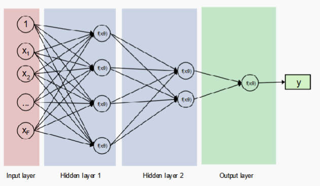

### Multi-layer Perceptron (MLP) vs. other Neural Networks
- Multi-layer Perceptron  
    - One specific type of neural network  
    - Feed-forward  
    - Fully connected  
    - Supervised learner  

- Other types of neural networks  (not in content)
    - Convolutional neural networks  
    - Recurrent neural networks  
    - Autoencoder (unsupervised)

### Linear VS Non-Linear Classifier
- Linear classification  
    - The perceptron, naive bayes, logistic regression are linear classifiers  
    - Decision boundary is a linear combination of features $\sum_i \theta_i X_i$  
    - Cannot learn 'feature interactions' naturally  

- Non-linear classification  
    - Neural networks with at least 1 hidden layer and non-linear activations  
    - Decision boundary is a non-linear function of the inputs  

### (Non-linear) classification with Multi-layer Perceptron
- 
    - Input units $x_j$, one per feature $j$  
    - Multiple layers $\ell = 1 \dots L$ of nodes; $L$ is the depth of the network  
    - Each layer $\ell$ has a number of units $K_\ell$, which is the width of layer $\ell$  
    - The width can vary from layer to layer  
    - Output unit $y$  
    - Each layer $\ell$ is fully connected to its neighboring layers $\ell - 1$ and $\ell + 1$  
    - One weight $\theta_{ij}^{(\ell)}$ for each connection $ij$ (including bias $\theta_{0}$)  
    - Non-linear activation function for layer $\ell$ as $\phi^{(\ell)}$  

- Passing an input through a neural network with 2 hidden layers:

$$
h_i^{(1)} = \phi^{(1)}\left( \sum_j \theta_{ij}^{(1)} x_j \right)
$$

$$
h_i^{(2)} = \phi^{(2)}\left( \sum_j \theta_{ij}^{(2)} h_j^{(1)} \right)
$$

$$
y_i = \phi^{(3)}\left( \sum_j \theta_{ij}^{(3)} h_j^{(2)} \right)
$$

---

- Or in **vectorized form**:

$$
\mathbf{h}^{(1)} = \phi^{(1)}\left( \boldsymbol{\theta}^{(1)T} \mathbf{x} \right)
$$

$$
\mathbf{h}^{(2)} = \phi^{(2)}\left( \boldsymbol{\theta}^{(2)T} \mathbf{h}^{(1)} \right)
$$

$$
\mathbf{y} = \phi^{(3)}\left( \boldsymbol{\theta}^{(3)T} \mathbf{h}^{(2)} \right)
$$

- Where the activation functions $\phi^{(\ell)}$ are applied **element-wise** to all entries

### Feature Learning with Neural Network

- Feature Engineering  
    - The perceptron, naive Bayes and logistic regression require a fixed set of informative features  
    - e.g., `outlook ∈ {overcast, sunny, rainy}`, `wind ∈ {high, low}`, ...  
    - Requiring **domain knowledge**  

- Feature Learning  
    - Neural networks take as input 'raw' numeric data  
    - They learn features as intermediate representations as part of their target task (e.g., classification)  
    - **Representation learning**: learning abstract features that are informative for the target task  
    - **Note**: feature engineering is often replaced at the cost of additional parameter tuning (layers, activations, learning rates, ...)

### Design Neural Network 
- Inputs and feature functions  
    - $x$ could be a patient with features {blood pressure, height, age, weight, ...}  
    - $x$ could be a text, i.e., a sequence of words  
    - $x$ could be an image, i.e., a matrix of pixels  

- Non-numerical features need to be mapped to numerical  
    - For language: pre-trained embedding vectors or one-hot encoding  
        - For one-hot: $\text{dim}(x) = V$ (where $V$ is the vocabulary size)  
        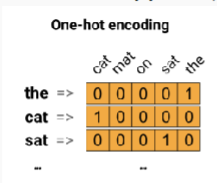
        - For embedding: $\text{dim}(x) = k$, where $k$ is the dimensionality of the embedding vectors  
    - For pixels: map to RGB, or other visual features  

- Network Structure  
    - Sequence of hidden layers $\ell_1, \dots, \ell_L$ for a network of depth $L$  
    - Each layer $\ell$ has $K_\ell$ parallel neurons (breadth)  
    - Many layers (depth) vs. many neurons per layer (breadth)?  
      Empirical question, theoretically poorly understood.  

- Advanced tricks include allowing for exploiting data structure  
    - Convolutions (convolutional neural networks; CNN), Computer Vision  
    - Recurrences (recurrent neural networks; RNN), Natural Language Processing  
    - Attention (efficient alternative to recurrences)  
    - ...

- Activation Function
    - Each layer has an associated activation function which performs a non-linear transformation of the input. Popular choices include:

    - **Logistic or Sigmoid ("$\sigma$")**:  
    $$
    f(x) = \frac{1}{1 + e^{-x}}
    $$

    - **Hyperbolic tan ("tanh")**:  
    $$
    f(x) = \frac{e^{2x} - 1}{e^{2x} + 1}
    $$

    - **Rectified Linear Unit ("ReLU")**:  
    $$
    f(x) = \max(0, x)
    $$

    - What about **step function**??

    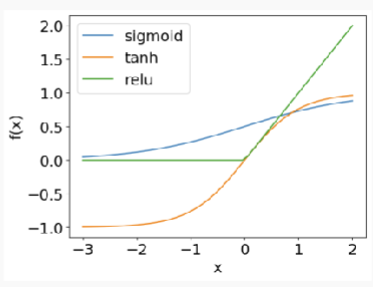

- Output function
    - Neural networks can learn different concepts: classification, regression, ...

    - The **output function** depends on the concept of interest:

    - **Binary classification**:  
        - Single unit with step function (as in the perceptron) or sigmoid

    - **Multiclass classification**:  
        - Multiple units (one for each class) with softmax to normalize $K$ outputs from the pre-final layer into a probability distribution over classes

        $$
        P(y_i = j \mid X_i; \boldsymbol{\theta}) =
        \frac{\exp(z_j)}{\sum_{k=1}^{K} \exp(z_k)}
        $$

    - **Regression**:  
        - Identity function (linear)  
        - Possibly other continuous functions such as sigmoid or tanh

- Loss function
    - For a single instance $i$:

    $$
    \mathcal{L} = - \log p(y^{(i)} \mid x^{(i)}; \boldsymbol{\theta})
    $$

    - For all instances:

    $$
    \mathcal{L} = - \sum_i \log p(y^{(i)} \mid x^{(i)}; \boldsymbol{\theta})
    $$

    - Binary Classification Loss

        Let:

        $$
        \hat{y}_1^{(i)} = p(y^{(i)} = 1 \mid x^{(i)}; \boldsymbol{\theta})
        $$

        Then the loss is:

        $$
        \mathcal{L} = - \sum_i \left[
            y^{(i)} \log (\hat{y}_1^{(i)}) + (1 - y^{(i)}) \log (1 - \hat{y}_1^{(i)})
        \right]
        $$

    - Multiclass Classification Loss

        Let:

        $$
        \hat{y}_j^{(i)} = p(y^{(i)} = j \mid x^{(i)}; \boldsymbol{\theta})
        $$

        Then:

        $$
        \mathcal{L} = - \sum_i \sum_j y_j^{(i)} \log (\hat{y}_j^{(i)})
        $$

        - For $j$ possible labels  
        - $y_j^{(i)} = 1$ if class $j$ is the true label for instance $i$, else 0
    - Regression Loss: typically mean-squared error (MSE)

        - Here, the output as well as the target are real-valued numbers

        $$
        \mathcal{L} = \frac{1}{N} \sum_{i=1}^{N} \left( y^{(i)} - \hat{y}^{(i)} \right)^2
        $$

- However, train is not possible ni the hidden layers,Use **Back Propagation**

### Why Neural Network
- Pros

    - Powerful tool!  
    - Neural networks with at least 1 hidden layer can approximate any (continuous) function.  
    They are **universal approximators**  
    - Automatic feature learning  
    - Empirically, very good performance for many diverse tasks  

- Cons

    - Powerful model increases the danger of **overfitting**  
    - Requires large training data sets  
    - Often requires powerful compute resources (GPUs)  
    - Lack of interpretability  

### Activation Function
- Can have different function for each layer
- **Sigmoid**: $\sigma(z) = \frac{1}{1 + e^{-z}}$
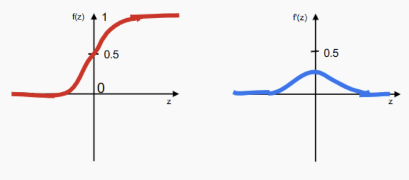
- **Tanh**: $\tanh(z) = \frac{e^{2z} - 1}{e^{2z} + 1}$
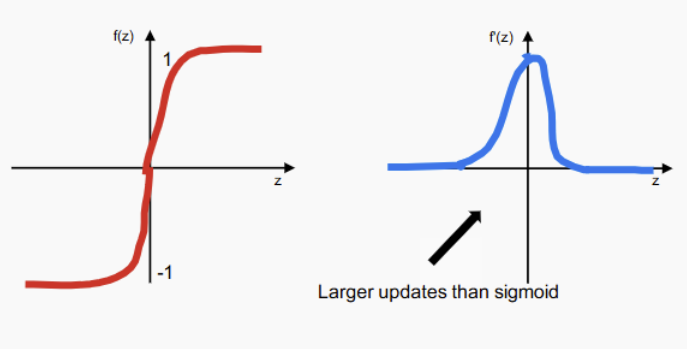
- **ReLU**: $f(z) = \max(0, z)$
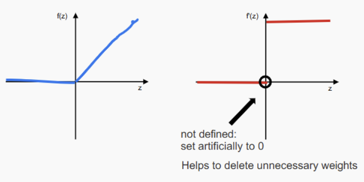
- Step Function is not suitable for NN, as the derivate is not defined at 0 -> no way to update
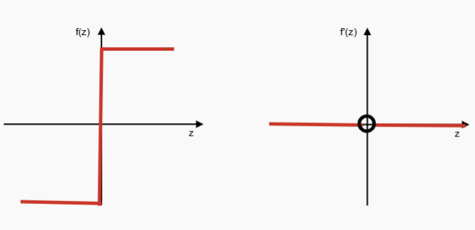

## Back Propagation
- Recall [Perceptron learning](#algorithm)
- This update rule relys on true target output y
- But only have access to final output layer
- Don't know the true action in the hidden layers
- Introduce the back propagation -> computing
partial derivatives of the error of an MLP wrt each individual weight.

### Procedure
- Receive input  
- **Forward pass**: propagate activations through the network  
- Compute error ($\delta$): compare output $\hat{y}$ against true $y$  
- **Backward pass**: propagate **error terms** through the network  
- From the **error terms**, derive weight updates $\Delta \theta_{ij}^{\ell}$ for all $\theta_{ij}^{\ell}$  
- Update weights:  
  $$
  \theta_{ij}^{\ell} \leftarrow \theta_{ij}^{\ell} + \Delta \theta_{ij}^{\ell}
  $$

- Recall Gradient Descent 
$$
\theta_i \leftarrow \theta_i + \Delta \theta_i 
\quad \text{with} \quad 
\Delta \theta_i = -\eta \frac{\partial E}{\partial \theta_i}
$$

- Use Back Propagation to get $\frac{\partial E}{\partial \theta_i}$

### Back Propagation
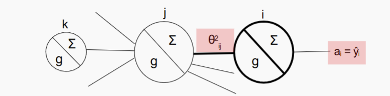
- Model Definition
    - Where $z_i$ is the sum of all incoming activations into neuron $i$:

    $$
    z_i = \sum_j \theta_{ij}^{\ell} a_j
    $$

    - Assuming a sigmoid activation function, the output of neuron $i$ (its activation $a_i$) is:

    $$
    a_i = g(z_i) = \frac{1}{1 + e^{-z_i}}
    $$

    - And Mean Squared Error (MSE) as the error function $E$:

    $$
    E = \frac{1}{2}(y - a_i)^2
    $$

    - Apply gradient descent for weight update:  
    $$
    \theta_{ij}^2 \leftarrow \theta_{ij}^2 + \Delta \theta_{ij}^2
    $$

    - Weight update rule:
    $$
    \Delta \theta_{ij}^2 = -\eta \frac{\partial E}{\partial \theta_{ij}^2}
    $$

    - Using the chain rule:
    $$
    \Delta \theta_{ij}^2 = \eta (y - a_i) \frac{\partial a_i}{\partial \theta_{ij}^2}
    $$

    - Where the error function is:

    $$
    E = \frac{1}{2} (y - a_i)^2
    $$

    - Apply gradient descent for weight:  
  $$
  \theta_{ij}^2 \leftarrow \theta_{ij}^2 + \Delta \theta_{ij}^2
  $$

    - Derivation of the weight update:

    $$
    \Delta \theta_{ij}^2 = -\eta \frac{\partial E}{\partial \theta_{ij}^2}
    $$

    $$
    = \eta (y - a_i) \frac{\partial a_i}{\partial \theta_{ij}^2}
    $$

    $$
    = \eta (y - a_i) \frac{\partial g(z_i)}{\partial \theta_{ij}^2}
    $$

    $$
    = \eta (y - a_i) g'(z_i) \frac{\partial z_i}{\partial \theta_{ij}^2}
    $$

    $$
    = \eta (y - a_i) g'(z_i) a_j
    $$

    - Define the error term:
    $$
    \delta_i = (y - a_i) g'(z_i)
    $$

    - Final update:
    $$
    \Delta \theta_{ij}^2 = \eta \delta_i a_j
    $$

    - Where:

    - $E = \frac{1}{2}(y - a_i)^2$  
    - $a_i = g(z_i)$  
    - $z_i = \sum_j \theta_{ij}^2 a_j$
### Generlized Delta Rule
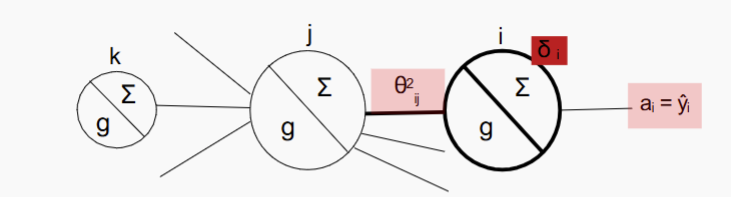

$$
\Delta \theta_{ij}^2 = \eta \, \delta_i \, a_j
$$

$$
\delta_i = (y - a_i) \, g'(z_i)
$$

- The weight update corresponds to an error term ($\delta_i$) scaled by the incoming activation

- The above $\delta_i$ can only be applied to **output units**, because it relies on the **target outputs** $y$

- Instead, we **backpropagate** the errors ($\delta$s) from right to left through the network

$$
\theta_{jk}^{1} \leftarrow \theta_{jk}^{1} + \Delta \theta_{jk}^{1}
$$

- Derivation of the update:

$$
\Delta \theta_{jk}^{1} = -\eta \frac{\partial E}{\partial \theta_{jk}^{1}}
= \eta (y - a_i) \frac{\partial a_i}{\partial \theta_{jk}^{1}}
= \eta (y - a_i) \frac{\partial g(z_i)}{\partial \theta_{jk}^{1}}
$$

$$
= \eta (y - a_i) g'(z_i) \frac{\partial z_i}{\partial \theta_{jk}^{1}}
= \eta \delta_i \frac{\partial z_i}{\partial \theta_{jk}^{1}}
$$

- Recall:

$$
\delta_i = (y - a_i) g'(z_i)
$$

- Continue with the chain rule:

$$
\frac{\partial z_i}{\partial \theta_{jk}^{1}} = \theta_{ij}^{2} g'(z_j)
$$

- Final form:

$$
\Delta \theta_{jk}^{1} = \eta \delta_i \theta_{ij}^{2} g'(z_j) \frac{\partial z_j}{\partial \theta_{jk}^{1}}
$$

- Where:

$$
z_i = \sum_j \theta_{ij}^{2} a_j = \sum_j \theta_{ij}^{2} g(z_j)
$$

### Back Propagation algorithm
- Forward passing
- Compute error
- Propagate back through the network 
$$
\Delta \theta_{ij}^{\ell} = -\eta \frac{\partial E}{\partial \theta_{ij}^{\ell}} = \eta \delta_i a_j
$$

- Update all parameter at once
$$
\theta_{ij}^{\ell} \leftarrow \theta_{ij}^{\ell} + \Delta \theta_{ij}^{\ell}
$$

## Summary Question
- Estimation of the MLP parameters
- How we use Gradient Descent to op:mize the parameters
- How Backpropaga:on is a special instance of gradient descent, which
allows us to efficiently compute the gradients of all weights wrt the
error (by reusing the δs)

