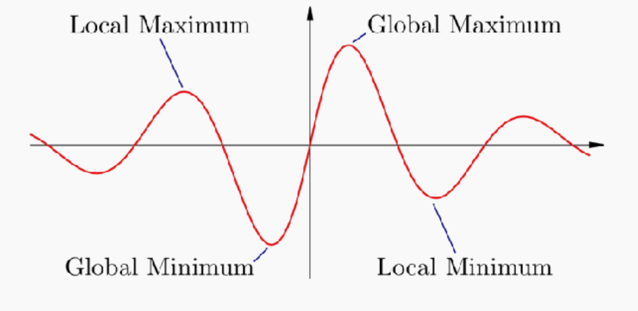
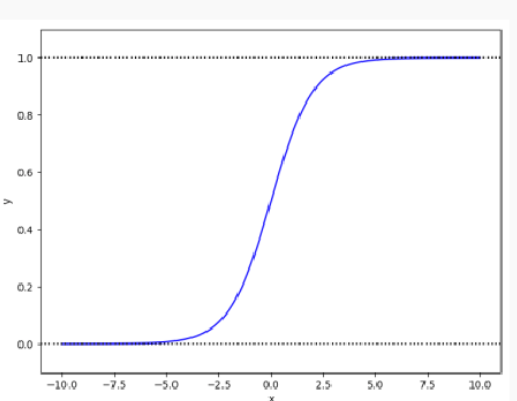
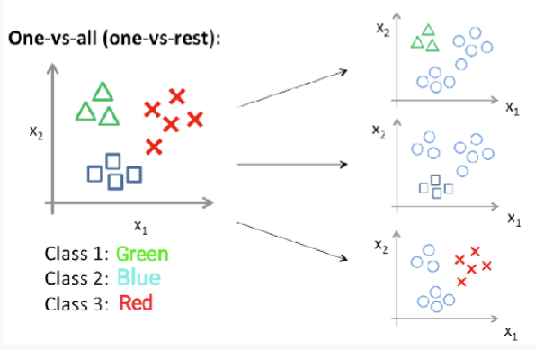

# Linear Regression
- Target dependent $y$'s relations with independent variable $X_i$ \\\
$y = f(\mathbf{X}) = \beta_0 + \beta_1 x_1 + \cdots + \beta_D x_D 
= [\beta_0, \beta_1, \dots, \beta_D] 
\cdot 
\begin{bmatrix}
1 \\
x_1 \\
\vdots \\
x_D
\end{bmatrix}
= \vec{\beta} \cdot \vec{X}$

### Training a model
- to find the optimal line, we minimize the **mistakes**
- where mistake = $y_i - \hat{y}_i =\epsilon_i$
- is called a **loss function**

### Loss Functions
- Residuals Sum of Squares (RSS)
- Mean Squared Error (MSE)
- Mean Absolute Error (MAE)
- Root Mean Squared Error (RMSE)
- And more

### Using regression
- Once we compute the $\beta s$, we can use that to predict future y with the formula.
- Only predict with x's within observed ranges
- Should not try to extrapolate beyond the range of

### Assumptions
- The relationship is linear
- independent variables (x) are not highly correlated with each other, otherwise become unstable

### Optimisation
- we want to find the extreme points
- the maximum $\hat{\theta} = \arg\max_{\theta} f(\theta)$
- the minimum, or the loss function $\hat{\theta} = \arg\min_{\theta} f(\theta)$

- Finding extreme points, we calculate the derivative $\frac{\partial f}{\partial \theta}$
- let derivative = 0, then replace the $\theta$ into original formular and find the extreme point.

#### Log optimization
- first log the equation
- derivative
- result in a form of $x/\theta$ or something similar

### Mean Squared Error MSE
- $\text{MSE} = \frac{1}{n} \sum_{i=1}^{N} (y_i - \hat{y}_i)^2 
= \frac{1}{n} \sum_{i=1}^{N} (y_i - \boldsymbol{\beta} \cdot \mathbf{x}_i)^2$

# Gradient descent
- Often, there is no closed-form solution exist
- Need **iteratively** improve estimation of $\hat{\theta}$ until reach a satisfied solution
- **Gradient descent** is one popular method

### Step
- follow the curvature step by step along the steepest way
- Intuition
    - Descending a mountain as fast as possible: at every position take the next step that takes you most directly into the valley
    compute $\theta^{(1)},\theta^{(2)},\theta^{(3)}...$ by walking along the way with the steepest local scope.
    - each solution depend on current location
- Details
    - learn the model parameter $\theta$
        - minimize the error
        - traverse over the loss function step by step
        - $\theta <- \theta + \triangle\theta$
        - $\triangle\theta$ is the derivative $\delta f/\delta\theta$
        - tells us how much f change in response to change in $\theta$
        - a measure of the slope or gradient of a function f at point $\theta$
        - the gradient points to the greatest increase of a function
- $\theta^{t+1} = \theta^t - \eta \frac{\partial f}{\partial \theta^t}$ where $\eta$ is the learning rate. loop through this function until reachs $\delta f/\delta\theta = 0$

- For multiple parameters 
    - compute partial derivatives of $f(\theta)$ with individual $\theta_i$
    - partial derivative measure change in a function of multiple parameters given a change in a single parameter, with all others held constant
    - for exmaple $f(\theta_1,\theta_2)$ -> $\delta f/\delta\theta_1$ and $\delta f/\delta\theta_2$
    - then update each one individually with \\\
    $\theta_1 \leftarrow \theta_1 + \Delta \theta_1 
    \quad \text{with} \quad \Delta \theta_1 = -\eta \frac{\partial f}{\partial \theta_1}$ and \\\
    $\theta_2 \leftarrow \theta_2 + \Delta \theta_2 
    \quad \text{with} \quad \Delta \theta_2 = -\eta \frac{\partial f}{\partial \theta_2}$

- Potential Problem
    - local maxima and minima
    
- Guarantees
    - find global minimum for differentiable convex functions
    - find local minimum for differentiable non-convex functions

# Logistic Regression
- A binary classifier
- probablistic discriminative model as it optimize $P(Y|X)$ directly
- Learns to optimally discriminate between features that belong to different classes 
- No model of Likelihoods $(P(x|y ))$ → no conditional feature independence assumption

### Operation
- Assume a binary classification task
- model prob $P(y=1/x;\theta) =p(x)$ as function of observations x under parameter $\theta$
- want to use a regression approach
    - failed approach of $p(x)$ as linear
    - $log(p(x))$ as linear
    - due to prob not bound between 0 and 1
- Use logistic function (sigmoid) instead

- Odds = $P(x)/1-P(x)$
- then apply log to odds with $z = log(p(x)/1-p(x))$ with $-\infty < x < +\infty$ and $0 < P(x) < 1$
- inverse and solve $P(x) = \frac{e^z}{1 + e^z} = \frac{1}{1 + e^{-z}}$
- As $\text{logit}\, P(x) = \log \left( \frac{P(x)}{1 - P(x)} \right)= \theta_0 + \theta_1 x_1 + \cdots + \theta_F x_F 
= \boldsymbol{\theta} \cdot \mathbf{x}$ 
rearrange and get 
$P(x) = \frac{e^z}{1 + e^z} = \frac{1}{1 + e^{-\theta \cdot x}}$
- $\theta \cdot x > 0$ -> y =1
- $\theta \cdot x = 0$ -> y =uncertain
- $\theta \cdot x < 0$ -> y =0

- therefore a threshold, if $P(y=1|X,\theta) > 0.5$, we define y =1

### How do we find $\theta$
- minimize loss function

$\mathcal{L}(\beta) = -\mathbb{P}(Y \mid \mathbf{X}, \boldsymbol{\theta}) 
= - \prod_{i=1}^{N} \mathbb{P}(y_i \mid \mathbf{x}_i, \boldsymbol{\theta})$ 

$= - \prod_{i=1}^{N} \left( \sigma(\boldsymbol{\theta} \cdot \mathbf{x}_i)^{y_i} 
\left( 1 - \sigma(\boldsymbol{\theta} \cdot \mathbf{x}_i) \right)^{1 - y_i} \right)$

$\hat{\boldsymbol{\theta}} = \arg\min_{\boldsymbol{\theta}} 
\left( - \prod_{i=1}^{N} \sigma(\boldsymbol{\theta} \cdot \mathbf{x}_i)^{y_i}
\left( 1 - \sigma(\boldsymbol{\theta} \cdot \mathbf{x}_i) \right)^{1 - y_i} \right)$
 
then take log
$\log(\mathcal{L}(\boldsymbol{\theta})) = 
\sum_{i=1}^{N} \left[
y_i \log(\sigma(\boldsymbol{\theta} \cdot \mathbf{x}_i)) +
(1 - y_i) \log(1 - \sigma(\boldsymbol{\theta} \cdot \mathbf{x}_i))
\right]$

### Using Logistic Regression in a Multiclass Classification
- One-vs-all (One-vs-rest) Classification:
    - In this approach, we train a separate binary logistic regression
    classifier for each class. Each classifier distinguishes one class from all other classes

- Sotmax Regression (Multinomial Logistic Regression)
    - Softmax regression is an extension of logistic regression for
    multiclass classification. It generalizes the binary logistic
    regression model to handle multiple classes simultaneously.
    $\sigma(y = j \mid \mathbf{x}, \boldsymbol{\theta}) = 
\frac{e^{\boldsymbol{\theta}_j \cdot \mathbf{x}}}
{\sum_{i=1}^{f} e^{\boldsymbol{\theta}_i \cdot \mathbf{x}}}$

### NB vs Logistic Regression
- NB , generative model
    - learns the distribution of
    features for dogs and cats

- Logistic Regression
    - only learns to distinguish the
classes (without learning much
about them)

## Summary
- Pros
    - Probabilistic interpretation
    - No restrictive assumptions on features
    - Often outperforms Naive Bayes
    - Particularly suited to frequency-based features (so, popular in NLP)
- Cons
    - Can only learn linear feature-data relationships
    - Some feature scaling issues
    - Often needs a lot of data to work well
    - Regularisation a nuisance, but important since overfitting can be a big problem
