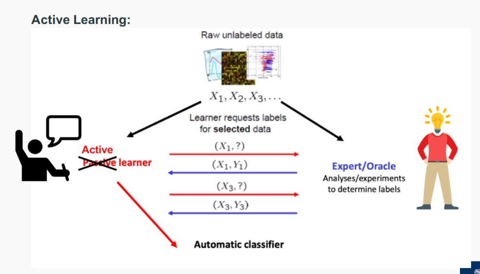

# Semisupervised learning
- Self-training
- Active-learning
- Data Augmentation
- Pretraining and fine-tuning
  

- Semi-supervised learning is learning from both labelled and unlabelled
data
  - Semi-supervised classification:
  - L is the set of labelled training instances $\{x_i ,y_i\}_{i=1}^l$
  - U is the set of unlabelled training instances $\{x_i\}_{i=l+1}^{i+u}$
  
  - Often U ≫ L
  
  - Goal: learn a better classifier from L ∪ U than is possible from L
  alone
- For example, find clusters, choose a label for each (most
common label?) and apply it to the unlabelled cluster members

## Self-training (Bootstrapping)
- Assume you have L labelled and U unlabeled training instances
- Repeat
  - Train a model f on L using any supervised learning method
  - Apply f to predict the labels on each instance in U
  - Identify a subset of U with “high confidence” labels
  - Remove them from U and add them to L with the classifier
  predictions as the “ground-truth”
  - Until L does not change

### Self-Training Assumptions
- Propagating labels requires some assumptions about the distribution of labels
over instances:
  - Points that are nearby (similar) are likely to have the same label
- Classification errors can propagate
- Solution: Keep a kind of safety net...
  - Don’t add to the “labelled” pool if the classification confidence
    falls below a threshold
    In 1-NN, the nearest neighbour
    distance is less than $\gamma$

## Active Learning

- Active learning builds on the hypothesis that a classifier can achieve
higher accuracy with fewer training instances if it is allowed to have
some say in the selection of the training instances
- The underlying assumption is that labelling is a finite resource, which
should be used in a way that optimises machine learning effectiveness
- Active learners pose queries (unlabelled instances) for labelling by an
oracle (e.g. a human annotator)

### Query strategies:
1. Uncertainty Sampling
   - Least confidence
   - Margin Sampling
   - Entropy Sampling
2. Query by Committee (QBC)

- Uncertain Sampling:
    Select the instances for which the model is least confident in its predictions.
    - Least Confidence: Choose samples with the smallest predicted
    probability for the most likely class
    $$
    x = \arg\min_x \left( \max_y P(y \mid x) \right)
    $$
    - Margin Sampling: Choose samples where the difference
    between the top two predicted class probabilities is smallest:
    $$
    x = \arg\min_x \left( P(y_1 \mid x) - P(y_2 \mid x) \right)
    $$
    - Entropy sampling: Select the sample with the highest prediction
    entropy
    $$
    x = \arg\max_x \left( -\sum_y P(y \mid x) \log P(y \mid x) \right)
    $$

- Query by Committee (QBC)
  - If the committee disagrees on an instance, the model is uncertain and
    would benefit most from seeing the true label.
  - You maintain a committee (i.e. a set) of models, all trained on the same
  labelled data but in different ways.
  - For each unlabelled instance, the committee votes on the predicted
  label.
  - The instance with the most disagreement among the committee
  members is selected for labelling

- Vote Entropy

    Measures uncertainty based on how spread the votes are among labels:

    $$
    H_{\text{vote}}(x) = -\sum_y \frac{V_y(x)}{C} \log \left( \frac{V_y(x)}{C} \right)
    $$

    **Where:**

    - $V_y(x)$ = number of votes for label $y$
    - $C$ = total number of committee members

### Summary
- Active learning is used increasingly widely, but must be handled with some
care:
  - Empirically shown to be a robust strategy, but a theoretical justification
  has proven elusive
  - Active learning introduces bias: data with predicted labels no longer
  follows the true label distribution
  - Strategies like uncertainty sampling can select outliers or noise

## Data Augmentation
- There are various ways to expand a labelled training dataset
- General: re-sampling methods
- Dataset-specific: add artificial variation to each instance, without
changing ground truth label

### General Data Augmentation
- Bootstrap sampling: create “new” datasets by resampling existing data,
with or without replacement
- Cross validation / repeated random subsampling are based on the same
idea
- Each “batch” has a slightly different distribution of instances, forces
model to use different features and not get stuck in local minima
- Also, common in perceptron and neural network training
(“mini-batch”,“batch size”), methods that involve stochastic gradient
descent

### Problem-specific Data Augmentation
- add a small amount of “noise”
  - Images: adjust brightness, flip left-right, shift image up /down / left /
  right, resize, rotate
  - Audio: adjust volume, shift in time, adjust frequencies
  - Text: synonym substitution

### Pros
- More data nearly always improves learning
- Most learning algorithms have some robustness to noise

### Cons
- Biased training data
- May introduce features that don’t exist in the real world
- May propagate errors
- Increases problems with interpretability and transparency

## Unsupervised Pre-training
- Deep Learning 
  - Better models (recurrent models, convolutional, activation functions, ...)
  - Bags of tricks (dropout, mini-batching, layer normalization, ...)
  - More powerful machines (GPUs)
  - More data – but we cannot label it all!

    - Pre-train (reusable) parameters on some unsupervised (self-
    supervised) task
    - Use the pre-trained weights to initialise your model
    - Fine-tune the final model on a (usually) supervised target task.

### BERT 
- (Bidirectional Encoder Representations from
Transformers) is a pretrained language model
developed by Google that understands text by looking
at both left and right context simultaneously.
- BERT is trained with
  - Masked Language Modelling (MLM): Predict missing words in a
    sentence.
    "The cat [MASK] on the mat."
  - Next Sentence Prediction (NSP): Predict if one sentence follows another.
- Fine Tuning BERT
  - You take the pretrained BERT model.
  - You add a classification layer on top (e.g., softmax for
    positive/negative).
  - You fine-tune the whole model on a small labelled dataset (e.g.,
    movie reviews).
  - The model quickly adapts, since it already knows how to "read"

## Summary Question
- What is semi-supervised learning?
- What is self-training, and how does it operate?
- What is active learning?
- What are the main sampling / query strategies in active learning?
- Pre-training in modern deep learning