# Unsupervised
- fully unlabelled data
- some examples
    - PCA
    - Clustering
    - Anomaly detection
    - Associate rule mining

## Clustering
- learn the structure from the data alone
- But you usually bring your own assumptions about what kind of
    structure you expect in the data
    - Exclusive vs. Overlapping
        
    - Deterministic vs. Probabilistic (Hard vs. Soft clustering)
    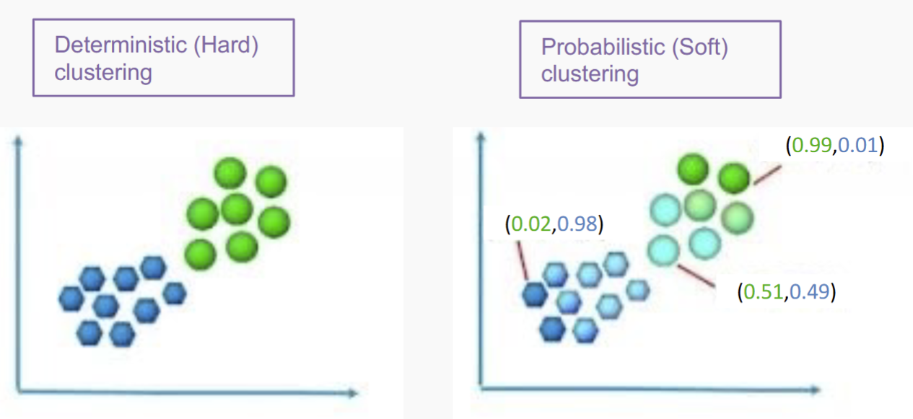
    - Hierarchical vs. Partitioning
    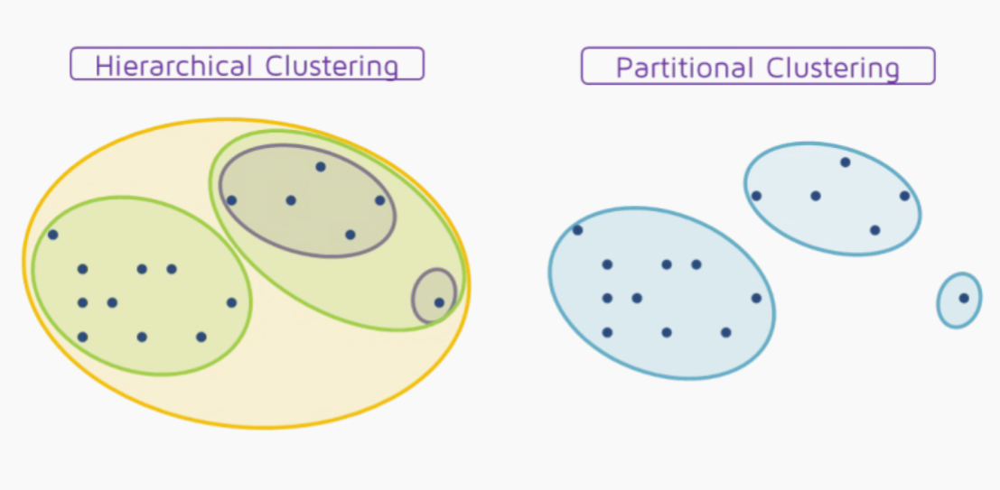
    - Partial vs. Complete
    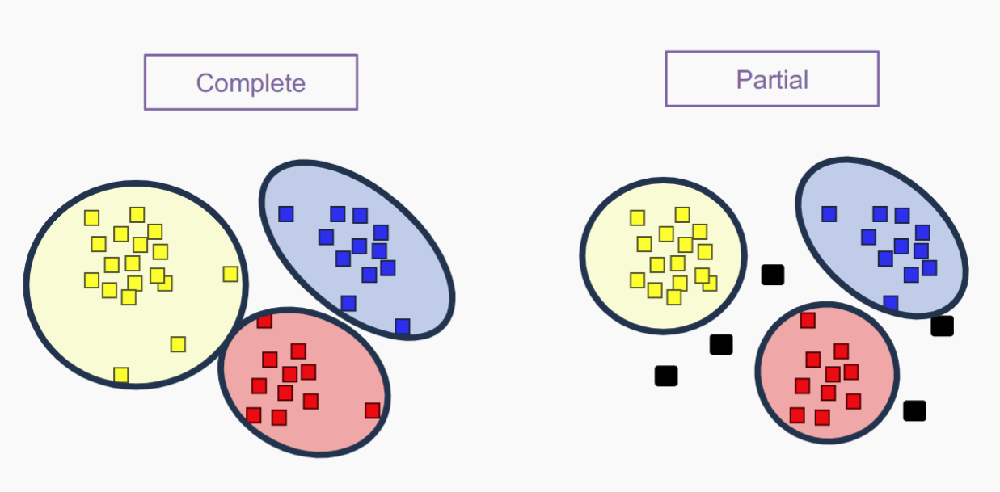
    - Heterogeneous vs Homogeneous
    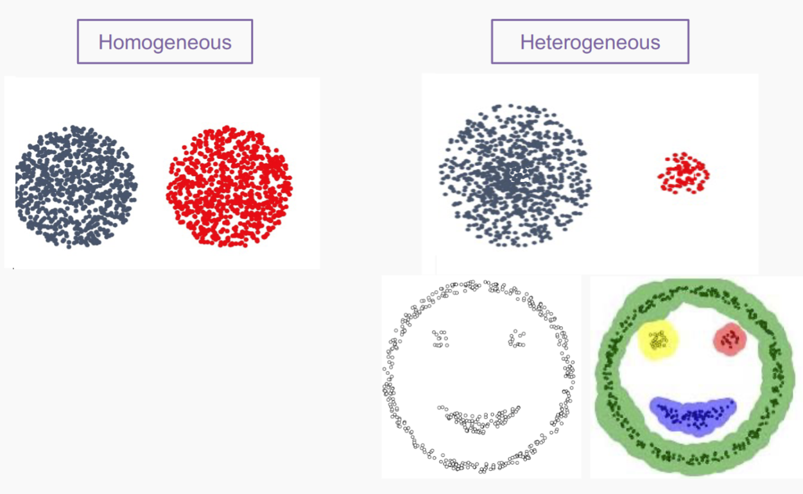

-**K-means** clustering
- **Agglomerative** clustering
- **Warn** Normalise attribute as most cluster are based on **distance**

### Good Clustering
- Cluster cohesion (compactness, tightness)
    - Intra-cluster distance: distances between instances inside each
    cluster
- Cluster separation (isolation, distinctiveness)
    - Inter-cluster distances: the degree to which clusters are distinct
    or well-separated from each other
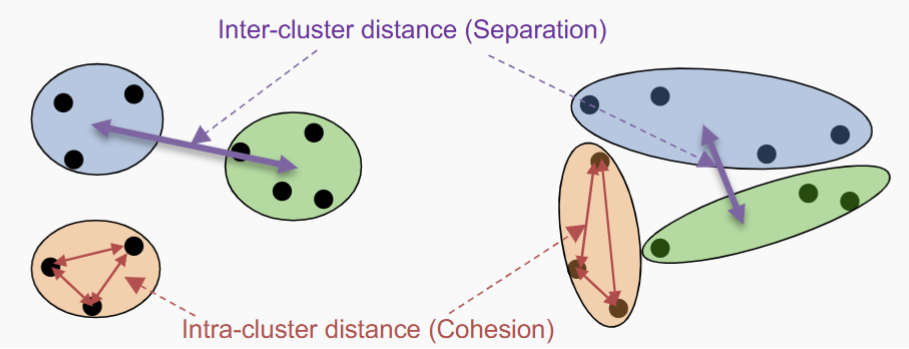

- A “good” cluster should have one or both of:
    - High cluster cohesion:
        - instances in a given cluster should be closely related to each
        other (Intra-cluster distances are minimized) aka **Within-cluster Sum of Squares** (WCSS)
    - High Cluster Separation:
        - instances in different clusters should be distinct from each
        other (Inter-cluster distances are maximized) aka **Between-cluster Sum of Squares (BCSS)**
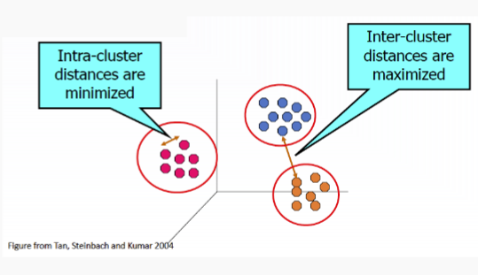

- Within-cluster Sum of Squares (WCSS): the sum of the squared
distance between each point and the centroid in a cluster (Cluster
Cohesion)
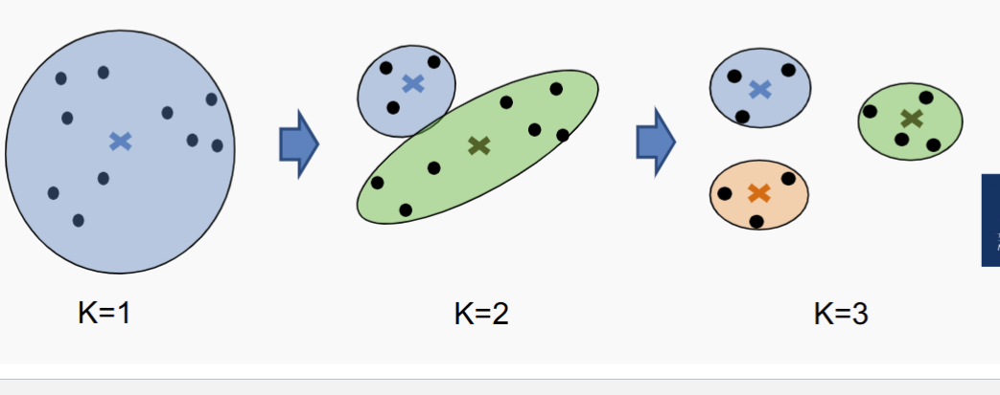

### K-means 
- K-Means is an exclusive, complete and partitioning
clustering method.
- It aims to create **compact** and **spherical** clusters.
K-means Clustering Algorithm
- Process
    - Randomly pick K points
    - Repeat 
        - Assign each instance to the cluster with the nearst **centroid**
        - Recompute the **centroid** of each cluster
    - Until the centroids don’t change (or until changes are smaller
    than a threshold, or until relatively few points change clusters)

- Limitations
    - “mean” is ill-defined for categorical attributes
    - Sensitive to outliers: outliers can significantly affect the
    position of cluster centroids and distort the clustering results.
    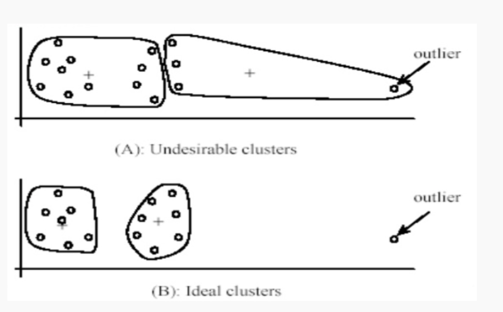
    - Sensitive to Initial Centroids: Different initializations can result in
    different outcomes, prone to converging to suboptimal solutions.
    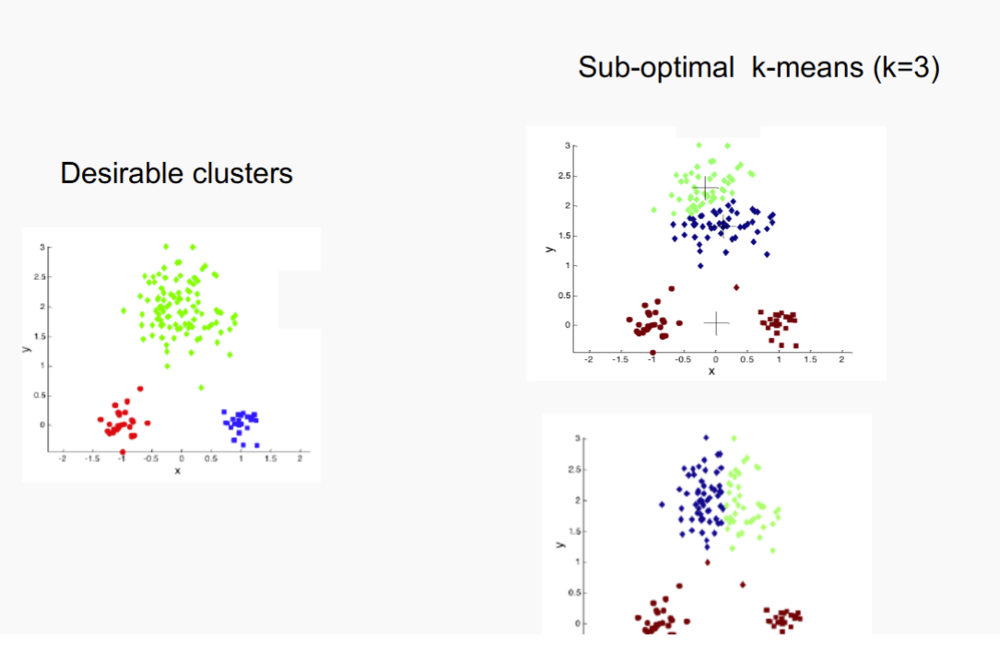
    - Not able to handle non-spherical clusters
    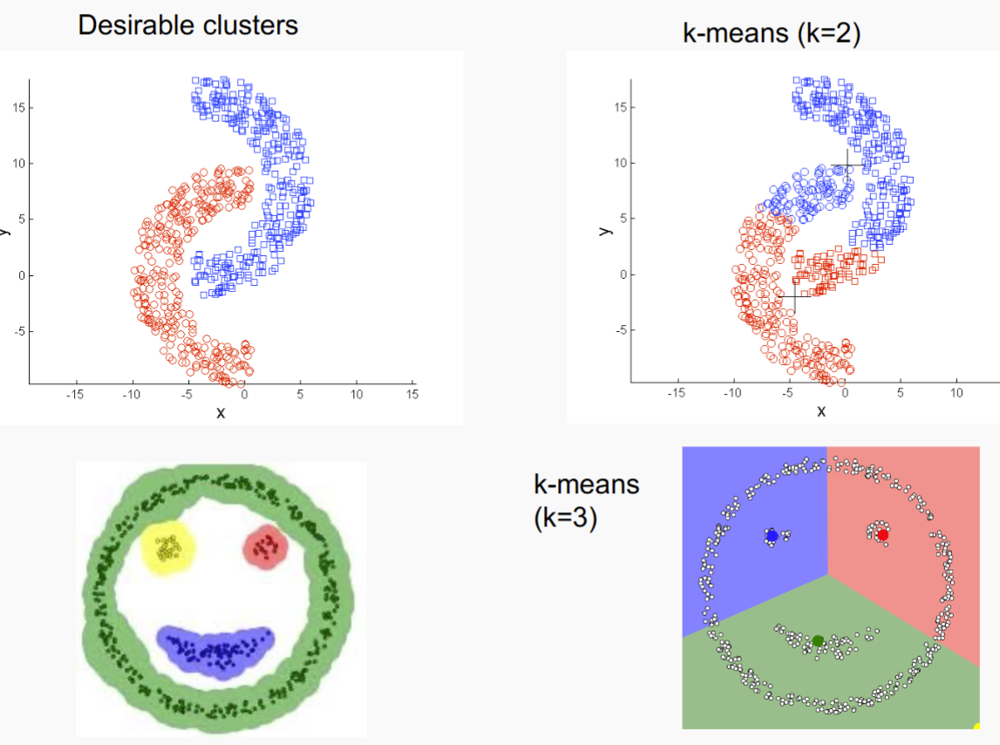
    - Not able to handle clusters of differing sizes
    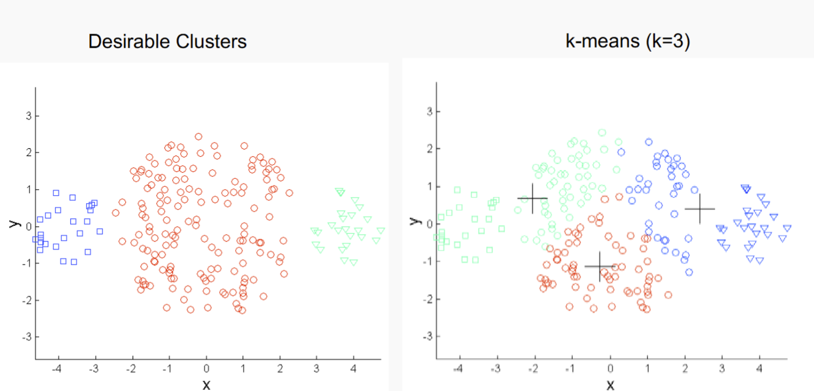
    - Not able to handle clusters with different densities
    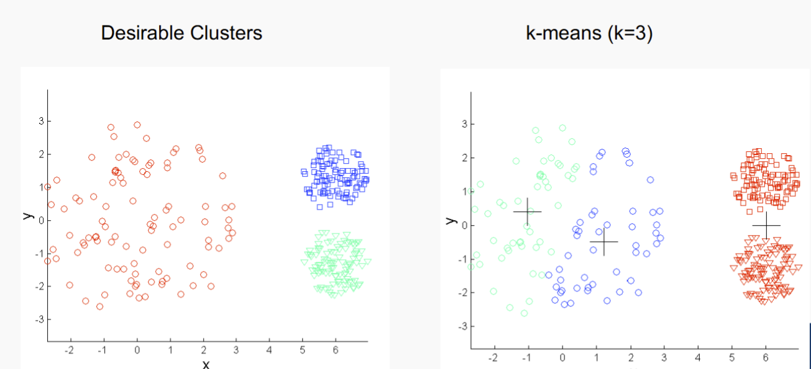
    - Requires Predefined Number of Clusters (K)
- Strength
    - Simplicity: straightforward and easy-to-understand algorithm.
    - Scalability: computationally efficient and can converge
    relatively quickly. Suitable for clustering tasks involving a large
    number of data points.
    - Interpretable Results: Clusters can be easily interpreted and
    visualised.
    - Applicability: K-means is applicable to a wide range of
    clustering tasks (often good enough).
    - It is effective in cases where the underlying clusters are
    spherical in shape and when the data points are well-separated.

- How to find K
    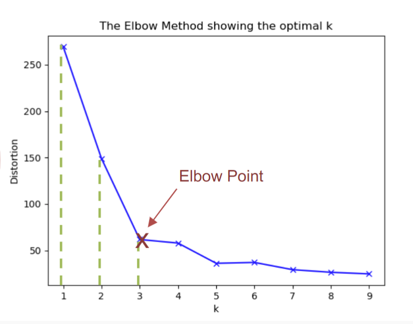
    - For each cluster, calc WCSS
    - plot the value
    - find elbow point
    - choose K
    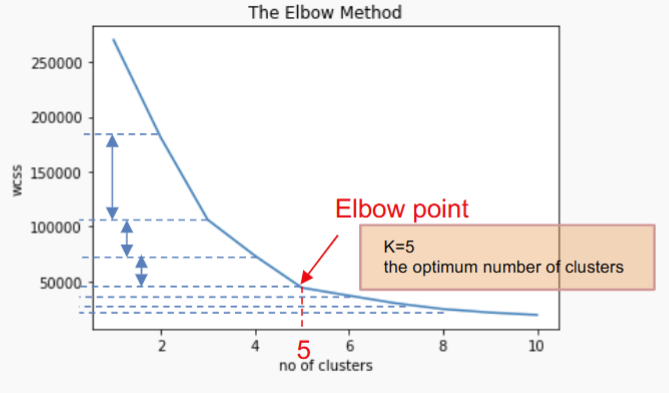

### Hierarchical Clustering
- Produces a set of nested clusters organized as a hierarchical tree
- Can be visualized as a dendrogram
    - A tree like diagram that records the sequences of merges
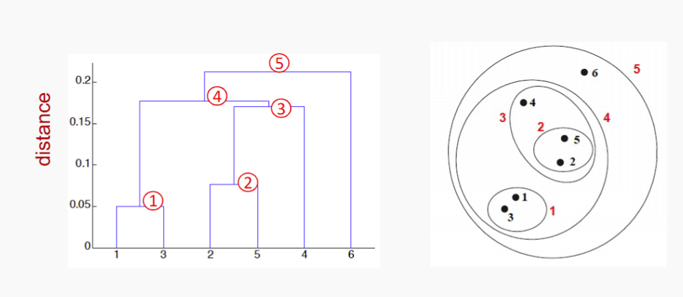

- Agglomerative (Bottom-up) clustering
    - Start with the points (instances) as individual clusters
    - At each step, merge the closest pair of clusters until
    only one cluster (or k clusters) left

- Divisive (Top-down) clustering:
    - Start with one, all-inclusive cluster
    - At each step, split a cluster until each cluster contains
    a point (or there are k clusters)

- These hierarchical algorithms use a **dis-similarity** or **distance matrix** or **proximity matrix** to merge or split **one cluster at a time**

### Agglomerative (Bottom-up) clustering
- Basic algorithm
    - compute dis-similarity matrix 
    - let each data point to be a cluster
    - Repeat
        - Merge two closest clusters
        - Update matrix
        - Until **Single** Cluster Remains

### Cluster Distance
- Single Linkage
    - Minimum distance
    - Distance between the closest members of the
    cluster
    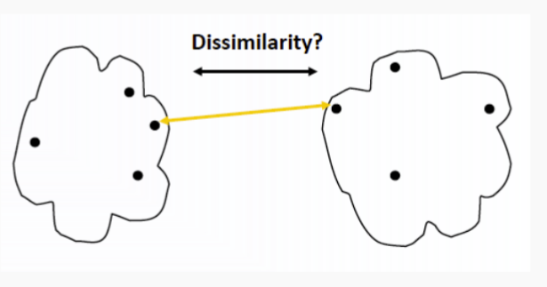

- Complete Linkage
    - Maximum distance
    - Distance between the furthest members of the
    cluster
    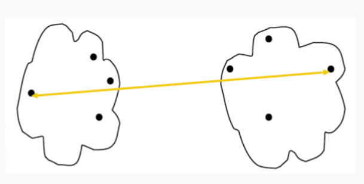
- Average Linkage
    - Sum the distance of all pairs from both clusters
    - calculate the average
    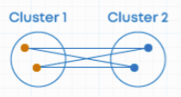
- Centroid Method
    

| Method             | Strength                                        | Weakness                                                       | Visual 1       | Visual 2       |
|--------------------|-------------------------------------------------|----------------------------------------------------------------|----------------|----------------|
| **Single Linkage**   | - Can handle non-spherical shapes               | - Very sensitive to noise and outliers                         | 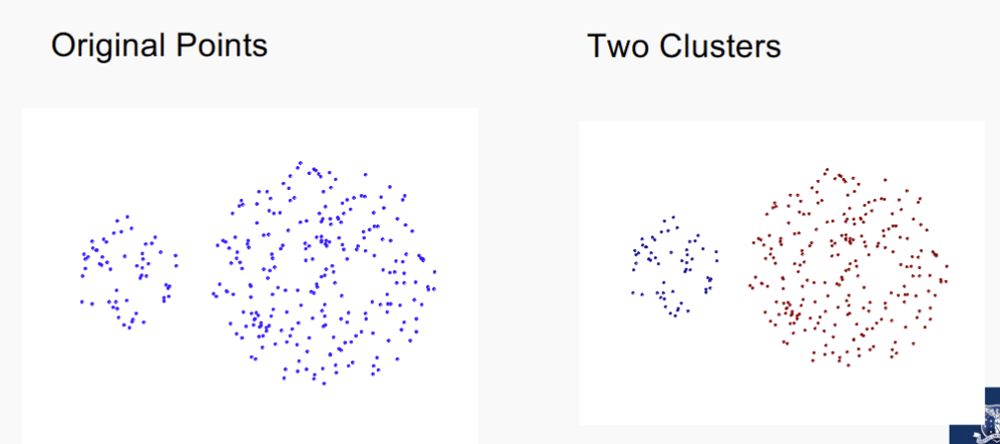               | 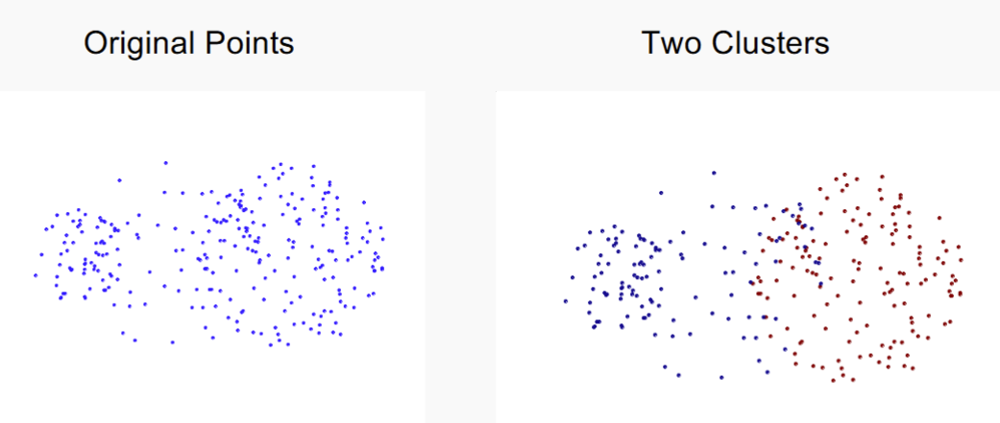               |
| **Complete Linkage** | - Less sensitive to noise and outliers          | - Tends to form spherical clusters and break large ones        |            |   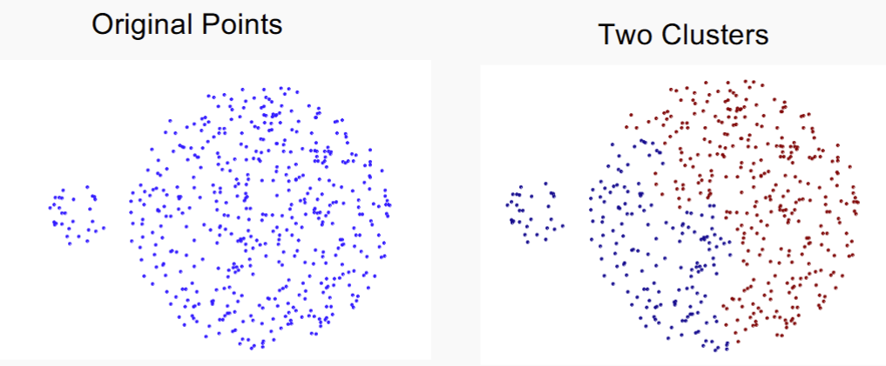                |
| **Centroid Linkage** | - Balances shape sensitivity and compactness   | - May give inconsistent merges due to drifting centroids       |               |                |

- Strength of Hierachical Clustering 
    - No assumption of any particular number of clusters
        - Any desired number of clusters can be obtained by ʻcuttingʼ
        the dendrogram at the appropriate level
    - No assumption of cluster shape
        - not assume specific shapes or distributions for the clusters.
        - can handle clusters of various shapes, sizes, and densities
    - They may correspond to meaningful taxonomies
        - Examples in biological sciences (e.g., animal kingdom,
        phylogeny reconstruction, ...)
- Weakness 
    - Once a decision is made to combine two clusters, it cannot be
    undone, i.e., an object that is in the wrong cluster will always
    stay there.
    - No objective function is directly minimised, i.e., no ‘relative’
    quality measure

### Clustering Metrics
- WCSS
$$
WCSS = \sum_{j=1}^{K} \sum_{x_i \in C_j} (x_i - \mu_j)^2
$$

    - **Where:**

    - $\mu_j$ = mean of data points in cluster $j$  
    - $K$ = number of clusters  
    - $x_i$ = data point assigned to cluster $j$
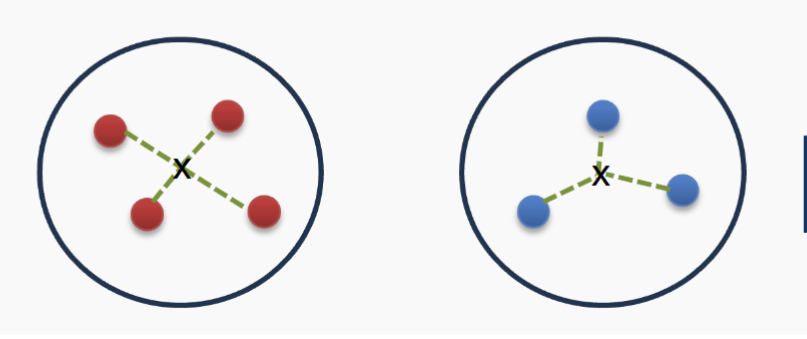

- WBSS
    $$
    BCSS = \sum_{j=1}^{K} n_j (\mu - \mu_j)^2
    $$

    - **Where:**

    - $\mu_j$ = mean of data points in cluster $j$  
    - $\mu$ = mean of all data points  
    - $n_j$ = number of instances in cluster $j$  
    - $K$ = number of clusters
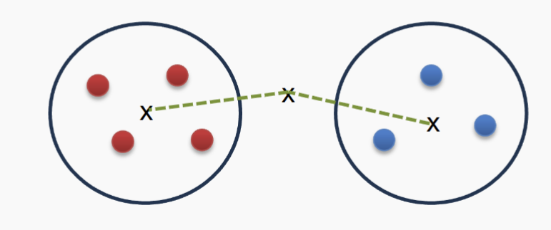

### Calinski-Harabasz Index (Variance Ratio Criterion)
- $CH = \frac{BCSS}{WCSS} * \frac{N-K}{K-1}$
- where N = instance K = Clusters 
- A high CH indicates a better clustering

## Supervised Clustering Metrics
- Measures the extent to which the clustering structure discovered by
a clustering algorithm matches the actual labels.
    - Homogeneity
    - Completeness
- Compare generated clusters to labels if provided

### Homogeneity 
- Whether each cluster contains only data points that are all from the
same class. Homogeneity checks if all the items in a cluster are the
same type.
$$
\text{homogeneity} = 1 - \frac{H(Y_{\text{true}} \mid Y_{\text{pred}})}{H(Y_{\text{true}})}
= 1 - \frac{H(C \mid K)}{H(C)}
$$
- Given a ground truth class C and a clustering K, homogeneity can
be defined as follows:
If the clustering is perfect and all points in one cluster have the
same class, $H(Y_{\text{pred}} \mid Y_{\text{true}})$ will be 0, and homogeneity will be 1

### Completeness

- Completeness measures whether **all data points of a particular class** are assigned to the same cluster.

- Given a ground truth class $C$ and a clustering $K$, completeness is defined as:

$$
\text{completeness} = 1 - \frac{H(K \mid C)}{H(K)}
= 1 - \frac{H(Y_{\text{pred}} \mid Y_{\text{true}})}{H(Y_{\text{pred}})}
$$

- If the clustering is perfect and all points from the same class are in the same cluster,  
then $H(Y_{\text{pred}} \mid Y_{\text{true}}) = 0$, and completeness will be **1**.

## Summary Question
- Unsupervised Learning
- Clustering
- K-Means
- Agglomerative
- Clustering Evaluation
    - Unsupervised evaluation metrics
    - Supervised evaluation metrics