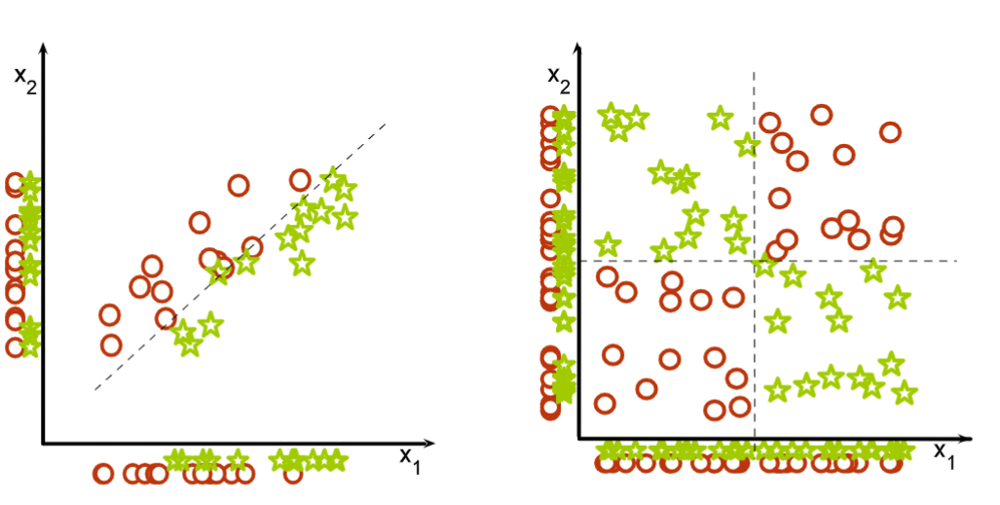

# Feature Selection
- For classify the data
- Choose model based on attributes
- Choose attributes based on model

### Goal
- main goal
    - Better performance according to some evaluation metric
- side goal
    - Seeing important features can suggest other important features 
    - Fewer features -> smaller models -> faster answer

### Selection
- Thousands to millons of low level features.choose the most relevant features to build better faster and easier to understand learning algorithms

## Nomanclature
- Univariate Method: considers one variable (feature) at a
time

- Multivariate Method: considers subsets of variables
(features) together

- Filter Method: ranks features (or feature subsets)
independently of the classifier.

- Wrapper Method: uses a classifier to assess features (or feature subsets)

### Univariate Method
- evaluate the goodness of each attribute
- independent of the model
- consider each attribute separately -> linear time in the number of attributes
- Good feature:
    - Well 'correlated' with the label, in the sense that it can predict (by itself) the label
    - “Correlated” is a loose term here as we will not only work with continuous values but also discrete values

- **Signal-to-Noise Ratio**
    - for continuous features
    - $S2N = \frac{\left| \mu_+ - \mu_- \right|}{\sigma_+ + \sigma_-}$  $\mu_+$ indicates $E[X]$ when $Y >0 $
    - select the class with high S2N value

- **Univariate Dependence**
    - Recall Independence $P(Y,Xi) = P(Y) P(Xi)$
    - Mutual Information $I(Y,X_i)$ measures the dependence, 
        - I = 0, independent
        - I > 0, dependent
    - select features with high I
- For continuous variables use
    - $I(Y, X_i) = \int_{-\infty}^{+\infty} \int_{-\infty}^{+\infty}
    P(Y, X_i) \log \left( \frac{P(Y, X_i)}{P(Y) P(X_i)} \right) \, dY \, dX_i$ 

- For discrete, use
    - $\hat{I}(Y, X_i) = \sum_{y \in \{-1, 1\}} \sum_{x_i = 1}^{k}
    \hat{P}(y, x_i) \log \left( \frac{\hat{P}(y, x_i)}{\hat{P}(y)\hat{P}(x_i)} \right)$ 
    - For this equation, the log() part is to check the independence, as $\left( \frac{\hat{P}(y, x_i)}{\hat{P}(y)\hat{P}(x_i)} \right) = 1$ and $log(1) = 0$ if they are independently 
    
    - $\hat{P}(y, x_i) = \frac{1}{n} \sum_{t=1}^{n} \delta(y, y_t) \cdot \delta(x_i, x_{it})$
    - $\hat{P}(y) = \frac{1}{n} \sum_{t=1}^{n} \delta(y, y_t)$
    - $\hat{P}(x_i) = \frac{1}{n} \sum_{t=1}^{n} \delta(x_i, x_{it})$
    - $\delta(a, b) =
    \begin{cases}
    1, & \text{if } a = b \\
    0, & \text{otherwise}
    \end{cases}$

- Mutual Information is another name for 
[Information Gain](DecisionTree.md#information-gain)

- Chi-Square $\Chi^2$ a statistical test used to determine if
there is a significant association between categorical
variables.
    - for classification tasks with categorical features

- ANOVA F-value: a statistical measure used to evaluate
the significance of individual features in a dataset
    - for classification tasks with continuous features. 

- Correlation-based Feature Selection (CFS)
    - Measures the
    correlation between each feature and the target variable.
    Features with a high correlation (in magninute) with the
    target are selected. (e.g., Pearson Correlation)

### Multivariate Method
- sometimes using single feature is not enough and need several features together allow for good decision boundary
- 

- Is complex choose each group as features, loop through each combination -> {},{$x_1$},{$x_2$},{$x_1,x_2$}
- Advantage
    - can find the feature set with optimal performance on validation data for the learner
- Disadvantage
    - Takes along time
    - Only practical with few features
- Subset Assessment
    - Split into train-validation-test
    - Until $Generalization Error < Validation Error+ \sqrt{C/n_{val}}$
    - see [Generalization Error]()
### Filter Method

- Criterion: Measure feature (or feature subset) “relevance”
with respect to label Y
- Search: Usually sort features (individual feature ranking or
nested subsets of features)
- Assessment: None directly, but might use cross-validation
to decide for the number of selected features

### Wrapper Method
- Criterion: Measure feature subset “usefulness” to predict
Y
-  Search: Search the space of all feature subsets. It trains a
new classifier for every candidate feature subset.
- Assessment: Use cross-validation

### Embedded Method
- Criterion: Measure feature subset “usefulness” to predict
Y
- Search: Search guided by knowledge from the classifier, to
avoid training a new classifier for every candidate feature
subset.
- Assessment: Use cross-validation
- Similar to wrappers, but less computationally expensive

### Forward Selection 
- Wrapper Style
    - Train a new classifier for every candidate feature to be added. $\frac{d(d+1)}{2}$in total
    - Advantage
        - Performs best when the optimal subset is samll
    - Disadvantage 
        - Running times: cycles can be slower with more attributes
        - Can converge to a sub-optimal or even bad solution
        - not feasible on large datasets

- Embedded Style
    - Uses knowledge from the classifier to evaluate candidate
    features to be added. Trains a new classifier only after adding a
    new feature. (𝑑 train-evaluate cycles in total.)

### Backward Elimination 
- Wrapper Style
    - Train a new classifier for every candidate feature to be removed.$\frac{d(d+1)}{2}$ in total
    - Advantage
        - Removes most irrevelant attributes at the start
        - Perform best when the optimal subset is large
    - Disadvantage 
        - Running times: cycles can be slower with more attributes
        - Can converge to a sub-optimal or even bad solution
        - not feasible on large datasets

### L1-Norm Regularization
- L0-Norm SVM 
- Model selection strategy: find the subset of features such
that the model is the best.
- Alternative strategy: Directly minimize the number of
features that an algorithm uses.
- Change the objective function in Support Vector Machines
to promote zero entries in θ:
- with formula
- $\min \sum_{j=1}^{d} \left( 1 - \delta(\theta_j, 0) \right)$ or $\min \|\boldsymbol{\theta}\|_0$
- This objective function is not continuous, thus not convex --> Introduce the L1-Norm that change it to a convex function that promotes zero entries in $\theta$

- L1-Norm SVM
- $\|\boldsymbol{\theta}\|_1 = \sum_{j=1}^{d} |\theta_j|$

## Summary Questions
- Various methods to perform feature selection: filter,
wrapper, embedded, regularization
- No method is universally better
- Pay attention to the complexity
- Feature selection is not always necessary to achieve good performance