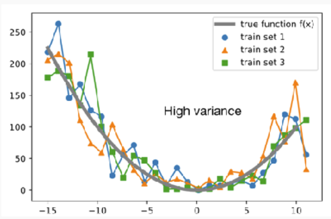
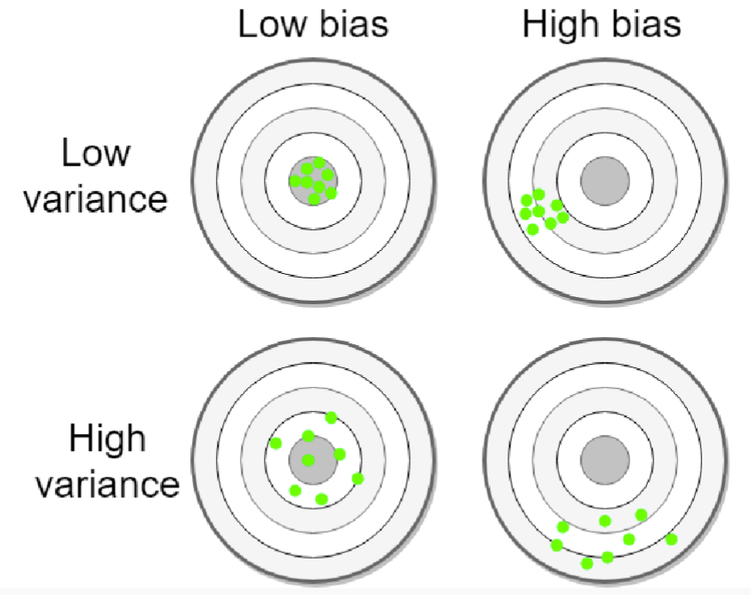

# Machine Learning Notes

---
## week1

# Machine Learning Concepts

### concept discriptions
- each example of data is called **Instance**
- each Instance have **Feature** or **Attributes**
- also have **Concepts**
- **Label** or **classes**

### Concept we aim to learn
- **Classification** -> (Y/N)
- **Regression** -> a specific value
- **Clustering** -> group similar data
- **Association Learning** -> some features may appear together

### Unsupervised learning
- Do not have access to an inventory of classes.
- Use un-labelled dataset to learn
- aim to discover hidden patterns, group or relationship in the data without target label

### advantage of unsupervised learning
#### Grouping of instances
- customer segmentation
- anomaly detection

#### Other methods
- Dimensionality reduction -> reduce number of features
- Market Basket Analysis -> products purchased together

### Clustering
- finding groups of items that are similar
- unsupervised
- Class is unknown or not passing to algorithm
- Success is often measured subjectively; evaluation is problematic

### Supervised
- Have prior knowledge of classes and set out to discover and categorise new instance
- Use labelled dataset to learn
- To predict a **label** or **numeric value**

### Classification
- Assign an instance a discrete class label
- Supervised
- providewith actual outcome or class
- provided with a set of classified training data
- Measure success on held-out data for which class labels are known

### Regression 
- The class is continuous
- numeric prediction
- can have infinitely labels for an instance
- correct when the numeric value is close to the true value

### Feature vector
- Assume a feature of fruit are Colour, Shape, Sweetness
- Apple = [red, round, medium], Orange = [orange, round, low]

### Feature Data Types
- Discrete
- Continuous

### Nominal (Categorical) Quantities
- Values are distinct
- == categorical or discrete
- boolean is a special case
- Can only perform **equality** test

### Ordinal Quantities
- explicit order
- no distance between the values, indicate some order but does not quantify the precise distance
- No addition or subtraction
- the distinction between Ordinal and Nominal is not always clear

### Numeric Quantities
- **real-value** attribute
- Scalar -> attribute distance
- All mathematical operations are allowed

### Algorithm <---> Attribute type
- Naive Bayes -> nominal or numeric
- Logistic/Linear Regression -> numeric
- Perceptron/Neural Networks -> numeric

- When meeting wrong attribute type, we can :
    - Select only attribute with correct type
    - Change the model assumptions to match the data
    - **Change attributes to match the model**

### Functions to convert
#### Nominal to Numeric
- Encoding
    - Pros
    - simplicity
    - space efficiency
    
    - Cons
    - Arbitrary Ordinal Relationships
    - Meaningless distance
- One-hot encoding
    - Problem
    - Increase dimensionality of feature space
    - Increase data sparsity -> tons of zeros
#### Numeric to Nominal
- Discretisation
    - group numeric values into a pre-defined set of distinct categories
    - -> map housing price to {high, medium, low}
    - Decide number of categories -> decide the boundaries

- Equal width Binning -> Make categories with same range
    - Pros
    - Simplicity
    - Interpretablity
    - Cons
    - Unequal Data Distribution

- Equal frequency Binning -> Group similar values
    - Pros
    - Robust to outliers
    - Preserve Data Distribution
    - Mitigate Sparse Intervals
    
    - Cons
    - Loss of Interpretablity
    - Can lead to inconsisitency
    - Information Loss

- Clustering -> use unsupervised machine learning to group the value
    - example -> K-means clustering

#### Numeric Feature Normalisation
- Features of vastly different scales can be problematic -> kilo/dollar or gram/dollar
- Feature standardisation -> normal scaling (x-U/sigma) -> mean = 0 and standard deviation = 1
- Feature Normalisation -> x' = (x-min/max-min) ->  0 < x < 1

### Prepare input
- Problem: different data sources -> different style, convention, time periods, data aggregation, keys, errors
- Data must be assembled, integrated, cleaned up

### Missing values
- missing values
- inter-dependent attributes

### out-range values
- unknown, unrecorded, irrelevant
- Reasons
    - Malfunctioning equipment
    - changes in experimental design
    - Collation of different datasets
- Most algorithm assume **missing on random**
- Some values may be significant like test in medical exam -> **Missing not at random**

#### Missing values 
- Miss on random -> Can not predict
- Miss not at Random -> Can have a rule to predict
- Disguised missing data -> Look for unusual or suspicious values in the dataset

### Simple imputation for numerical data
- Imputation -> methods to guess missing data
- Statistical Measurement Imputation -> simple strategies to fill out numerical data instance
    - Mean
    - Median
    - Mode
    - Pro: easy to compute, no loss for record
    - Con: biased other stats measures:
    - Variance
    - Standard Deviation

### Inaccurate Values
- Typographical errors
- In nominal attributes -> Values need to be checked for consistency
- In numerical -> Outliers need to be identified
- Errors may be deliberate -> not in the correct format

### Getting to know the data
- Simple visualisation tool
    - nominal -> histogram, numeric -> scatter plot
- 2-D, 3-D plot
- need to consult domain experts
- Take a sample for too much data

---
## Lifecycle

# Machine Learning Lifecycle

### BaseLine Model
- Zero-R (0-R)
- widely used as a baseline for classification study
- One-R

### Zero-R
- Predict all labels with the most frequent one

### One-R
- Use Only One feature to Predict
- Also a famous baseline model
- Choose the feature with least error rate

- This leads to
[Decision Tree](DecisionTree.md)

### Supervised lifecycle

---
## K-NN

# K- Nearest Neighbors

- K nearest neighbor = k closest stored data points
- K = 1 -> only take the very close neighbor

### Training
- store all training examples

### Testing
- Compute distance of test instance to all training data points
- Find the K neighbors
- Compute **target concept** of the test instance based on labels of training instances

- KNN Classification
    - Return the most common class label

- KNN Regression
    - Return the average value 

### Key questions
- How to represent each data point -> Feature vectors
- How to measure the distance  
- What if neighbors disagree
- How to select K

### How to represent each data point
- Feature vectors

### How to measure the distance
- convert nominal into numeric if need (one-hot) 
    -> Hamming Distance = difference in objects
    -> Simple Matching Distance = $d = 1-k/m$ (d:distance, k: matching, m: total)
    -> Jaccard Distance = Intersection over union d = $1 - (A \cap B/A \cup B)$
    -> Manhattan Distance = d = $\sum |Ai - Bi|$
    -> Euclidean Distance = d = $\sqrt(\sum(ai-bi)^2)$
    -> Cosine Distance = d = $1 - cos(a,b) = a \cdot b/|a||b| $

- Comparing Ordinal Feature Vectors
    - sort values and return a rank r
    - map ranks to evenly spaced value between 0 and 1
    - compute distance function for numeric features

### What if neighbors disagree
- Majority Voting
    Head count

- Inverse Distance
    $Wj = 1/Dj + e$ where $e = 1e-10$

- Inverse Linear Distance
    $Wj = (Dk-Dj)/(Dk-D1)$ where Dk is max and D1 is min

### How to select K

- Small K
    - Jagged decision boundary
    - we capture noise
    - lower classifier performance

- Large K
    - smooth decision boundary
    - danger of grouping together unrelated classes
    - also: lower classifier performance
    - what if K == N

Take the maximum point in the graph

### Breaking Tie
- Tied Distance
    - Arbitrarily choose one (e.g., lexicographically).

    - Choose the majority class among tied neighbors (if k > 1).

    - Add a random tie-breaking step (non-deterministic).

- Tied vote
    - Use odd values of k (e.g., 3, 5) to avoid ties in most cases.

    - Use weighted voting: closer neighbors get more vote weight.

    - Apply a deterministic tie-breaker, like prioritizing a specific class.

### Why KNN
- Pros
    - Intuitive and simple
    - No assumptions
    - Supports classification and regressino
    - No training: new data join > evolve and adapt immediately

- Cons
    - How to decide best distance
    - How to combine multiple neighbors
    - How to select K
    - Expensive with large dataset

--- 
## Future 
### Lazy Learning
- AKA Instance based learning
- Store training data
- fixed distance function
- fixed prediction rule
- compare test instances with stored instances
- no learning

### Eager Learning
- train a model with labelled data training instances
- generalize from seen data to unseen data
- predict labels for test instances

---
## Probs

# Probability revisit

### Very Basic
P(A=a) -> $0 <= P  <= 1 $

### Some formulas
- $P(A,B) = P(A \cap B)$

- $P(A|B) = P(A\cap B)/P(B)$

- $P(A,B) = P(A)*P(B)$ if A,B are independent

### Notation
- $P(A=x)$ indicates the likelyhood of A = x, also write as $P(x)$
- $P(A)$ shows the probability distribution, a histogram

### Rules
- independence
    - if $P(A,B) = P(A)*P(B)$
- disjoint events
    - $P(A \cap B) = \emptyset$ and $P(A or B) = P(A) + P(B)$
- product rule
    - $P(A \cap B) = P(A|B)P(B) = P(B|A)P(A)$
- chain rule
    - $P(A1\cap ... \cap An) = P(A1)P(A2|A1)P(A3|A2 \cap A1)...P(An|\cap ..Ai)$

- Bayes
    - $P(A|B) =P(A)P(B|A)/P(B)$ derived from $P(A|B) = P(A \cap B)/P(B)$ and $P(A \cap B) = P(A|B)P(B) = P(B|A)P(A)$

    - Bayes rule allow us to compute P(A|B) with known of P(B|A)

### Marginalization
- $P(A) = \sum_{b \in \mathbb{B}} P(A,B=b)$
- $P(A) = \sum_{b \in \mathbb{B}} P(A|B=b)P(B=b)$ 
- $P(A|C) = \sum_{b \in \mathbb{B}} P(A|C,B=b)P(B=b|C)$

### Probability Distributions
- Random Variable
    - Discrete Random Variable -> a countable number of distinct values
    - Continuous Random Variable -> infinite

### Gaussian Nromal Distribution
- two parameter
    - mean $\mu$
    - standard deviation $\sigma$
    - $P(A = x \mid \mu, \sigma) = \frac{1}{\sigma \sqrt{2\pi}} e^{-\frac{1}{2} \left( \frac{x - \mu}{\sigma} \right)^2}$

### Bernoulli Distribution
- a single trial with binary outcome

### Binomial Distribution
- a series of independent trials with only two outcomes
- $P(m, n, p) = \binom{n}{m} p^m (1 - p)^{n - m}$

### Multinomial Distribution
- The outcome of a series of trials where each trial can result in one of more than two possible outcomes
- $P(X_1 = x_1, X_2 = x_2, \dots, X_n = x_n; \mathbf{p}) =
\frac{(\sum_i x_i)!}{x_1! \cdots x_n!} \, p_1^{x_1} p_2^{x_2} \cdots p_n^{x_n}
= \frac{(\sum_i x_i)!}{x_1! \cdots x_n!} \prod_i p_i^{x_i}$

### Categorical Distribution
- events result from a single trial with more than two possible outcomes
- e.g rolling a fair-dice face **once** and the probability observing a five

### Relation with Machine Learning
- Uncertainty
- Model features as following certain **probability distributions**
- Soft predictions

### Probabilistic Models
- allow us to reason about random events in a principled way.
- allow to formalise hypotheses as different types of probability distribution

### Maximum Likelihood Estimate MLE
- $\hat{\theta} = \arg\max_{\theta} \, p(X = x; \theta, N)$
- Use known X to pick $\theta$
- With picked $\theta$, we can predict unseen X

### Maximum Posteriori Estimate
- $\hat{\theta} = \arg\max_{\theta} \, P(\theta) P(x \mid \theta)$

---
## Naive_Bayes

# Naive Bayes
- A supervised learning algorithm
- Recall probability and product rule
- $P(x, y) = P(y \mid x) P(x) = P(x \mid y) P(y)$
- $P(y \mid x) = \frac{P(x \mid y) P(y)}{P(x)}$

- To make it more feasible, we come up with 
$P(x_1, x_2, \dots, x_M \mid y) P(y) 
\approx P(x_1 \mid y) P(x_2 \mid y) \cdots P(x_M \mid y) P(y) \\
= P(y) \prod_{m=1}^{M} P(x_m \mid y)$

### Conditional Independence Assumption
- Where each features are assumed to be independent
- Intuitively: if know the class of email is spam, then none of the words depend on their surronding words

### Complete Naive Bayes Classifier
- $\hat{y} = \arg\max_{y \in \mathcal{Y}} P(y) P(x_1, x_2, x_3, x_4, \dots, x_n \mid y) \\
= \arg\max_{y \in \mathcal{Y}} P(y) \prod_{m=1}^{M} P(x_m \mid y)$

- features are conditionally independent given the class
- Instances are independent on each other
- The distributino in test data is same as in training data

### Smooth Categorical features
- The problem with unseen features
- If any $P(Xm|y) = 0$, then $P(y|x) = 0$
- But it is possible in real life, not all combinations stored in train dataset
- A single zero renders many additional meaningful observations irrelevant
- Solution
    - No event is impossible
    - add a small and positive value to every unseen class-feature combination
    - readjust the remaining model parameters to maintain valid probabilty distribution

### Epsilon smoothing
- if a 0 is observed, replace with a small $\epsilon$
- $\epsilon < 1/N $
- Effectively it reduces most comparisons to the cordinality of $\epsilon$ 

### Laplace Smoothing
- add a pseudocount $\alpha$ to each feature count observed during traning
- $\alpha$ is a parameter, usually = 1
- $P(x_m = j \mid y = k) = 
\frac{\alpha + \text{count}(y = k, x_m = j)}
{M\alpha + \text{count}(y = k)}$ where M is the number of values m can take
- Probability change drastically when dataset is small, minor otherwise
- Reduce Variance because reduce sensitivity to individual observations in dataset
- adds bias to the NB classifier, no longer have a true maximum likelihood estimator

### Maximum likelihood calculation
- Categorical Naive Bayes
    - Parameter $\phi$ of the Categorical distribution over class labels are the relative frequencies of classes observed in training data
    $\space$ $\phi_y = \frac{\text{count}(y)}{N}$
    - Parameter $\psi$ of the Categorical distribution over features given a class label are the observed relative frequencies of (class,label) among all instances with that class
    $\psi_{y,m} = \frac{\text{count}(y, m)}{\text{count}(y)}$

    - These parameters maximize the probability of the observed dataset. They are the maximum likelihood estimator of $\phi and \psi$

- Gaussian Naive Bayes

    - For each class y and each feature $x_m$ , we learn an individual Gaussian
    distribution parameterized by a mean $μy,m$ and a standard deviation $σy,m$

    - Mean:  
    The average of all observed feature values for \( x_m \) under class \( y \):

    $\mu_{y,m} = \frac{1}{\text{count}(y)} \sum_{i : y_i = y} x_m^i $

    - Standard deviation:  
    Sum of squared differences of observed values from the mean, normalized, and square rooted:

    $\sigma_{y,m} = \sqrt{ \frac{ \sum_{i : y_i = y} (x_m^i - \mu_{y,m})^2 }{ \text{count}(y) } }$

### Calculate Priors
- One prior $P(Y=k)$
- Normalize the count for $y_i$ by the total number of training instance N by:
    - divide each entry by the sum of the entries in the list
    - keep a separate counter for the total number of instance N, which is often useful

### Calculate likelihood parameters
- One likelihood $P(x=j|y=k)$ per attribute per class, for each X:
    - Each likelihood is a Gaussian distribution parameterized by a mean and standard deviation

### Making predictions using a NB Classifier

$\hat{y} = \arg\max_{k \in \mathcal{Y}} P(y = k) \prod_m P(x_m = j \mid y = k; \mu_{k,m}, \sigma_{k,m})$

- $( P(y = k) )$ can be read off the data structures from the training phase.
- $( P(x_m = j \mid y = k; \mu_{k,m}, \sigma_{k,m}) )$ can be computed using the likelihood function of the Gaussian distribution:

- $\frac{1}{\sqrt{2\pi \sigma_{m,k}^2}} \exp\left( -\frac{1}{2} \frac{(x_m - \mu_{m,k})^2}{\sigma_{m,k}^2} \right)$

- We only care about the class corresponding to the maximal value, so as we progress through the classes, we can keep track of the greatest value so far.

- We’re multiplying a bunch of numbers $(0, 1]$ together — because of our
floating-point number representation, we tend to get underflow.
One common solution is a log-transformation:  
$\hat{y} = \arg\max_{k \in \mathcal{Y}} P(y = k) \prod_m P(x_m = j \mid y = k)$ \\ $= \arg\max_{k \in \mathcal{Y}} \left[ \log P(y = k) + \sum_m \log P(x_m = j \mid y = k) \right]$

### Sommthing continuous features
- what if a class of 0 variance, all observed values are the same

1. ignore the feature
    - might loss information if 0 variance only for some classes
    - safe to do if the features has the same value across all classes
2. add small smoothing value to the PDF  
    - $p(x = j|μ, σ) → p(x = j|μ, σ+𝜀)$
    - set $\epsilon$ as a small fraction of the largest observed variance to all variance

### Final thoughts 
- we don't need the true distribution, just need to identify the most likely outcome
- Advantage
    - easy to build
    - easy to scale to many dimensions
    - reasonably easy to explain why a specific class was predicted
    - good starting point for a classification project

### Summary Questions
- what is NB algorithm
- what is Bayes's rule and how it relate to Naive Bates
- what are the simplifying assumptions
- how and why do we use smoothing in NB
- how can we implement a NB classifier

---
## DecisionTree

### Decision Tree
- With features calculate from One-R, we can have different branches.
- Create Optimal Desicion Tree

### ID3 with Inforamation Gain (Entropy)
- A low-prob happens -> High entropy
- A high-prob happens -> low entropy

- Self Information $\textit{Selfinfo}(x) = \frac{1}{p(x)} \approx -\log_2 p(x)$

- $H(x) = -\sum_{i=1}^{n} P(i) \log_2 P(i)$ where $0 \times \log_2 0 \overset{\text{def}}{=} 0$

- Conditioned Entropy of X given Y $H(X \mid Y) = \sum_{y \in \mathcal{Y}} p(y) \cdot H(X \mid Y = y)$

### Information Gain
- Information gain measures the reduction in entropy about the target variable achieved by partitioning the data based on a given feature.
- How important a feature is to the label
- $IG(X, Y) = H(X) - H(X \mid Y)$ $= H(X) - \sum_{y \in \mathcal{Y}} p(y) \cdot H(X \mid Y = y)$
- Calculate for all features and pick the biggest one

### Shortcoming of Information Gain
- A subset of information is more likely to be homogenous if there are only few instances
- Attributes with many values will have fewer instances at each child node 
- May lead to **overfitting**/fragmentation

### Solution
- Gain Ratio (GR)
    - reduces the bias for information gain toward highly branching attributes by normalising relative to the split information 

- Split info (SI)
    - is the entropy of a given split (evenness of the distribution of instances to attribute values)
- Discourages the selection of attributes with many uniformly distributed values, which have high entropy

### Stopping Criteria 
- IG and GR may help choose the best attribute at a given node
- IG = 0 means no improvement, a very small improvment is often unjustifiable
- Stop when $purity(Root) > \gamma$
- Choose the best attribute when IG/GR > threshold $\theta$
- pruning, a post-process the tree to remove branches with few instance or low IG/GR

### Decision Tree with numeric values
- A tree with numeric features is typically a binary tree
- The algorithm finds a threshold $t$ that best split the data to maximize some purity metric (IG/GR)
- left child: contains data points where feature value is less than $t$
- right child: contains data points where feature value is greater than $t$

### Regression Tree
- For predicting continuous values
- Uses metrics like the sum of squared residuals (SSR) to select the most suitable attribute to use as the node within each subset
- Outputs a numeric value, which is the mean of the target variable in the leaf node
- a regression tree is typically a binary tree

### Why use DT
- Pros
    - highly regarded among basic learners
    - fast to train, even faster to classify
    - very transparent 
- Cons
    - prone to overfitting
    - loss of information for coutinuous variables
    - complex calculation if there are many classes
    - no guarantee to return the globally optimal decision
    - Information gain: Bias for attribute with greater no. of values

### Other
- [Random Forest](Random_Forest.md)

### Summary Questions
- Describe the basic decision tree induction method used in ID3
- What is information gain, how is it calculated and what is its
primary shortcoming?
- What is gain ratio, and how does it attempt to overcome the
shortcoming of information gain?
- What are the theoretical and practical properties of ID3-style
decision trees?

### Evaluation
### Depth of Decision Tree
- As our dataset grows, their decision tree will also grow
- The problem with such a big Tree is that it does NOT generalize well
- We need a way to optimize the complexity of our model
- Depth: a hyperparameter for DT

[Back to Evaluation](Evaluation.md)
---
## Regression

# Linear Regression
- Target dependent $y$'s relations with independent variable $X_i$ \\\
$y = f(\mathbf{X}) = \beta_0 + \beta_1 x_1 + \cdots + \beta_D x_D 
= [\beta_0, \beta_1, \dots, \beta_D] 
\cdot 
\begin{bmatrix}
1 \\
x_1 \\
\vdots \\
x_D
\end{bmatrix}
= \vec{\beta} \cdot \vec{X}$

### Training a model
- to find the optimal line, we minimize the **mistakes**
- where mistake = $y_i - \hat{y}_i =\epsilon_i$
- is called a **loss function**

### Loss Functions
- Residuals Sum of Squares (RSS)
- Mean Squared Error (MSE)
- Mean Absolute Error (MAE)
- Root Mean Squared Error (RMSE)
- And more

### Using regression
- Once we compute the $\beta s$, we can use that to predict future y with the formula.
- Only predict with x's within observed ranges
- Should not try to extrapolate beyond the range of

### Assumptions
- The relationship is linear
- independent variables (x) are not highly correlated with each other, otherwise become unstable

### Optimisation
- we want to find the extreme points
- the maximum $\hat{\theta} = \arg\max_{\theta} f(\theta)$
- the minimum, or the loss function $\hat{\theta} = \arg\min_{\theta} f(\theta)$

- Finding extreme points, we calculate the derivative $\frac{\partial f}{\partial \theta}$
- let derivative = 0, then replace the $\theta$ into original formular and find the extreme point.

#### Log optimization
- first log the equation
- derivative
- result in a form of $x/\theta$ or something similar

### Mean Squared Error MSE
- $\text{MSE} = \frac{1}{n} \sum_{i=1}^{N} (y_i - \hat{y}_i)^2 
= \frac{1}{n} \sum_{i=1}^{N} (y_i - \boldsymbol{\beta} \cdot \mathbf{x}_i)^2$

# Gradient descent
- Often, there is no closed-form solution exist
- Need **iteratively** improve estimation of $\hat{\theta}$ until reach a satisfied solution
- **Gradient descent** is one popular method

### Step
- follow the curvature step by step along the steepest way
- Intuition
    - Descending a mountain as fast as possible: at every position take the next step that takes you most directly into the valley
    compute $\theta^{(1)},\theta^{(2)},\theta^{(3)}...$ by walking along the way with the steepest local scope.
    - each solution depend on current location
- Details
    - learn the model parameter $\theta$
        - minimize the error
        - traverse over the loss function step by step
        - $\theta <- \theta + \triangle\theta$
        - $\triangle\theta$ is the derivative $\delta f/\delta\theta$
        - tells us how much f change in response to change in $\theta$
        - a measure of the slope or gradient of a function f at point $\theta$
        - the gradient points to the greatest increase of a function
- $\theta^{t+1} = \theta^t - \eta \frac{\partial f}{\partial \theta^t}$ where $\eta$ is the learning rate. loop through this function until reachs $\delta f/\delta\theta = 0$

- For multiple parameters 
    - compute partial derivatives of $f(\theta)$ with individual $\theta_i$
    - partial derivative measure change in a function of multiple parameters given a change in a single parameter, with all others held constant
    - for exmaple $f(\theta_1,\theta_2)$ -> $\delta f/\delta\theta_1$ and $\delta f/\delta\theta_2$
    - then update each one individually with \\\
    $\theta_1 \leftarrow \theta_1 + \Delta \theta_1 
    \quad \text{with} \quad \Delta \theta_1 = -\eta \frac{\partial f}{\partial \theta_1}$ and \\\
    $\theta_2 \leftarrow \theta_2 + \Delta \theta_2 
    \quad \text{with} \quad \Delta \theta_2 = -\eta \frac{\partial f}{\partial \theta_2}$

- Potential Problem
    - local maxima and minima
    
- Guarantees
    - find global minimum for differentiable convex functions
    - find local minimum for differentiable non-convex functions

# Logistic Regression
- A binary classifier
- probablistic discriminative model as it optimize $P(Y|X)$ directly
- Learns to optimally discriminate between features that belong to different classes 
- No model of Likelihoods $(P(x|y ))$ → no conditional feature independence assumption

### Operation
- Assume a binary classification task
- model prob $P(y=1/x;\theta) =p(x)$ as function of observations x under parameter $\theta$
- want to use a regression approach
    - failed approach of $p(x)$ as linear
    - $log(p(x))$ as linear
    - due to prob not bound between 0 and 1
- Use logistic function (sigmoid) instead

- Odds = $P(x)/1-P(x)$
- then apply log to odds with $z = log(p(x)/1-p(x))$ with $-\infty < x < +\infty$ and $0 < P(x) < 1$
- inverse and solve $P(x) = \frac{e^z}{1 + e^z} = \frac{1}{1 + e^{-z}}$
- As $\text{logit}\, P(x) = \log \left( \frac{P(x)}{1 - P(x)} \right)= \theta_0 + \theta_1 x_1 + \cdots + \theta_F x_F 
= \boldsymbol{\theta} \cdot \mathbf{x}$ 
rearrange and get 
$P(x) = \frac{e^z}{1 + e^z} = \frac{1}{1 + e^{-\theta \cdot x}}$
- $\theta \cdot x > 0$ -> y =1
- $\theta \cdot x = 0$ -> y =uncertain
- $\theta \cdot x < 0$ -> y =0

- therefore a threshold, if $P(y=1|X,\theta) > 0.5$, we define y =1

### How do we find $\theta$
- minimize loss function

$\mathcal{L}(\beta) = -\mathbb{P}(Y \mid \mathbf{X}, \boldsymbol{\theta}) 
= - \prod_{i=1}^{N} \mathbb{P}(y_i \mid \mathbf{x}_i, \boldsymbol{\theta})$ 

$= - \prod_{i=1}^{N} \left( \sigma(\boldsymbol{\theta} \cdot \mathbf{x}_i)^{y_i} 
\left( 1 - \sigma(\boldsymbol{\theta} \cdot \mathbf{x}_i) \right)^{1 - y_i} \right)$

$\hat{\boldsymbol{\theta}} = \arg\min_{\boldsymbol{\theta}} 
\left( - \prod_{i=1}^{N} \sigma(\boldsymbol{\theta} \cdot \mathbf{x}_i)^{y_i}
\left( 1 - \sigma(\boldsymbol{\theta} \cdot \mathbf{x}_i) \right)^{1 - y_i} \right)$
 
then take log
$\log(\mathcal{L}(\boldsymbol{\theta})) = 
\sum_{i=1}^{N} \left[
y_i \log(\sigma(\boldsymbol{\theta} \cdot \mathbf{x}_i)) +
(1 - y_i) \log(1 - \sigma(\boldsymbol{\theta} \cdot \mathbf{x}_i))
\right]$

### Using Logistic Regression in a Multiclass Classification
- One-vs-all (One-vs-rest) Classification:
    - In this approach, we train a separate binary logistic regression
    classifier for each class. Each classifier distinguishes one class from all other classes

- Sotmax Regression (Multinomial Logistic Regression)
    - Softmax regression is an extension of logistic regression for
    multiclass classification. It generalizes the binary logistic
    regression model to handle multiple classes simultaneously.
    $\sigma(y = j \mid \mathbf{x}, \boldsymbol{\theta}) = 
\frac{e^{\boldsymbol{\theta}_j \cdot \mathbf{x}}}
{\sum_{i=1}^{f} e^{\boldsymbol{\theta}_i \cdot \mathbf{x}}}$

### NB vs Logistic Regression
- NB , generative model
    - learns the distribution of
    features for dogs and cats

- Logistic Regression
    - only learns to distinguish the
classes (without learning much
about them)

## Summary
- Pros
    - Probabilistic interpretation
    - No restrictive assumptions on features
    - Often outperforms Naive Bayes
    - Particularly suited to frequency-based features (so, popular in NLP)
- Cons
    - Can only learn linear feature-data relationships
    - Some feature scaling issues
    - Often needs a lot of data to work well
    - Regularisation a nuisance, but important since overfitting can be a big problem

---
## SVM

# Support Vector Machine
- A maximum Margin classifier

### Concept
- assume $f(x;\theta) = sign(\theta,x)= sign(\sum(\theta_i,x_i)) \\=1 \space if \theta\cdot x > 0, =-1 \space \space otherwise$

- calculate with $\frac{y_i (\boldsymbol{\theta}^* \cdot \mathbf{x}_i)}{\lVert \boldsymbol{\theta}^* \rVert}$ This is the minimum distance from point to the separating boundary
- $\gamma_g = min_i \frac{y_i (\boldsymbol{\theta}^* \cdot \mathbf{x}_i)}{\lVert \boldsymbol{\theta}^* \rVert}$

### Optimisation with constraints
- e.g. Minimize $(z-1)^2$
- maintain $z>=3$

### maximum Margin classifier
- simulate test performance by evaluating Leave-One-Out Cross-Validation error

---
## Evaluation

# Evaluation

### 3 Main Evaluation Strategy
- Holdout
- Stratification
- Cross-validation

### Holdout 
- Each instance is randomly assigned as either a training instance or test instance
- Data is partitioned, no overlap between datasets

- build the model with only train dataset
- evaluate with only test dataset
- normally 50-50,80-20 or 90-10

- Pros
    - simple to work 
    - Highly reproducible

- Cons
    - size of split may cause issue
    - bias in sampling
    - inefficient resource utilization

- size of split may cause issue
    - with too less train, may not have enough information to build a model
    - with too less test test data may not be representative, estimated performance can be too high or low

- bias in sampling
    - random sampling can lead to different distribution in train and test datasets

### Stratification
- When dealing with imbalanced datasets
- Stratification ensures that each fold or partition of the data    maintains the same class distribution as the original dataset

- Pros
    - Preserves Distribution: Ensures that each stratum (subgroup) in the population is adequately represented in the sample.
    - Ensures Representation: Particularly important when certain subgroups are small but still need to be represented accurately.

- Cons
    - Complexity: Can be more complex to implement compared to simple random sampling.
    - Inefficient Resource Utilization: some data is only used for training and some only for testing

### k-fold Cross-Validation
- We divide the data into multiple parts (folds) iteratively.
- First, we select a desired number of partitions (k) and split the data into k folds.
- In each iteration
    - we use one partition (fold) as the test data
    - the remaining k-1 partitions (folds) are used as the training data
- Finally, we aggregate (average) the evaluation metric across all k iterations.

- Pros
    - Every instance serves as both a training and testing instance, for some partition
    - Evaluation metrics are more reliable as they are calculated with respect to a dataset that looks like the entire dataset (i.e., the entire dataset)
- Cons
    - Takes more time (depending on k)

### How to choose K

- The number of folds directly impacts the runtime and the results:
- Fewer folds: more instances per partition, more variance in performance
estimates
- More folds: fewer instances per partition, less variance but slower
- The most common choice of k: 10 (occasionally, 5)
- Mimics 90–10 Holdout, but far more reliable

### We can have stratified cross-validation

Each partition is created in a way that maintains
the overall class distribution

[Decision Tree Related](DecisionTree.md#evaluation)

### Hyperparameter Tuning
- find the just right hyperparameter

- If the Decision Tree is too short (Depth is too small)
    - The DT would be too simple (Something like 1-R
-  If the Decision Tree is too long (Depth is too big)
    - The DT would be too complex and cannot generalize well

- Constraint
    - need way to measure how well it works
    - if use test, then there is no unseen data to validate model -> **Data Leakage**
    - need a third **validation set**

### Validation data 
- Use merged train-validation data  to fit the model then use test dataset to check the performance
- Instead use a third dataset, use **Cross validation**.

### Cross Validation
- Repeat k-times
- Each time
    - partition into k blocks
    - use k-1 to train
    - 1 to validate 

## Evaluation Metrics

### Classification Metrics
- Confusion Matrix 
    -Possible classification results:
    - Positive case classified as “positive” (true positive, TP)
    - Positive case classified as “negative” (false negative, FN)
    - Negative case classified as “positive” (false positive, FP)
    - Negative case classified as “negative” (true negative, TN)

- Accuracy = $(TP+TN)/N$

    - Accuracy alone may not be usefull, need to compare with baseline model to check if it works.
- Recall = $TP/(TP+FN)$ -> Recall = 1, indicates fewer false negative
- Precision = $TP/(TP+FP)$ -> Presicison = 1, indicates fewer false positive

    - Precision and Recall are inverse
    - Unless there is clear goal on what is wanted
    - Try to maximize both

- F1-score
    - $F1 = \frac {2*Precision*Recall}{Precision+Recall}$

### Non-binary Confusion Matrix
- need to assume a intersting class(I) against other unintersting (UI) where we make I as positive. 

- For each class, make it as a Interesting
- Average the result for each class and get final Evaluation

### Averaging
- Macro
    - calculate metric per class then average them
    - Treats all classes equally
    - Suitable to ensure all classes are treated with the same importance, regardless of their size
    - Emphasizes small classes
    
- Micro
    - combine all instance into a single pool 
    - Treats all instances equally
    - Dominated by large classes
    
- Weighted 
    - calculate metric per class and then average based on proportion of instance in each class
    - Gives more weight to classes with larger numbers of instances
    

## Regression Metrics
- instead of count, we measure error
- samller error -> better performance

### Sum of Squared Errors (SSE) 
- AKA Residual Sum of Squares (RSS) or Sum of Squared Residuals (SSR)
- $𝐸𝑟𝑟𝑜𝑟_𝑖 = 𝑦𝑖 −\hat{y}_i$
- SSE = $\sum_{i=1}^n (𝑦𝑖 −\hat{y}_i)^2$

### Mean Square Error (MSE)
- Mean Square Error (MSE): MSE measures the average squared difference between the predicted and actual values. It penalizes larger errors more than smaller errors.
- $MSE = \frac{1}{N} \sum_{i=1}^n (𝑦𝑖 −\hat{y}_i)^2$ = $\frac{SSE}{N}$

### Root Mean Square Error (RMSE)
- Root Mean Square Error (RMSE): RMSE is the square root of the MSE and provides the measure of the average magnitude of the errors in the same units as the target variable. It is widely used as it gives a good indication of the model's prediction
accuracy.

- RMSE = $\sqrt(\frac{1}{N} \sum_{i=1}^n (𝑦𝑖 −\hat{y}_i)^2$ = $\frac{SSE}{N})$ = $\sqrt {MSE}$

### Mean Absolute Error (MAE)
- Mean Absolute Error (MAE): MAE measures the average absolute difference between the predicted and actual values. Unlike MSE, it does not square the errors, making it less sensitive to outliers

### Comparing
- MSE emphasizes larger errors due to squaring and is sensitive to outliers.
- RMSE is the square root of MSE, providing a more interpretable metric in the
same units as the target variable.
- MAE treats all errors equally, is less sensitive to outliers, and provides a straightforward average error measure.

- $\text{MAE} = \frac{1}{N} \sum_{i=1}^{N} \left| y_i - \hat{y}_i \right|$

### Summary Questions
- Evaluation strategies: Hold-out, Cross-Validation, Stratification
- Model tuning
- Evaluation Metrics
- Classification:
- Accuracy, Precision, Recall, F1-score
- Confusion Matrix and averaging methods
- Regression
- MSE, RMSE, MAE

## Generalization problem

- Underfitting -> The model is not expressive enough to capture
patterns in the data

- Overfitting -> the model is too complicated; It captures noise in
the data

- appropriate fitting -> captures essential patterns in the
data

## Learning Curves
For machine learning, we can plot
- y-axis performance measure by accuracy, error rate or other metrics
- x-axis conditions, size of training sets, model complexity, numer of iterations
- Training learning curve: calculated from the training set that
shows how well the model is learning.
- Validation learning curve: calculated from a holdout set that
shows how well the model is generalising.

- Example One
    - More training instances → (usually) better model
    - More evaluation instances → more reliable estimate of effectiveness

- Example Two compare models
    - Using the polynomial of order 𝐷 of 𝑥 to increase the flexibility of linear regression
$𝑦 = 𝒘 ∙ 𝜙 𝑥 \\
𝜙 𝑥 = [1, 𝑥, 𝑥2, ... , 𝑥𝐷]$
- Massive Examples Orders of a polynomial model

- Model complexity
    - The number of adjustable parameters in a model

## Overfitting 
- An overly complex model is selected that captures specific
patterns in the training data but fails to learn the true nature of
relationships between attributes and class labels
- Error Rate = 100% - Accuracy
- overfitting -> large gap between training and test performance
- underfitting -> High error rate for both test and training set

### A bit about expectations
- $\mathbb{E}[X] = \sum_{x} x \, p(x)$ 
- $\mathbb{E}[X] = \int_{x} x \, p(x) \, dx$ 
- Consider a Bernoulli 𝑋 ∈ {0,1} where 𝑝 0 = 1/2, 𝑝 1 = 1/2
- when N reaches infinity, E[X] reaches 0.5

## Bias and Variance

### Bias
- Model bias: the tendency of
our model to make
systematically wrong
predictions
- Evaluation bias: the tendency of our evaluation
strategy to over- or under-estimate the effectiveness of
our model
- Sampling bias: if our training or evaluation dataset
isn’t representative of the population

### Variance
- Model variance: Sensitivity of a
machine learning model's
predictions to small changes in
the training data, leading to
different outcomes when the
model is trained on different
subsets of the data.
- Evaluation variance: Variability in the performance
metrics of a model (such as accuracy, precision, or
recall) when evaluated across different test datasets or
under different evaluation conditions.

### Model bias in regression:
- For every evaluation instance, the signed error can be calculated
- Assuming every instance is independent, bias is the average of
these signed errors
$\frac{1}{N}\sum_{i=1}^n(y_i-\hat{y}_i)$
- A model is biased if
    - the predictions are systematically higher than the true value, or
    - the predictions are systematically lower than the true value
- A model is unbiased if
    - the predictions are systematically correct, or
    - some of the predictions are too high, and some of the
predictions are too low

### Model Bias in Regression:

- Label predictions is either “too high” or “too low”
    - “biased towards the majority class” means our model predicts
too many instances as the majority class

    $Bias(\hat{f},f) = E[\hat{f}(x)-f(x)]$

### Model Variance in Regression
- relates to the tendency of
different training sets to produce different models or predictions
with the same type of learner
    - A model has high variance if a different randomly sampled
training set leads to very different predictions on the
evaluation set
    - A model has low variance if a different randomly sampled
training set leads to similar predictions, independent of
whether the predictions are correct 

    $Var(\hat{f},f)=E[\hat{f}(x)-E[\hat{f}(x)]^2]$

### Generlisation Error
- We may estimate a model $\hat{f}(x)$ of $𝑓(𝑥)$ using linear regression
- But different training sets → different model weights and outputs
- To remove the dependency → repeat modelling many times (on
different training sets)
-In this case, the expected
squared prediction error
is:
$𝐸𝑟𝑟 = 𝐸[(𝑌 − \hat{f}(x))2]$
- In regression, the generalization error can be decomposed to:
- $𝐸𝑟𝑟 = 𝐵𝑖𝑎𝑠^2 + 𝑉𝑎𝑟𝑖𝑎𝑛𝑐𝑒 + 𝐼𝑟𝑟𝑒𝑑𝑢𝑐𝑖𝑏𝑙𝑒 𝐸𝑟𝑟𝑜𝑟$

- Variance: Captures how much your model changes if you train
on a different training set. How ”over-specialized” is your
classifier to a particular training set?
- Bias: What is the inherent error that you obtain from your
model even with infinite number training instances? This is due
to your model being ”biased” to a particular kind of solution. In
other words, bias is inherent to your model.
- Noise: This error measures ambiguity due to your data
distribution and feature representation. You can never beat
this; it is an aspect of the data

- In generalIn general, both High bias and high variance lead to Poor Generalization
    - For example, Zero-R (see Lecture 5) has zero variance but
    a high bias
    - It is important to keep balance
- Lower bias and lower variance --> better generalisation

### Diagnosing High Bias and Variance
- At its root, dealing with bias and variance is really about dealing with
overfitting and underfitting. Bias is reduced and variance is increased
in relation to model complexity

- High Bias
    - More training data by itself does not help
    - learning curve is characterised by high training and test errors

- High Variace
    - Getting more training data is likely to
help
    - The learning curve is characterised by
the gap between the two errors

### High Bias Remedy
- Use more complex model (e.g., use nonlinear models)
- Add features

### High Variance Remedy
- Add more training data
- Reduce features
- Reduce model complexity – complex models are prone to high
variance
- Bagging

### Evaluation Bias and Variance
- The evaluation metric is also an estimator
- Desire to know the true error rate of a classifier, but only have
an estimate of the error rate, subject to some particular set of
evaluation instances
- The quality of the estimation is independent of the trained
model
- We extrapolate performance from a finite sample of cases
- With unlimited/infinite number of samples/instances, the
apparent error rate will become the true error rate
- What are the potential problems with our estimated error rate?
    - We have good accuracy with respect to some specific
evaluation sets, but poor accuracy with respect to other
unseen evaluation sets
    - It’s also possible to overfit the validation data, with
respect to our evaluation function

- **Evaluation bias**: Our estimate of the effectiveness of a
model is systematically too high/low

- **Evaluation variance**: Our estimate of the effectiveness
of a model changes a lot, as we alter the instances in the
test set. (This can be hard to distinguish from model
variance)

- control bias and variance in evaluation
    - Holdout partition size
        - More training data, less test data: less model variance, more
        evaluation variance
        - Less training data, more test data: more model variance, less
        evaluation variance
    - K-fold Cross-Validation
        - Less variance than Holdout for model and evaluation
    - Stratification
        - Less model and evaluation bias
    - Leave-one-out Cross-Validation (k-fold with k=# of samples)
        - No sampling bias, lowest bias/variance in general
    - For any evaluation method we can **report average and variance of scores**

## Summary Questions
- What is generalisation and overfitting?
- What is a learning curve, and why is it useful?
- How are bias and variance different?
- How is model bias different to evaluation bias?
- How do we try to control for bias and variance in evaluation?
