# 📚 Machine Learning Notes – Table of Contents

- [Week 1](#week1) ................................................. 1  
- [Lifecycle](#lifecycle) ........................................... 6  
- [K-NN](#k-nn) ...................................................... 7  
- [Probs](#probs) ................................................... 10  
- [Naive Bayes](#naive_bayes) ....................................... 13  
- [Decision Tree](#decisiontree) .................................... 22  
- [Regression](#regression) ......................................... 25  
- [SVM](#svm) ....................................................... 31  
- [Evaluation](#evaluation) ......................................... 32  
- [Feature Selection](#feature_selection) ........................... 53  
- [Dimension Reduction](#dimensionreduction) ....................... 58  
- [Neural Network](#neuralnetwork) ................................. 63  
- [Generative Models](#generative) ................................. 78  
- [Unsupervised Learning](#unsupervised) ........................... 84  
- [Semi-Supervised Learning](#semisupervise) ...................... 100  
- [Ensemble Learning](#ensemble) .................................. 106  
- [Anomaly Detection](#anomaly) ................................... 116  
- [Ethics and Bias](#ethics-and-bias) .............................. 128  
---
<!-- pagebreak -->
## week1

# Machine Learning Concepts

### concept discriptions
- each example of data is called **Instance**
- each Instance have **Feature** or **Attributes**
- also have **Concepts**
- **Label** or **classes**

### Concept we aim to learn
- **Classification** -> (Y/N)
- **Regression** -> a specific value
- **Clustering** -> group similar data
- **Association Learning** -> some features may appear together

### Unsupervised learning
- Do not have access to an inventory of classes.
- Use un-labelled dataset to learn
- aim to discover hidden patterns, group or relationship in the data without target label

### advantage of unsupervised learning
#### Grouping of instances
- customer segmentation
- anomaly detection

#### Other methods
- Dimensionality reduction -> reduce number of features
- Market Basket Analysis -> products purchased together

### Clustering
- finding groups of items that are similar
- unsupervised
- Class is unknown or not passing to algorithm
- Success is often measured subjectively; evaluation is problematic

### Supervised
- Have prior knowledge of classes and set out to discover and categorise new instance
- Use labelled dataset to learn
- To predict a **label** or **numeric value**

### Classification
- Assign an instance a discrete class label
- Supervised
- providewith actual outcome or class
- provided with a set of classified training data
- Measure success on held-out data for which class labels are known

### Regression 
- The class is continuous
- numeric prediction
- can have infinitely labels for an instance
- correct when the numeric value is close to the true value

### Feature vector
- Assume a feature of fruit are Colour, Shape, Sweetness
- Apple = [red, round, medium], Orange = [orange, round, low]

### Feature Data Types
- Discrete
- Continuous

### Nominal (Categorical) Quantities
- Values are distinct
- == categorical or discrete
- boolean is a special case
- Can only perform **equality** test

### Ordinal Quantities
- explicit order
- no distance between the values, indicate some order but does not quantify the precise distance
- No addition or subtraction
- the distinction between Ordinal and Nominal is not always clear

### Numeric Quantities
- **real-value** attribute
- Scalar -> attribute distance
- All mathematical operations are allowed

### Algorithm <---> Attribute type
- Naive Bayes -> nominal or numeric
- Logistic/Linear Regression -> numeric
- Perceptron/Neural Networks -> numeric

- When meeting wrong attribute type, we can :
    - Select only attribute with correct type
    - Change the model assumptions to match the data
    - **Change attributes to match the model**

### Functions to convert
#### Nominal to Numeric
- Encoding
    - Pros
    - simplicity
    - space efficiency
    
    - Cons
    - Arbitrary Ordinal Relationships
    - Meaningless distance
- One-hot encoding
    - Problem
    - Increase dimensionality of feature space
    - Increase data sparsity -> tons of zeros
#### Numeric to Nominal
- Discretisation
    - group numeric values into a pre-defined set of distinct categories
    - -> map housing price to {high, medium, low}
    - Decide number of categories -> decide the boundaries

- Equal width Binning -> Make categories with same range
    - Pros
    - Simplicity
    - Interpretablity
    - Cons
    - Unequal Data Distribution

- Equal frequency Binning -> Group similar values
    - Pros
    - Robust to outliers
    - Preserve Data Distribution
    - Mitigate Sparse Intervals
    
    - Cons
    - Loss of Interpretablity
    - Can lead to inconsisitency
    - Information Loss

- Clustering -> use unsupervised machine learning to group the value
    - example -> K-means clustering

#### Numeric Feature Normalisation
- Features of vastly different scales can be problematic -> kilo/dollar or gram/dollar
- Feature standardisation -> normal scaling (x-U/sigma) -> mean = 0 and standard deviation = 1
- Feature Normalisation -> x' = (x-min/max-min) ->  0 < x < 1

### Prepare input
- Problem: different data sources -> different style, convention, time periods, data aggregation, keys, errors
- Data must be assembled, integrated, cleaned up

### Missing values
- missing values
- inter-dependent attributes

### out-range values
- unknown, unrecorded, irrelevant
- Reasons
    - Malfunctioning equipment
    - changes in experimental design
    - Collation of different datasets
- Most algorithm assume **missing on random**
- Some values may be significant like test in medical exam -> **Missing not at random**

#### Missing values 
- Miss on random -> Can not predict
- Miss not at Random -> Can have a rule to predict
- Disguised missing data -> Look for unusual or suspicious values in the dataset

### Simple imputation for numerical data
- Imputation -> methods to guess missing data
- Statistical Measurement Imputation -> simple strategies to fill out numerical data instance
    - Mean
    - Median
    - Mode
    - Pro: easy to compute, no loss for record
    - Con: biased other stats measures:
    - Variance
    - Standard Deviation

### Inaccurate Values
- Typographical errors
- In nominal attributes -> Values need to be checked for consistency
- In numerical -> Outliers need to be identified
- Errors may be deliberate -> not in the correct format

### Getting to know the data
- Simple visualisation tool
    - nominal -> histogram, numeric -> scatter plot
- 2-D, 3-D plot
- need to consult domain experts
- Take a sample for too much data

---
<!-- pagebreak -->
## Lifecycle

# Machine Learning Lifecycle

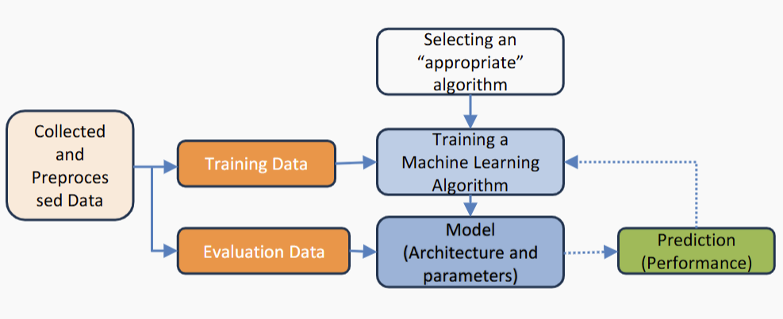

### BaseLine Model
- Zero-R (0-R)
- widely used as a baseline for classification study
- One-R

### Zero-R
- Predict all labels with the most frequent one

### One-R
- Use Only One feature to Predict
- Also a famous baseline model
- Choose the feature with least error rate

- This leads to
[Decision Tree](DecisionTree.md)

### Supervised lifecycle

---
<!-- pagebreak -->
## K-NN

# K- Nearest Neighbors

- K nearest neighbor = k closest stored data points
- K = 1 -> only take the very close neighbor

### Training
- store all training examples

### Testing
- Compute distance of test instance to all training data points
- Find the K neighbors
- Compute **target concept** of the test instance based on labels of training instances

- KNN Classification
    - Return the most common class label

- KNN Regression
    - Return the average value 

### Key questions
- How to represent each data point -> Feature vectors
- How to measure the distance  
- What if neighbors disagree
- How to select K

### How to represent each data point
- Feature vectors

### How to measure the distance
- convert nominal into numeric if need (one-hot) 
    -> Hamming Distance = difference in objects
    -> Simple Matching Distance = $d = 1-k/m$ (d:distance, k: matching, m: total)
    -> Jaccard Distance = Intersection over union d = $1 - (A \cap B/A \cup B)$
    -> Manhattan Distance = d = $\sum |Ai - Bi|$
    -> Euclidean Distance = d = $\sqrt(\sum(ai-bi)^2)$
    -> Cosine Distance = d = $1 - cos(a,b) = a \cdot b/|a||b| $

- Comparing Ordinal Feature Vectors
    - sort values and return a rank r
    - map ranks to evenly spaced value between 0 and 1
    - compute distance function for numeric features

### What if neighbors disagree
- Majority Voting
    Head count

- Inverse Distance
    $Wj = 1/Dj + e$ where $e = 1e-10$

- Inverse Linear Distance
    $Wj = (Dk-Dj)/(Dk-D1)$ where Dk is max and D1 is min

### How to select K

- Small K
    - Jagged decision boundary
    - we capture noise
    - lower classifier performance

- Large K
    - smooth decision boundary
    - danger of grouping together unrelated classes
    - also: lower classifier performance
    - what if K == N

Take the maximum point in the graph

### Breaking Tie
- Tied Distance
    - Arbitrarily choose one (e.g., lexicographically).

    - Choose the majority class among tied neighbors (if k > 1).

    - Add a random tie-breaking step (non-deterministic).

- Tied vote
    - Use odd values of k (e.g., 3, 5) to avoid ties in most cases.

    - Use weighted voting: closer neighbors get more vote weight.

    - Apply a deterministic tie-breaker, like prioritizing a specific class.

### Why KNN
- Pros
    - Intuitive and simple
    - No assumptions
    - Supports classification and regressino
    - No training: new data join > evolve and adapt immediately

- Cons
    - How to decide best distance
    - How to combine multiple neighbors
    - How to select K
    - Expensive with large dataset

--- 
## Future 
### Lazy Learning
- AKA Instance based learning
- Store training data
- fixed distance function
- fixed prediction rule
- compare test instances with stored instances
- no learning

### Eager Learning
- train a model with labelled data training instances
- generalize from seen data to unseen data
- predict labels for test instances

---
<!-- pagebreak -->
## Probs

# Probability revisit

### Very Basic
P(A=a) -> $0 <= P  <= 1 $

### Some formulas
- $P(A,B) = P(A \cap B)$

- $P(A|B) = P(A\cap B)/P(B)$

- $P(A,B) = P(A)*P(B)$ if A,B are independent

### Notation
- $P(A=x)$ indicates the likelyhood of A = x, also write as $P(x)$
- $P(A)$ shows the probability distribution, a histogram

### Rules
- independence
    - if $P(A,B) = P(A)*P(B)$
- disjoint events
    - $P(A \cap B) = \emptyset$ and $P(A or B) = P(A) + P(B)$
- product rule
    - $P(A \cap B) = P(A|B)P(B) = P(B|A)P(A)$
- chain rule
    - $P(A1\cap ... \cap An) = P(A1)P(A2|A1)P(A3|A2 \cap A1)...P(An|\cap ..Ai)$

- Bayes
    - $P(A|B) =P(A)P(B|A)/P(B)$ derived from $P(A|B) = P(A \cap B)/P(B)$ and $P(A \cap B) = P(A|B)P(B) = P(B|A)P(A)$

    - Bayes rule allow us to compute P(A|B) with known of P(B|A)

### Marginalization
- $P(A) = \sum_{b \in \mathbb{B}} P(A,B=b)$
- $P(A) = \sum_{b \in \mathbb{B}} P(A|B=b)P(B=b)$ 
- $P(A|C) = \sum_{b \in \mathbb{B}} P(A|C,B=b)P(B=b|C)$

### Probability Distributions
- Random Variable
    - Discrete Random Variable -> a countable number of distinct values
    - Continuous Random Variable -> infinite

### Gaussian Nromal Distribution
- two parameter
    - mean $\mu$
    - standard deviation $\sigma$
    - $P(A = x \mid \mu, \sigma) = \frac{1}{\sigma \sqrt{2\pi}} e^{-\frac{1}{2} \left( \frac{x - \mu}{\sigma} \right)^2}$

### Bernoulli Distribution
- a single trial with binary outcome

### Binomial Distribution
- a series of independent trials with only two outcomes
- $P(m, n, p) = \binom{n}{m} p^m (1 - p)^{n - m}$

### Multinomial Distribution
- The outcome of a series of trials where each trial can result in one of more than two possible outcomes
- $P(X_1 = x_1, X_2 = x_2, \dots, X_n = x_n; \mathbf{p}) =
\frac{(\sum_i x_i)!}{x_1! \cdots x_n!} \, p_1^{x_1} p_2^{x_2} \cdots p_n^{x_n}
= \frac{(\sum_i x_i)!}{x_1! \cdots x_n!} \prod_i p_i^{x_i}$

### Categorical Distribution
- events result from a single trial with more than two possible outcomes
- e.g rolling a fair-dice face **once** and the probability observing a five

### Relation with Machine Learning
- Uncertainty
- Model features as following certain **probability distributions**
- Soft predictions

### Probabilistic Models
- allow us to reason about random events in a principled way.
- allow to formalise hypotheses as different types of probability distribution

### Maximum Likelihood Estimate MLE
- $\hat{\theta} = \arg\max_{\theta} \, p(X = x; \theta, N)$
- Use known X to pick $\theta$
- With picked $\theta$, we can predict unseen X

### Maximum Posteriori Estimate
- $\hat{\theta} = \arg\max_{\theta} \, P(\theta) P(x \mid \theta)$

---
<!-- pagebreak -->
## Naive_Bayes

# Naive Bayes
- A supervised learning algorithm
- Recall probability and product rule
- $P(x, y) = P(y \mid x) P(x) = P(x \mid y) P(y)$
- $P(y \mid x) = \frac{P(x \mid y) P(y)}{P(x)}$

- To make it more feasible, we come up with 
$P(x_1, x_2, \dots, x_M \mid y) P(y) 
\approx P(x_1 \mid y) P(x_2 \mid y) \cdots P(x_M \mid y) P(y) \\
= P(y) \prod_{m=1}^{M} P(x_m \mid y)$

### Conditional Independence Assumption
- Where each features are assumed to be independent
- Intuitively: if know the class of email is spam, then none of the words depend on their surronding words

### Complete Naive Bayes Classifier
- $\hat{y} = \arg\max_{y \in \mathcal{Y}} P(y) P(x_1, x_2, x_3, x_4, \dots, x_n \mid y) \\
= \arg\max_{y \in \mathcal{Y}} P(y) \prod_{m=1}^{M} P(x_m \mid y)$

- features are conditionally independent given the class
- Instances are independent on each other
- The distributino in test data is same as in training data

### Smooth Categorical features
- The problem with unseen features
- If any $P(Xm|y) = 0$, then $P(y|x) = 0$
- But it is possible in real life, not all combinations stored in train dataset
- A single zero renders many additional meaningful observations irrelevant
- Solution
    - No event is impossible
    - add a small and positive value to every unseen class-feature combination
    - readjust the remaining model parameters to maintain valid probabilty distribution

### Epsilon smoothing
- if a 0 is observed, replace with a small $\epsilon$
- $\epsilon < 1/N $
- Effectively it reduces most comparisons to the cordinality of $\epsilon$ 

### Laplace Smoothing
- add a pseudocount $\alpha$ to each feature count observed during traning
- $\alpha$ is a parameter, usually = 1
- $P(x_m = j \mid y = k) = 
\frac{\alpha + \text{count}(y = k, x_m = j)}
{M\alpha + \text{count}(y = k)}$ where M is the number of values m can take
- Probability change drastically when dataset is small, minor otherwise
- Reduce Variance because reduce sensitivity to individual observations in dataset
- adds bias to the NB classifier, no longer have a true maximum likelihood estimator

### Maximum likelihood calculation
- Categorical Naive Bayes
    - Parameter $\phi$ of the Categorical distribution over class labels are the relative frequencies of classes observed in training data
    $\space$ $\phi_y = \frac{\text{count}(y)}{N}$
    - Parameter $\psi$ of the Categorical distribution over features given a class label are the observed relative frequencies of (class,label) among all instances with that class
    $\psi_{y,m} = \frac{\text{count}(y, m)}{\text{count}(y)}$

    - These parameters maximize the probability of the observed dataset. They are the maximum likelihood estimator of $\phi and \psi$

- Gaussian Naive Bayes

    - For each class y and each feature $x_m$ , we learn an individual Gaussian
    distribution parameterized by a mean $μy,m$ and a standard deviation $σy,m$

    - Mean:  
    The average of all observed feature values for \( x_m \) under class \( y \):

    $\mu_{y,m} = \frac{1}{\text{count}(y)} \sum_{i : y_i = y} x_m^i $

    - Standard deviation:  
    Sum of squared differences of observed values from the mean, normalized, and square rooted:

    $\sigma_{y,m} = \sqrt{ \frac{ \sum_{i : y_i = y} (x_m^i - \mu_{y,m})^2 }{ \text{count}(y) } }$

### Calculate Priors
- One prior $P(Y=k)$
- Normalize the count for $y_i$ by the total number of training instance N by:
    - divide each entry by the sum of the entries in the list
    - keep a separate counter for the total number of instance N, which is often useful

### Calculate likelihood parameters
- One likelihood $P(x=j|y=k)$ per attribute per class, for each X:
    - Each likelihood is a Gaussian distribution parameterized by a mean and standard deviation

### Making predictions using a NB Classifier

$\hat{y} = \arg\max_{k \in \mathcal{Y}} P(y = k) \prod_m P(x_m = j \mid y = k; \mu_{k,m}, \sigma_{k,m})$

- $( P(y = k) )$ can be read off the data structures from the training phase.
- $( P(x_m = j \mid y = k; \mu_{k,m}, \sigma_{k,m}) )$ can be computed using the likelihood function of the Gaussian distribution:

- $\frac{1}{\sqrt{2\pi \sigma_{m,k}^2}} \exp\left( -\frac{1}{2} \frac{(x_m - \mu_{m,k})^2}{\sigma_{m,k}^2} \right)$

- We only care about the class corresponding to the maximal value, so as we progress through the classes, we can keep track of the greatest value so far.

- We’re multiplying a bunch of numbers $(0, 1]$ together — because of our
floating-point number representation, we tend to get underflow.
One common solution is a log-transformation:  
$\hat{y} = \arg\max_{k \in \mathcal{Y}} P(y = k) \prod_m P(x_m = j \mid y = k)$ \\ $= \arg\max_{k \in \mathcal{Y}} \left[ \log P(y = k) + \sum_m \log P(x_m = j \mid y = k) \right]$

### Sommthing continuous features
- what if a class of 0 variance, all observed values are the same

1. ignore the feature
    - might loss information if 0 variance only for some classes
    - safe to do if the features has the same value across all classes
2. add small smoothing value to the PDF  
    - $p(x = j|μ, σ) → p(x = j|μ, σ+𝜀)$
    - set $\epsilon$ as a small fraction of the largest observed variance to all variance

### Final thoughts 
- we don't need the true distribution, just need to identify the most likely outcome
- Advantage
    - easy to build
    - easy to scale to many dimensions
    - reasonably easy to explain why a specific class was predicted
    - good starting point for a classification project

### Summary Questions
- what is NB algorithm
- what is Bayes's rule and how it relate to Naive Bates
- what are the simplifying assumptions
- how and why do we use smoothing in NB
- how can we implement a NB classifier

---
<!-- pagebreak -->
## DecisionTree

### Decision Tree
- With features calculate from One-R, we can have different branches.
- Create Optimal Desicion Tree

### ID3 with Inforamation Gain (Entropy)
- A low-prob happens -> High entropy
- A high-prob happens -> low entropy

- Self Information $\textit{Selfinfo}(x) = \frac{1}{p(x)} \approx -\log_2 p(x)$

- $H(x) = -\sum_{i=1}^{n} P(i) \log_2 P(i)$ where $0 \times \log_2 0 \overset{\text{def}}{=} 0$

- Conditioned Entropy of X given Y $H(X \mid Y) = \sum_{y \in \mathcal{Y}} p(y) \cdot H(X \mid Y = y)$

### Information Gain
- Information gain measures the reduction in entropy about the target variable achieved by partitioning the data based on a given feature.
- How important a feature is to the label
- $IG(X, Y) = H(X) - H(X \mid Y)$ $= H(X) - \sum_{y \in \mathcal{Y}} p(y) \cdot H(X \mid Y = y)$
- Calculate for all features and pick the biggest one

### Shortcoming of Information Gain
- A subset of information is more likely to be homogenous if there are only few instances
- Attributes with many values will have fewer instances at each child node 
- May lead to **overfitting**/fragmentation

### Solution
- Gain Ratio (GR)
    - reduces the bias for information gain toward highly branching attributes by normalising relative to the split information 

- Split info (SI)
    - is the entropy of a given split (evenness of the distribution of instances to attribute values)
- Discourages the selection of attributes with many uniformly distributed values, which have high entropy

### Stopping Criteria 
- IG and GR may help choose the best attribute at a given node
- IG = 0 means no improvement, a very small improvment is often unjustifiable
- Stop when $purity(Root) > \gamma$
- Choose the best attribute when IG/GR > threshold $\theta$
- pruning, a post-process the tree to remove branches with few instance or low IG/GR

### Decision Tree with numeric values
- A tree with numeric features is typically a binary tree
- The algorithm finds a threshold $t$ that best split the data to maximize some purity metric (IG/GR)
- left child: contains data points where feature value is less than $t$
- right child: contains data points where feature value is greater than $t$

### Regression Tree
- For predicting continuous values
- Uses metrics like the sum of squared residuals (SSR) to select the most suitable attribute to use as the node within each subset
- Outputs a numeric value, which is the mean of the target variable in the leaf node
- a regression tree is typically a binary tree

### Why use DT
- Pros
    - highly regarded among basic learners
    - fast to train, even faster to classify
    - very transparent 
- Cons
    - prone to overfitting
    - loss of information for coutinuous variables
    - complex calculation if there are many classes
    - no guarantee to return the globally optimal decision
    - Information gain: Bias for attribute with greater no. of values

### Other
- [Random Forest](Ensemble.md#bagging---random-forest)

### Summary Questions
- Describe the basic decision tree induction method used in ID3
- What is information gain, how is it calculated and what is its
primary shortcoming?
- What is gain ratio, and how does it attempt to overcome the
shortcoming of information gain?
- What are the theoretical and practical properties of ID3-style
decision trees?

### Evaluation
### Depth of Decision Tree
- As our dataset grows, their decision tree will also grow
- The problem with such a big Tree is that it does NOT generalize well
- We need a way to optimize the complexity of our model
- Depth: a hyperparameter for DT

[Back to Evaluation](Evaluation.md)
---
<!-- pagebreak -->
## Regression

# Linear Regression
- Target dependent $y$'s relations with independent variable $X_i$ \\\
$y = f(\mathbf{X}) = \beta_0 + \beta_1 x_1 + \cdots + \beta_D x_D 
= [\beta_0, \beta_1, \dots, \beta_D] 
\cdot 
\begin{bmatrix}
1 \\
x_1 \\
\vdots \\
x_D
\end{bmatrix}
= \vec{\beta} \cdot \vec{X}$

### Training a model
- to find the optimal line, we minimize the **mistakes**
- where mistake = $y_i - \hat{y}_i =\epsilon_i$
- is called a **loss function**

### Loss Functions
- Residuals Sum of Squares (RSS)
- Mean Squared Error (MSE)
- Mean Absolute Error (MAE)
- Root Mean Squared Error (RMSE)
- And more

### Using regression
- Once we compute the $\beta s$, we can use that to predict future y with the formula.
- Only predict with x's within observed ranges
- Should not try to extrapolate beyond the range of

### Assumptions
- The relationship is linear
- independent variables (x) are not highly correlated with each other, otherwise become unstable

### Optimisation
- we want to find the extreme points
- the maximum $\hat{\theta} = \arg\max_{\theta} f(\theta)$
- the minimum, or the loss function $\hat{\theta} = \arg\min_{\theta} f(\theta)$

- Finding extreme points, we calculate the derivative $\frac{\partial f}{\partial \theta}$
- let derivative = 0, then replace the $\theta$ into original formular and find the extreme point.

#### Log optimization
- first log the equation
- derivative
- result in a form of $x/\theta$ or something similar

### Mean Squared Error MSE
- $\text{MSE} = \frac{1}{n} \sum_{i=1}^{N} (y_i - \hat{y}_i)^2 
= \frac{1}{n} \sum_{i=1}^{N} (y_i - \boldsymbol{\beta} \cdot \mathbf{x}_i)^2$

# Gradient descent
- Often, there is no closed-form solution exist
- Need **iteratively** improve estimation of $\hat{\theta}$ until reach a satisfied solution
- **Gradient descent** is one popular method

### Step
- follow the curvature step by step along the steepest way
- Intuition
    - Descending a mountain as fast as possible: at every position take the next step that takes you most directly into the valley
    compute $\theta^{(1)},\theta^{(2)},\theta^{(3)}...$ by walking along the way with the steepest local scope.
    - each solution depend on current location
- Details
    - learn the model parameter $\theta$
        - minimize the error
        - traverse over the loss function step by step
        - $\theta <- \theta + \triangle\theta$
        - $\triangle\theta$ is the derivative $\delta f/\delta\theta$
        - tells us how much f change in response to change in $\theta$
        - a measure of the slope or gradient of a function f at point $\theta$
        - the gradient points to the greatest increase of a function
- $\theta^{t+1} = \theta^t - \eta \frac{\partial f}{\partial \theta^t}$ where $\eta$ is the learning rate. loop through this function until reachs $\delta f/\delta\theta = 0$

- For multiple parameters 
    - compute partial derivatives of $f(\theta)$ with individual $\theta_i$
    - partial derivative measure change in a function of multiple parameters given a change in a single parameter, with all others held constant
    - for exmaple $f(\theta_1,\theta_2)$ -> $\delta f/\delta\theta_1$ and $\delta f/\delta\theta_2$
    - then update each one individually with \\\
    $\theta_1 \leftarrow \theta_1 + \Delta \theta_1 
    \quad \text{with} \quad \Delta \theta_1 = -\eta \frac{\partial f}{\partial \theta_1}$ and \\\
    $\theta_2 \leftarrow \theta_2 + \Delta \theta_2 
    \quad \text{with} \quad \Delta \theta_2 = -\eta \frac{\partial f}{\partial \theta_2}$

- Potential Problem
    - local maxima and minima
    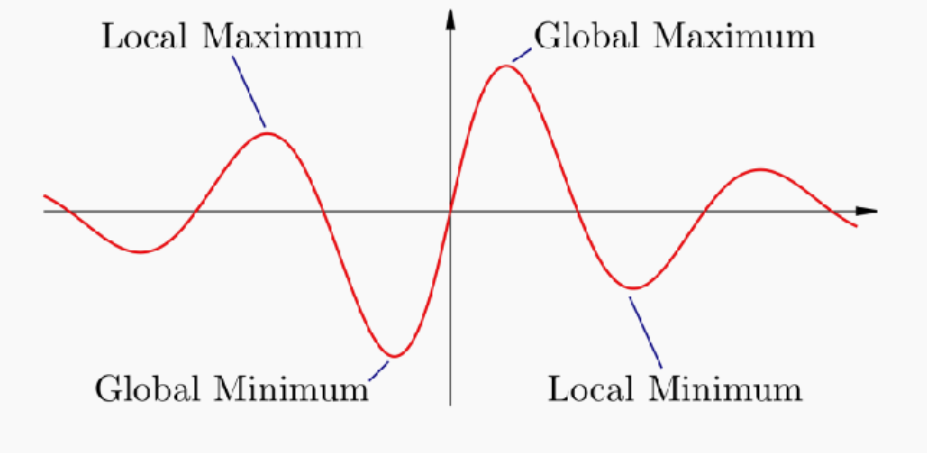
- Guarantees
    - find global minimum for differentiable convex functions
    - find local minimum for differentiable non-convex functions

# Logistic Regression
- A binary classifier
- probablistic discriminative model as it optimize $P(Y|X)$ directly
- Learns to optimally discriminate between features that belong to different classes 
- No model of Likelihoods $(P(x|y ))$ → no conditional feature independence assumption

### Operation
- Assume a binary classification task
- model prob $P(y=1/x;\theta) =p(x)$ as function of observations x under parameter $\theta$
- want to use a regression approach
    - failed approach of $p(x)$ as linear
    - $log(p(x))$ as linear
    - due to prob not bound between 0 and 1
- Use logistic function (sigmoid) instead
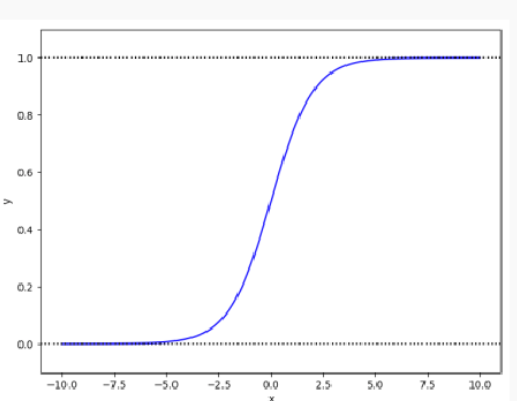

- Odds = $P(x)/1-P(x)$
- then apply log to odds with $z = log(p(x)/1-p(x))$ with $-\infty < x < +\infty$ and $0 < P(x) < 1$
- inverse and solve $P(x) = \frac{e^z}{1 + e^z} = \frac{1}{1 + e^{-z}}$
- As $\text{logit}\, P(x) = \log \left( \frac{P(x)}{1 - P(x)} \right)= \theta_0 + \theta_1 x_1 + \cdots + \theta_F x_F 
= \boldsymbol{\theta} \cdot \mathbf{x}$ 
rearrange and get 
$P(x) = \frac{e^z}{1 + e^z} = \frac{1}{1 + e^{-\theta \cdot x}}$
- $\theta \cdot x > 0$ -> y =1
- $\theta \cdot x = 0$ -> y =uncertain
- $\theta \cdot x < 0$ -> y =0

- therefore a threshold, if $P(y=1|X,\theta) > 0.5$, we define y =1

### How do we find $\theta$
- minimize loss function

$\mathcal{L}(\beta) = -\mathbb{P}(Y \mid \mathbf{X}, \boldsymbol{\theta}) 
= - \prod_{i=1}^{N} \mathbb{P}(y_i \mid \mathbf{x}_i, \boldsymbol{\theta})$ 

$= - \prod_{i=1}^{N} \left( \sigma(\boldsymbol{\theta} \cdot \mathbf{x}_i)^{y_i} 
\left( 1 - \sigma(\boldsymbol{\theta} \cdot \mathbf{x}_i) \right)^{1 - y_i} \right)$

$\hat{\boldsymbol{\theta}} = \arg\min_{\boldsymbol{\theta}} 
\left( - \prod_{i=1}^{N} \sigma(\boldsymbol{\theta} \cdot \mathbf{x}_i)^{y_i}
\left( 1 - \sigma(\boldsymbol{\theta} \cdot \mathbf{x}_i) \right)^{1 - y_i} \right)$
 
then take log
$\log(\mathcal{L}(\boldsymbol{\theta})) = 
\sum_{i=1}^{N} \left[
y_i \log(\sigma(\boldsymbol{\theta} \cdot \mathbf{x}_i)) +
(1 - y_i) \log(1 - \sigma(\boldsymbol{\theta} \cdot \mathbf{x}_i))
\right]$

### Using Logistic Regression in a Multiclass Classification
- One-vs-all (One-vs-rest) Classification:
    - In this approach, we train a separate binary logistic regression
    classifier for each class. Each classifier distinguishes one class from all other classes

- Sotmax Regression (Multinomial Logistic Regression)
    - Softmax regression is an extension of logistic regression for
    multiclass classification. It generalizes the binary logistic
    regression model to handle multiple classes simultaneously.
    $\sigma(y = j \mid \mathbf{x}, \boldsymbol{\theta}) = 
\frac{e^{\boldsymbol{\theta}_j \cdot \mathbf{x}}}
{\sum_{i=1}^{f} e^{\boldsymbol{\theta}_i \cdot \mathbf{x}}}$

### NB vs Logistic Regression
- NB , generative model
    - learns the distribution of
    features for dogs and cats

- Logistic Regression
    - only learns to distinguish the
classes (without learning much
about them)

## Summary
- Pros
    - Probabilistic interpretation
    - No restrictive assumptions on features
    - Often outperforms Naive Bayes
    - Particularly suited to frequency-based features (so, popular in NLP)
- Cons
    - Can only learn linear feature-data relationships
    - Some feature scaling issues
    - Often needs a lot of data to work well
    - Regularisation a nuisance, but important since overfitting can be a big problem

---
<!-- pagebreak -->
## SVM

# Support Vector Machine
- A maximum Margin classifier

### Concept
- assume $f(x;\theta) = sign(\theta,x)= sign(\sum(\theta_i,x_i)) \\=1 \space if \theta\cdot x > 0, =-1 \space \space otherwise$

- calculate with $\frac{y_i (\boldsymbol{\theta}^* \cdot \mathbf{x}_i)}{\lVert \boldsymbol{\theta}^* \rVert}$ This is the minimum distance from point to the separating boundary
- $\gamma_g = min_i \frac{y_i (\boldsymbol{\theta}^* \cdot \mathbf{x}_i)}{\lVert \boldsymbol{\theta}^* \rVert}$

### Optimisation with constraints
- e.g. Minimize $(z-1)^2$
- maintain $z>=3$

### maximum Margin classifier
- simulate test performance by evaluating Leave-One-Out Cross-Validation error

---
<!-- pagebreak -->
## Evaluation

# Evaluation

### 3 Main Evaluation Strategy
- Holdout
- Stratification
- Cross-validation

### Holdout 
- Each instance is randomly assigned as either a training instance or test instance
- Data is partitioned, no overlap between datasets

- build the model with only train dataset
- evaluate with only test dataset
- normally 50-50,80-20 or 90-10

- Pros
    - simple to work 
    - Highly reproducible

- Cons
    - size of split may cause issue
    - bias in sampling
    - inefficient resource utilization

- size of split may cause issue
    - with too less train, may not have enough information to build a model
    - with too less test test data may not be representative, estimated performance can be too high or low

- bias in sampling
    - random sampling can lead to different distribution in train and test datasets

### Stratification
- When dealing with imbalanced datasets
- Stratification ensures that each fold or partition of the data    maintains the same class distribution as the original dataset

- Pros
    - Preserves Distribution: Ensures that each stratum (subgroup) in the population is adequately represented in the sample.
    - Ensures Representation: Particularly important when certain subgroups are small but still need to be represented accurately.

- Cons
    - Complexity: Can be more complex to implement compared to simple random sampling.
    - Inefficient Resource Utilization: some data is only used for training and some only for testing

### k-fold Cross-Validation
- We divide the data into multiple parts (folds) iteratively.
- First, we select a desired number of partitions (k) and split the data into k folds.
- In each iteration
    - we use one partition (fold) as the test data
    - the remaining k-1 partitions (folds) are used as the training data
- Finally, we aggregate (average) the evaluation metric across all k iterations.

- Pros
    - Every instance serves as both a training and testing instance, for some partition
    - Evaluation metrics are more reliable as they are calculated with respect to a dataset that looks like the entire dataset (i.e., the entire dataset)
- Cons
    - Takes more time (depending on k)

### How to choose K

- The number of folds directly impacts the runtime and the results:
- Fewer folds: more instances per partition, more variance in performance
estimates
- More folds: fewer instances per partition, less variance but slower
- The most common choice of k: 10 (occasionally, 5)
- Mimics 90–10 Holdout, but far more reliable

### We can have stratified cross-validation

Each partition is created in a way that maintains
the overall class distribution

[Decision Tree Related](DecisionTree.md#evaluation)

### Hyperparameter Tuning
- find the just right hyperparameter

- If the Decision Tree is too short (Depth is too small)
    - The DT would be too simple (Something like 1-R
-  If the Decision Tree is too long (Depth is too big)
    - The DT would be too complex and cannot generalize well

- Constraint
    - need way to measure how well it works
    - if use test, then there is no unseen data to validate model -> **Data Leakage**
    - need a third **validation set**

### Validation data 
- Use merged train-validation data  to fit the model then use test dataset to check the performance
- Instead use a third dataset, use **Cross validation**.

### Cross Validation
- Repeat k-times
- Each time
    - partition into k blocks
    - use k-1 to train
    - 1 to validate 

## Evaluation Metrics

### Classification Metrics
- Confusion Matrix 
    -Possible classification results:
    - Positive case classified as “positive” (true positive, TP)
    - Positive case classified as “negative” (false negative, FN)
    - Negative case classified as “positive” (false positive, FP)
    - Negative case classified as “negative” (true negative, TN)
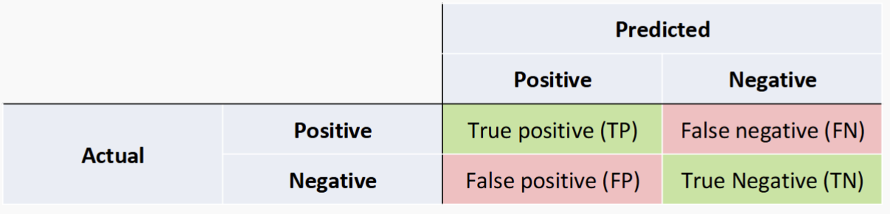

- Accuracy = $(TP+TN)/N$

    - Accuracy alone may not be usefull, need to compare with baseline model to check if it works.
- Recall = $TP/(TP+FN)$ -> Recall = 1, indicates fewer false negative
- Precision = $TP/(TP+FP)$ -> Presicison = 1, indicates fewer false positive

    - Precision and Recall are inverse
    - Unless there is clear goal on what is wanted
    - Try to maximize both

- F1-score
    - $F1 = \frac {2*Precision*Recall}{Precision+Recall}$

### Non-binary Confusion Matrix
- need to assume a intersting class(I) against other unintersting (UI) where we make I as positive. 

- For each class, make it as a Interesting
- Average the result for each class and get final Evaluation

### Averaging
- Macro
    - calculate metric per class then average them
    - Treats all classes equally
    - Suitable to ensure all classes are treated with the same importance, regardless of their size
    - Emphasizes small classes
    
- Micro
    - combine all instance into a single pool 
    - Treats all instances equally
    - Dominated by large classes
    
- Weighted 
    - calculate metric per class and then average based on proportion of instance in each class
    - Gives more weight to classes with larger numbers of instances
    

## Regression Metrics
- instead of count, we measure error
- samller error -> better performance

### Sum of Squared Errors (SSE) 
- AKA Residual Sum of Squares (RSS) or Sum of Squared Residuals (SSR)
- $𝐸𝑟𝑟𝑜𝑟_𝑖 = 𝑦𝑖 −\hat{y}_i$
- SSE = $\sum_{i=1}^n (𝑦𝑖 −\hat{y}_i)^2$

### Mean Square Error (MSE)
- Mean Square Error (MSE): MSE measures the average squared difference between the predicted and actual values. It penalizes larger errors more than smaller errors.
- $MSE = \frac{1}{N} \sum_{i=1}^n (𝑦𝑖 −\hat{y}_i)^2$ = $\frac{SSE}{N}$

### Root Mean Square Error (RMSE)
- Root Mean Square Error (RMSE): RMSE is the square root of the MSE and provides the measure of the average magnitude of the errors in the same units as the target variable. It is widely used as it gives a good indication of the model's prediction
accuracy.

- RMSE = $\sqrt(\frac{1}{N} \sum_{i=1}^n (𝑦𝑖 −\hat{y}_i)^2$ = $\frac{SSE}{N})$ = $\sqrt {MSE}$

### Mean Absolute Error (MAE)
- Mean Absolute Error (MAE): MAE measures the average absolute difference between the predicted and actual values. Unlike MSE, it does not square the errors, making it less sensitive to outliers

### Comparing
- MSE emphasizes larger errors due to squaring and is sensitive to outliers.
- RMSE is the square root of MSE, providing a more interpretable metric in the
same units as the target variable.
- MAE treats all errors equally, is less sensitive to outliers, and provides a straightforward average error measure.

- $\text{MAE} = \frac{1}{N} \sum_{i=1}^{N} \left| y_i - \hat{y}_i \right|$

### Summary Questions
- Evaluation strategies: Hold-out, Cross-Validation, Stratification
- Model tuning
- Evaluation Metrics
- Classification:
- Accuracy, Precision, Recall, F1-score
- Confusion Matrix and averaging methods
- Regression
- MSE, RMSE, MAE

## Generalization problem

- Underfitting -> The model is not expressive enough to capture
patterns in the data

- Overfitting -> the model is too complicated; It captures noise in
the data

- appropriate fitting -> captures essential patterns in the
data
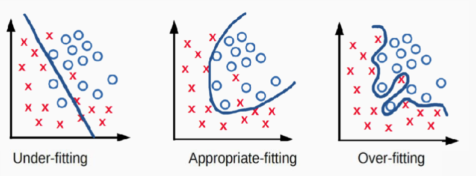

## Learning Curves
For machine learning, we can plot
- y-axis performance measure by accuracy, error rate or other metrics
- x-axis conditions, size of training sets, model complexity, numer of iterations
- Training learning curve: calculated from the training set that
shows how well the model is learning.
- Validation learning curve: calculated from a holdout set that
shows how well the model is generalising.
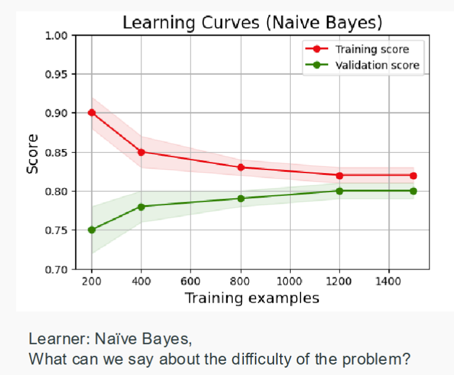

- Example One
    - More training instances → (usually) better model
    - More evaluation instances → more reliable estimate of effectiveness

- Example Two compare models
    - Using the polynomial of order 𝐷 of 𝑥 to increase the flexibility of linear regression
$𝑦 = 𝒘 ∙ 𝜙 𝑥 \\
𝜙 𝑥 = [1, 𝑥, 𝑥2, ... , 𝑥𝐷]$
- Massive Examples Orders of a polynomial model

- Model complexity
    - The number of adjustable parameters in a model

## Overfitting 
- An overly complex model is selected that captures specific
patterns in the training data but fails to learn the true nature of
relationships between attributes and class labels
- Error Rate = 100% - Accuracy
- overfitting -> large gap between training and test performance
- underfitting -> High error rate for both test and training set
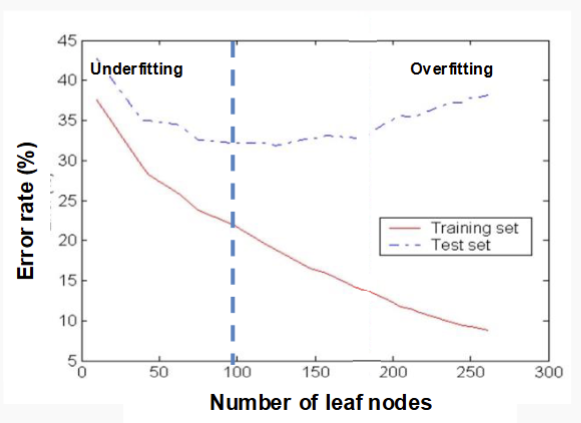

### A bit about expectations
- $\mathbb{E}[X] = \sum_{x} x \, p(x)$ 
- $\mathbb{E}[X] = \int_{x} x \, p(x) \, dx$ 
- Consider a Bernoulli 𝑋 ∈ {0,1} where 𝑝 0 = 1/2, 𝑝 1 = 1/2
- when N reaches infinity, E[X] reaches 0.5

## Bias and Variance

### Bias
- Model bias: the tendency of
our model to make
systematically wrong
predictions
- Evaluation bias: the tendency of our evaluation
strategy to over- or under-estimate the effectiveness of
our model
- Sampling bias: if our training or evaluation dataset
isn’t representative of the population
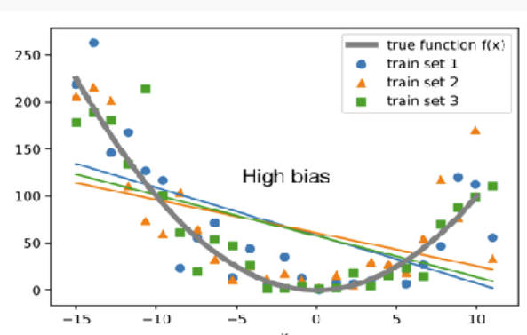

### Variance
- Model variance: Sensitivity of a
machine learning model's
predictions to small changes in
the training data, leading to
different outcomes when the
model is trained on different
subsets of the data.
- Evaluation variance: Variability in the performance
metrics of a model (such as accuracy, precision, or
recall) when evaluated across different test datasets or
under different evaluation conditions.

### Model bias in regression:
- For every evaluation instance, the signed error can be calculated
- Assuming every instance is independent, bias is the average of
these signed errors
$\frac{1}{N}\sum_{i=1}^n(y_i-\hat{y}_i)$
- A model is biased if
    - the predictions are systematically higher than the true value, or
    - the predictions are systematically lower than the true value
- A model is unbiased if
    - the predictions are systematically correct, or
    - some of the predictions are too high, and some of the
predictions are too low

### Model Bias in Regression:

- Label predictions is either “too high” or “too low”
    - “biased towards the majority class” means our model predicts
too many instances as the majority class

    $Bias(\hat{f},f) = E[\hat{f}(x)-f(x)]$

### Model Variance in Regression
- relates to the tendency of
different training sets to produce different models or predictions
with the same type of learner
    - A model has high variance if a different randomly sampled
training set leads to very different predictions on the
evaluation set
    - A model has low variance if a different randomly sampled
training set leads to similar predictions, independent of
whether the predictions are correct 

    $Var(\hat{f},f)=E[\hat{f}(x)-E[\hat{f}(x)]^2]$

### Generlisation Error
- We may estimate a model $\hat{f}(x)$ of $𝑓(𝑥)$ using linear regression
- But different training sets → different model weights and outputs
- To remove the dependency → repeat modelling many times (on
different training sets)
-In this case, the expected
squared prediction error
is:
$𝐸𝑟𝑟 = 𝐸[(𝑌 − \hat{f}(x))2]$
- In regression, the generalization error can be decomposed to:
- $𝐸𝑟𝑟 = 𝐵𝑖𝑎𝑠^2 + 𝑉𝑎𝑟𝑖𝑎𝑛𝑐𝑒 + 𝐼𝑟𝑟𝑒𝑑𝑢𝑐𝑖𝑏𝑙𝑒 𝐸𝑟𝑟𝑜𝑟$

- Variance: Captures how much your model changes if you train
on a different training set. How ”over-specialized” is your
classifier to a particular training set?
- Bias: What is the inherent error that you obtain from your
model even with infinite number training instances? This is due
to your model being ”biased” to a particular kind of solution. In
other words, bias is inherent to your model.
- Noise: This error measures ambiguity due to your data
distribution and feature representation. You can never beat
this; it is an aspect of the data

- In generalIn general, both High bias and high variance lead to Poor Generalization
    - For example, Zero-R (see Lecture 5) has zero variance but
    a high bias
    - It is important to keep balance
- Lower bias and lower variance --> better generalisation

### Diagnosing High Bias and Variance
- At its root, dealing with bias and variance is really about dealing with
overfitting and underfitting. Bias is reduced and variance is increased
in relation to model complexity

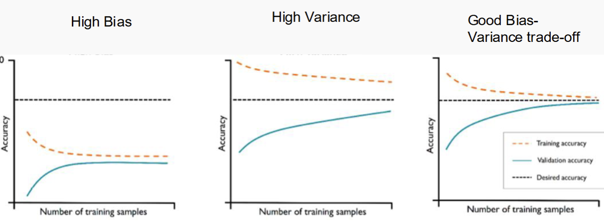

- High Bias
    - More training data by itself does not help
    - learning curve is characterised by high training and test errors
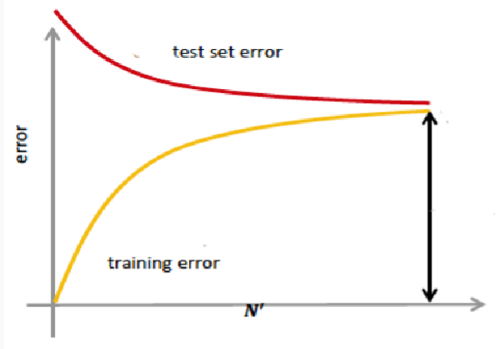
- High Variace
    - Getting more training data is likely to
help
    - The learning curve is characterised by
the gap between the two errors
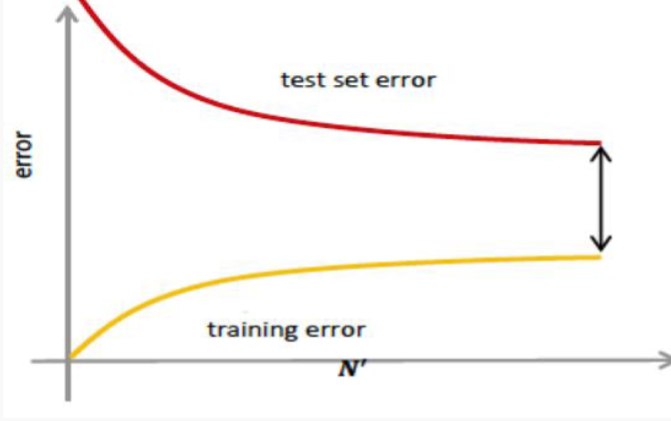

### High Bias Remedy
- Use more complex model (e.g., use nonlinear models)
- Add features

### High Variance Remedy
- Add more training data
- Reduce features
- Reduce model complexity – complex models are prone to high
variance
- Bagging

### Evaluation Bias and Variance
- The evaluation metric is also an estimator
- Desire to know the true error rate of a classifier, but only have
an estimate of the error rate, subject to some particular set of
evaluation instances
- The quality of the estimation is independent of the trained
model
- We extrapolate performance from a finite sample of cases
- With unlimited/infinite number of samples/instances, the
apparent error rate will become the true error rate
- What are the potential problems with our estimated error rate?
    - We have good accuracy with respect to some specific
evaluation sets, but poor accuracy with respect to other
unseen evaluation sets
    - It’s also possible to overfit the validation data, with
respect to our evaluation function

- **Evaluation bias**: Our estimate of the effectiveness of a
model is systematically too high/low

- **Evaluation variance**: Our estimate of the effectiveness
of a model changes a lot, as we alter the instances in the
test set. (This can be hard to distinguish from model
variance)

- control bias and variance in evaluation
    - Holdout partition size
        - More training data, less test data: less model variance, more
        evaluation variance
        - Less training data, more test data: more model variance, less
        evaluation variance
    - K-fold Cross-Validation
        - Less variance than Holdout for model and evaluation
    - Stratification
        - Less model and evaluation bias
    - Leave-one-out Cross-Validation (k-fold with k=# of samples)
        - No sampling bias, lowest bias/variance in general
    - For any evaluation method we can **report average and variance of scores**

## Summary Questions
- What is generalisation and overfitting?
- What is a learning curve, and why is it useful?
- How are bias and variance different?
- How is model bias different to evaluation bias?
- How do we try to control for bias and variance in evaluation?
---
<!-- pagebreak -->
## feature_selection

# Feature Selection
- For classify the data
- Choose model based on attributes
- Choose attributes based on model

### Goal
- main goal
    - Better performance according to some evaluation metric
- side goal
    - Seeing important features can suggest other important features 
    - Fewer features -> smaller models -> faster answer

### Selection
- Thousands to millons of low level features.choose the most relevant features to build better faster and easier to understand learning algorithms

## Nomanclature
- Univariate Method: considers one variable (feature) at a
time

- Multivariate Method: considers subsets of variables
(features) together

- Filter Method: ranks features (or feature subsets)
independently of the classifier.

- Wrapper Method: uses a classifier to assess features (or feature subsets)

### Univariate Method
- evaluate the goodness of each attribute
- independent of the model
- consider each attribute separately -> linear time in the number of attributes
- Good feature:
    - Well 'correlated' with the label, in the sense that it can predict (by itself) the label
    - “Correlated” is a loose term here as we will not only work with continuous values but also discrete values

- **Signal-to-Noise Ratio**
    - for continuous features
    - $S2N = \frac{\left| \mu_+ - \mu_- \right|}{\sigma_+ + \sigma_-}$  $\mu_+$ indicates $E[X]$ when $Y >0 $
    - select the class with high S2N value

- **Univariate Dependence**
    - Recall Independence $P(Y,Xi) = P(Y) P(Xi)$
    - Mutual Information $I(Y,X_i)$ measures the dependence, 
        - I = 0, independent
        - I > 0, dependent
    - select features with high I
- For continuous variables use
    - $I(Y, X_i) = \int_{-\infty}^{+\infty} \int_{-\infty}^{+\infty}
    P(Y, X_i) \log \left( \frac{P(Y, X_i)}{P(Y) P(X_i)} \right) \, dY \, dX_i$ 

- For discrete, use
    - $\hat{I}(Y, X_i) = \sum_{y \in \{-1, 1\}} \sum_{x_i = 1}^{k}
    \hat{P}(y, x_i) \log \left( \frac{\hat{P}(y, x_i)}{\hat{P}(y)\hat{P}(x_i)} \right)$ 
    - For this equation, the log() part is to check the independence, as $\left( \frac{\hat{P}(y, x_i)}{\hat{P}(y)\hat{P}(x_i)} \right) = 1$ and $log(1) = 0$ if they are independently 
    
    - $\hat{P}(y, x_i) = \frac{1}{n} \sum_{t=1}^{n} \delta(y, y_t) \cdot \delta(x_i, x_{it})$
    - $\hat{P}(y) = \frac{1}{n} \sum_{t=1}^{n} \delta(y, y_t)$
    - $\hat{P}(x_i) = \frac{1}{n} \sum_{t=1}^{n} \delta(x_i, x_{it})$
    - $\delta(a, b) =
    \begin{cases}
    1, & \text{if } a = b \\
    0, & \text{otherwise}
    \end{cases}$

- Mutual Information is another name for 
[Information Gain](DecisionTree.md#information-gain)

- Chi-Square $\Chi^2$ a statistical test used to determine if
there is a significant association between categorical
variables.
    - for classification tasks with categorical features

- ANOVA F-value: a statistical measure used to evaluate
the significance of individual features in a dataset
    - for classification tasks with continuous features. 

- Correlation-based Feature Selection (CFS)
    - Measures the
    correlation between each feature and the target variable.
    Features with a high correlation (in magninute) with the
    target are selected. (e.g., Pearson Correlation)

### Multivariate Method
- sometimes using single feature is not enough and need several features together allow for good decision boundary
- 

- Is complex choose each group as features, loop through each combination -> {},{$x_1$},{$x_2$},{$x_1,x_2$}
- Advantage
    - can find the feature set with optimal performance on validation data for the learner
- Disadvantage
    - Takes along time
    - Only practical with few features
- Subset Assessment
    - Split into train-validation-test
    - Until $Generalization Error < Validation Error+ \sqrt{C/n_{val}}$
    - see [Generalization Error]()
### Filter Method

- Criterion: Measure feature (or feature subset) “relevance”
with respect to label Y
- Search: Usually sort features (individual feature ranking or
nested subsets of features)
- Assessment: None directly, but might use cross-validation
to decide for the number of selected features

### Wrapper Method
- Criterion: Measure feature subset “usefulness” to predict
Y
-  Search: Search the space of all feature subsets. It trains a
new classifier for every candidate feature subset.
- Assessment: Use cross-validation

### Embedded Method
- Criterion: Measure feature subset “usefulness” to predict
Y
- Search: Search guided by knowledge from the classifier, to
avoid training a new classifier for every candidate feature
subset.
- Assessment: Use cross-validation
- Similar to wrappers, but less computationally expensive

### Forward Selection 
- Wrapper Style
    - Train a new classifier for every candidate feature to be added. $\frac{d(d+1)}{2}$in total
    - Advantage
        - Performs best when the optimal subset is samll
    - Disadvantage 
        - Running times: cycles can be slower with more attributes
        - Can converge to a sub-optimal or even bad solution
        - not feasible on large datasets

- Embedded Style
    - Uses knowledge from the classifier to evaluate candidate
    features to be added. Trains a new classifier only after adding a
    new feature. (𝑑 train-evaluate cycles in total.)

### Backward Elimination 
- Wrapper Style
    - Train a new classifier for every candidate feature to be removed.$\frac{d(d+1)}{2}$ in total
    - Advantage
        - Removes most irrevelant attributes at the start
        - Perform best when the optimal subset is large
    - Disadvantage 
        - Running times: cycles can be slower with more attributes
        - Can converge to a sub-optimal or even bad solution
        - not feasible on large datasets

### L1-Norm Regularization
- L0-Norm SVM 
- Model selection strategy: find the subset of features such
that the model is the best.
- Alternative strategy: Directly minimize the number of
features that an algorithm uses.
- Change the objective function in Support Vector Machines
to promote zero entries in θ:
- with formula
- $\min \sum_{j=1}^{d} \left( 1 - \delta(\theta_j, 0) \right)$ or $\min \|\boldsymbol{\theta}\|_0$
- This objective function is not continuous, thus not convex --> Introduce the L1-Norm that change it to a convex function that promotes zero entries in $\theta$

- L1-Norm SVM
- $\|\boldsymbol{\theta}\|_1 = \sum_{j=1}^{d} |\theta_j|$

## Summary Questions
- Various methods to perform feature selection: filter,
wrapper, embedded, regularization
- No method is universally better
- Pay attention to the complexity
- Feature selection is not always necessary to achieve good performance
---
<!-- pagebreak -->
## DimensionReduction

# Dimension Reduction

### Motivation
- when given dataset of massive sample and instance
- It is hard to visualise
- Hard to find correlations

### Goal
- Identify and describe the “dimensions” that underlie the data
    - May be more fundamental than those directly measured but hidden to the
user
- Reduce dimensionality of modeling problem
- Benefit is simplification, it reduces the number of variables you have to
deal with in modeling
- Can identify set of variables with similar behavior

## Methods
- Principal component analysis (PCA)
    - Linear transformation, find orthogonal directions of maximum variance
- Factor analysis
    - Linear combination of small number of latent variables
- Multidimensional scaling (MDS)
    - Project into low-dimensional subspace while preserving distance between
    points (can be non-linear)

## Linear Algebra Revisit

### Eigen Decomposition

- **Symmetric matrix**:
  $$
  \Sigma = U \Lambda U^T
  $$

- **"Orthonormal" matrix**:
  $$
  U^T U = I
  $$

- **Diagonal matrix** $\Lambda$ of eigenvalues

- **Eigenvectors**: columns of \( U \)

### Singular value decomposition (SVD)
- **Matrix**: $X = VSU^T$
- **"Orthonormal" matrices**: $V^T V = I$, $U^T U = I$
- **Diagonal matrix** $S$ contains the **singular values**

### Covariance
- Measures how variables A and B vary together  
    - given a set of $a_n \space and \space b_n$ values

  $$
  \text{Mean}(a) = \frac{1}{n} \sum_{i=1}^{n} a_i
  $$

    - **Covariance** between vectors $a$ and $b$:
  
  $$
  \text{Cov}(a, b) = \frac{1}{n} \sum_{i=1}^{n} (a_i - \text{Mean}(a))(b_i - \text{Mean}(b))
  $$

- Measures linear relationship

### Covariance Matrix
- Assume the matrix with **n** samples and **d** features
- A matrix of n*d
- **Centering**:
    - Calculate the mean of each column(feature) as $\mu_i$
    - Replace each $x_{i,j}$ in the matrix, do $x_{i,j} - \mu_i$ (take i as column and row as j)
    - This will result in a matrix with Mean = 0, and the covariance stay the same. This helps for later computation. This process is called **centering**
- Finally, compute $\sum = \frac{1}{n}X^TX$ to recieve a d*d matrix of covariance

## PCA
- Find a small subspace of all features that keep the most information
- First compute the d*d covariance matrix
- Compute eigenvectors/eigenvalues of covariance matrix:
    - $\sum = U\Lambda U^T$ 
    - $U$ is matrix of eigenvectors
    - $\Lambda$ is diagonal matrix of eigenvalues
- $U$ is **Principle Component** where each $u_j$ is a d*1 column vector of projection weights 

### Learning PCA
- Model Space: set of d orthonomal basis vectors
    - All basis have norm 1
    - Any pair has dot product 0
    - This is proved by the property of eigenVectors of a symmetric matrix. Where eigenvector has norm of 1. and eigenvectors are orthonormal based on the definition.
- Scoring Function
    - $1_{st}$ basis maximize variance of projected data
    - $2_{nd}$ basis again maximize it, but orthonormal to 1. 
 
 - Variance of "new feature" is $\lambda_j$
 - Sum of eigenvalues is equal to the sum of variance of the original attributes 
- "New features” are orthogonal, thus
transformed features have 0 covariance
- **Search**: Eigen decomposition of covariance
corresponds to finding the orthonormal
basis that maximize variance
-  We can more efficiently **singular value decomposition** of the centered data,
$𝑋 = 𝑉𝑆𝑈^T$  leading to the same 𝑈 as the eigen decomposition

### SVD 
- Why does it work
    - **Centered data matrix**: $X \in \mathbb{R}^{n \times d}$  
    (where $d$ is the number of features, $n$ is the number of samples)

    - **Covariance matrix**: $\Sigma = X^T X$  
    (ignoring the $\frac{1}{n}$ scaling for simplicity)

    - **Eigen decomposition**:  
    $\Sigma = UEU^T$  
    where $U$ is an orthonormal matrix, and $E$ is a diagonal matrix of eigenvalues

    - **Singular value decomposition (SVD)**:  
    $X = VSU^T$  
    where $U$ and $V$ are orthonormal matrices, and $S$ is a diagonal matrix of singular values

- Matrix derivation:

$$
X^T X = \Sigma = UEU^T
$$

$$
X^T X = (VSU^T)^T (VSU^T)
= US^T V^T V S U^T
= US^2 U^T \quad \text{so } E = S^2
$$

-  Time Complexity:

    - **SVD** takes: $\mathcal{O}(nd \cdot \min(n, d))$
    - **Computing $X^T X$** takes: $\mathcal{O}(nd^2)$
    - SVD would be faster if n < d

### Applying PCA
- Rearrange the eigenvectors so that $\lambda_1$ is biggest
- times orignal matrix X to U. Each $x_i$ is a row and $u_i$ is a column
- Tranform into new Matrix P where $p_1 = u_1\cdot x$ and $p_m = u_m\cdot x$ m is the row of P
- if m = d, data is transformed, m < d then transformation is lossy -> dimension reduced
- **Warning** This m is a hyperparameter!!

- Choice of m
    - as plot in the scree plot above, where y is variance and x is feature number m.
    - check the **elbow point** in this case is around e and 4. so choose 3, 4 for this one is the best.
---
<!-- pagebreak -->
## NeuralNetwork

# Neural Network(NN)

## Perceptron
- Biological motivation: imitating neurons in the brain
- No more probabilities
- Instead: minimize the classification error directly
- 
- y = 1 if $\sum \theta \cdot x > 0$ OR -1 otherwise

### Definition
- minimal NN
- NN are composed nuerons
- A neuron defined as 
    - Input: a vector of numeric input [1,$x_1,x_2$...]
    - output: a scalar y
    - hyper-parameter: activation function f
    - parameter($\theta$)
- Math -> y = f($\theta + \theta \cdot x_1 ....$)

- Task: binary classification into 1 and -1
- Model: single neuron aka perceptron
- f is called a step function
- $\theta \cdot x$ is the decision boundary

### Algorithm
- Learning is by altering the parameter $\theta$
- Supervised algorithm
- Simplest idea to learn : compare predicted outputs ̂ 𝑦 against true outputsy and minimize the number of mis-classifications. Unfortunately,
mathematically inconvenient.
- Second simplest idea: Find $\theta$ such that gap between the predicted value $\hat{y}^i = f(\theta \cdot x^i)$ and the true class label y $\in$ {1,-1} is minimized
    - y = 1 $\hat{y}= -1$ -> increase weight $\theta$
- Training stage
$$
\boldsymbol{\theta}^{(k+1)} = \boldsymbol{\theta}^{(k)} + \eta y_i \mathbf{x}_i
$$
$\eta$ is the learning rate
- Use $y_i(\theta^{(k)}\cdot x_i) <= 0$ as error
    - in a correct classify, $\theta x$ should have the same symbol as y

### Convergence
- The Perceptron algorithm is guaranteed to converge for
    linearly-separable data
    - the final parameter will depend on the initialisation
    - the final parameter will depend on the learning rate
    - (no guarantee of the margin being maximised as in
support vector machines)
- No guarantee of convergence over non-linearly separable data

### Perceptron VS Logistic Regression and Gradient Descent

- Activation functions:
A single ‘neuron’ with a sigmoid activation which optimizes the
cross-entropy loss (negative log likelihood) is equivalent to logistic
regression

### Online learning VS Batch Learning
- Perceptron is Online Learning
    - update weights after each training example
- The ones with Gradient Descent is Batch Learning
    - compute statistics of the whole training data set
    - update all parameters at once

- Online learning can be more efficient for large data sets
- Gradient Descent can be converted into an online version: **stochastic gradient descent**

## Neural Network -> Multi layer Perceptron (MLP)
- Multi layer Perceptron MLP
- Input layer -> input units x
- Output layer -> output unit y
- Hidden layer -> units h, all layers in between
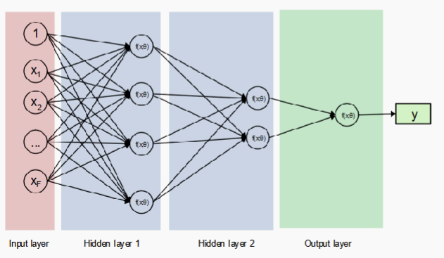

### Multi-layer Perceptron (MLP) vs. other Neural Networks
- Multi-layer Perceptron  
    - One specific type of neural network  
    - Feed-forward  
    - Fully connected  
    - Supervised learner  

- Other types of neural networks  (not in content)
    - Convolutional neural networks  
    - Recurrent neural networks  
    - Autoencoder (unsupervised)

### Linear VS Non-Linear Classifier
- Linear classification  
    - The perceptron, naive bayes, logistic regression are linear classifiers  
    - Decision boundary is a linear combination of features $\sum_i \theta_i X_i$  
    - Cannot learn 'feature interactions' naturally  

- Non-linear classification  
    - Neural networks with at least 1 hidden layer and non-linear activations  
    - Decision boundary is a non-linear function of the inputs  

### (Non-linear) classification with Multi-layer Perceptron
- 
    - Input units $x_j$, one per feature $j$  
    - Multiple layers $\ell = 1 \dots L$ of nodes; $L$ is the depth of the network  
    - Each layer $\ell$ has a number of units $K_\ell$, which is the width of layer $\ell$  
    - The width can vary from layer to layer  
    - Output unit $y$  
    - Each layer $\ell$ is fully connected to its neighboring layers $\ell - 1$ and $\ell + 1$  
    - One weight $\theta_{ij}^{(\ell)}$ for each connection $ij$ (including bias $\theta_{0}$)  
    - Non-linear activation function for layer $\ell$ as $\phi^{(\ell)}$  

- Passing an input through a neural network with 2 hidden layers:

$$
h_i^{(1)} = \phi^{(1)}\left( \sum_j \theta_{ij}^{(1)} x_j \right)
$$

$$
h_i^{(2)} = \phi^{(2)}\left( \sum_j \theta_{ij}^{(2)} h_j^{(1)} \right)
$$

$$
y_i = \phi^{(3)}\left( \sum_j \theta_{ij}^{(3)} h_j^{(2)} \right)
$$

---

- Or in **vectorized form**:

$$
\mathbf{h}^{(1)} = \phi^{(1)}\left( \boldsymbol{\theta}^{(1)T} \mathbf{x} \right)
$$

$$
\mathbf{h}^{(2)} = \phi^{(2)}\left( \boldsymbol{\theta}^{(2)T} \mathbf{h}^{(1)} \right)
$$

$$
\mathbf{y} = \phi^{(3)}\left( \boldsymbol{\theta}^{(3)T} \mathbf{h}^{(2)} \right)
$$

- Where the activation functions $\phi^{(\ell)}$ are applied **element-wise** to all entries

### Feature Learning with Neural Network

- Feature Engineering  
    - The perceptron, naive Bayes and logistic regression require a fixed set of informative features  
    - e.g., `outlook ∈ {overcast, sunny, rainy}`, `wind ∈ {high, low}`, ...  
    - Requiring **domain knowledge**  

- Feature Learning  
    - Neural networks take as input 'raw' numeric data  
    - They learn features as intermediate representations as part of their target task (e.g., classification)  
    - **Representation learning**: learning abstract features that are informative for the target task  
    - **Note**: feature engineering is often replaced at the cost of additional parameter tuning (layers, activations, learning rates, ...)

### Design Neural Network 
- Inputs and feature functions  
    - $x$ could be a patient with features {blood pressure, height, age, weight, ...}  
    - $x$ could be a text, i.e., a sequence of words  
    - $x$ could be an image, i.e., a matrix of pixels  

- Non-numerical features need to be mapped to numerical  
    - For language: pre-trained embedding vectors or one-hot encoding  
        - For one-hot: $\text{dim}(x) = V$ (where $V$ is the vocabulary size)  
        
        - For embedding: $\text{dim}(x) = k$, where $k$ is the dimensionality of the embedding vectors  
    - For pixels: map to RGB, or other visual features  

- Network Structure  
    - Sequence of hidden layers $\ell_1, \dots, \ell_L$ for a network of depth $L$  
    - Each layer $\ell$ has $K_\ell$ parallel neurons (breadth)  
    - Many layers (depth) vs. many neurons per layer (breadth)?  
      Empirical question, theoretically poorly understood.  

- Advanced tricks include allowing for exploiting data structure  
    - Convolutions (convolutional neural networks; CNN), Computer Vision  
    - Recurrences (recurrent neural networks; RNN), Natural Language Processing  
    - Attention (efficient alternative to recurrences)  
    - ...

- Activation Function
    - Each layer has an associated activation function which performs a non-linear transformation of the input. Popular choices include:

    - **Logistic or Sigmoid ("$\sigma$")**:  
    $$
    f(x) = \frac{1}{1 + e^{-x}}
    $$

    - **Hyperbolic tan ("tanh")**:  
    $$
    f(x) = \frac{e^{2x} - 1}{e^{2x} + 1}
    $$

    - **Rectified Linear Unit ("ReLU")**:  
    $$
    f(x) = \max(0, x)
    $$

    - What about **step function**??

    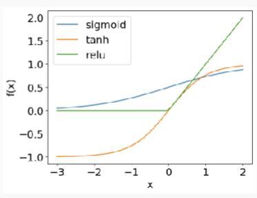

- Output function
    - Neural networks can learn different concepts: classification, regression, ...

    - The **output function** depends on the concept of interest:

    - **Binary classification**:  
        - Single unit with step function (as in the perceptron) or sigmoid

    - **Multiclass classification**:  
        - Multiple units (one for each class) with softmax to normalize $K$ outputs from the pre-final layer into a probability distribution over classes

        $$
        P(y_i = j \mid X_i; \boldsymbol{\theta}) =
        \frac{\exp(z_j)}{\sum_{k=1}^{K} \exp(z_k)}
        $$

    - **Regression**:  
        - Identity function (linear)  
        - Possibly other continuous functions such as sigmoid or tanh

- Loss function
    - For a single instance $i$:

    $$
    \mathcal{L} = - \log p(y^{(i)} \mid x^{(i)}; \boldsymbol{\theta})
    $$

    - For all instances:

    $$
    \mathcal{L} = - \sum_i \log p(y^{(i)} \mid x^{(i)}; \boldsymbol{\theta})
    $$

    - Binary Classification Loss

        Let:

        $$
        \hat{y}_1^{(i)} = p(y^{(i)} = 1 \mid x^{(i)}; \boldsymbol{\theta})
        $$

        Then the loss is:

        $$
        \mathcal{L} = - \sum_i \left[
            y^{(i)} \log (\hat{y}_1^{(i)}) + (1 - y^{(i)}) \log (1 - \hat{y}_1^{(i)})
        \right]
        $$

    - Multiclass Classification Loss

        Let:

        $$
        \hat{y}_j^{(i)} = p(y^{(i)} = j \mid x^{(i)}; \boldsymbol{\theta})
        $$

        Then:

        $$
        \mathcal{L} = - \sum_i \sum_j y_j^{(i)} \log (\hat{y}_j^{(i)})
        $$

        - For $j$ possible labels  
        - $y_j^{(i)} = 1$ if class $j$ is the true label for instance $i$, else 0
    - Regression Loss: typically mean-squared error (MSE)

        - Here, the output as well as the target are real-valued numbers

        $$
        \mathcal{L} = \frac{1}{N} \sum_{i=1}^{N} \left( y^{(i)} - \hat{y}^{(i)} \right)^2
        $$

- However, train is not possible ni the hidden layers,Use **Back Propagation**

### Why Neural Network
- Pros

    - Powerful tool!  
    - Neural networks with at least 1 hidden layer can approximate any (continuous) function.  
    They are **universal approximators**  
    - Automatic feature learning  
    - Empirically, very good performance for many diverse tasks  

- Cons

    - Powerful model increases the danger of **overfitting**  
    - Requires large training data sets  
    - Often requires powerful compute resources (GPUs)  
    - Lack of interpretability  

### Activation Function
- Can have different function for each layer
- **Sigmoid**: $\sigma(z) = \frac{1}{1 + e^{-z}}$
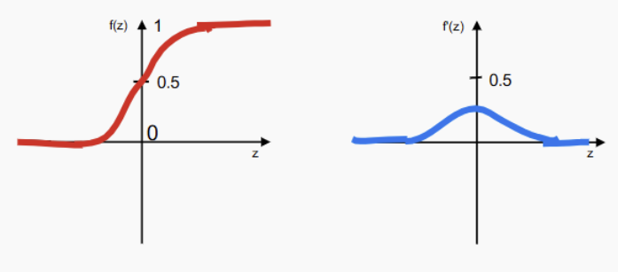
- **Tanh**: $\tanh(z) = \frac{e^{2z} - 1}{e^{2z} + 1}$

- **ReLU**: $f(z) = \max(0, z)$
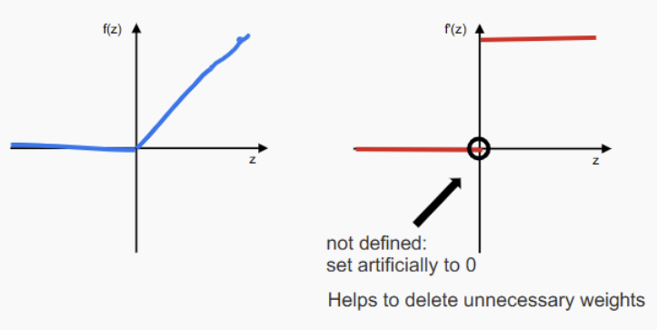
- Step Function is not suitable for NN, as the derivate is not defined at 0 -> no way to update
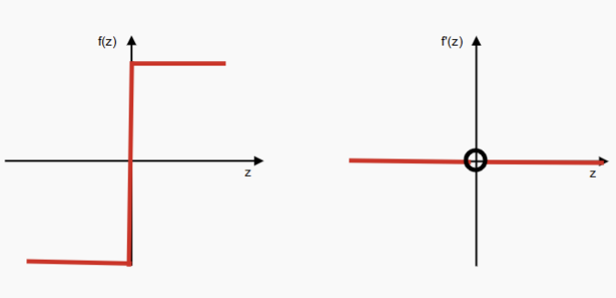

## Back Propagation
- Recall [Perceptron learning](#algorithm)
- This update rule relys on true target output y
- But only have access to final output layer
- Don't know the true action in the hidden layers
- Introduce the back propagation -> computing
partial derivatives of the error of an MLP wrt each individual weight.

### Procedure
- Receive input  
- **Forward pass**: propagate activations through the network  
- Compute error ($\delta$): compare output $\hat{y}$ against true $y$  
- **Backward pass**: propagate **error terms** through the network  
- From the **error terms**, derive weight updates $\Delta \theta_{ij}^{\ell}$ for all $\theta_{ij}^{\ell}$  
- Update weights:  
  $$
  \theta_{ij}^{\ell} \leftarrow \theta_{ij}^{\ell} + \Delta \theta_{ij}^{\ell}
  $$

- Recall Gradient Descent 
$$
\theta_i \leftarrow \theta_i + \Delta \theta_i 
\quad \text{with} \quad 
\Delta \theta_i = -\eta \frac{\partial E}{\partial \theta_i}
$$

- Use Back Propagation to get $\frac{\partial E}{\partial \theta_i}$

### Back Propagation

- Model Definition
    - Where $z_i$ is the sum of all incoming activations into neuron $i$:

    $$
    z_i = \sum_j \theta_{ij}^{\ell} a_j
    $$

    - Assuming a sigmoid activation function, the output of neuron $i$ (its activation $a_i$) is:

    $$
    a_i = g(z_i) = \frac{1}{1 + e^{-z_i}}
    $$

    - And Mean Squared Error (MSE) as the error function $E$:

    $$
    E = \frac{1}{2}(y - a_i)^2
    $$

    - Apply gradient descent for weight update:  
    $$
    \theta_{ij}^2 \leftarrow \theta_{ij}^2 + \Delta \theta_{ij}^2
    $$

    - Weight update rule:
    $$
    \Delta \theta_{ij}^2 = -\eta \frac{\partial E}{\partial \theta_{ij}^2}
    $$

    - Using the chain rule:
    $$
    \Delta \theta_{ij}^2 = \eta (y - a_i) \frac{\partial a_i}{\partial \theta_{ij}^2}
    $$

    - Where the error function is:

    $$
    E = \frac{1}{2} (y - a_i)^2
    $$

    - Apply gradient descent for weight:  
  $$
  \theta_{ij}^2 \leftarrow \theta_{ij}^2 + \Delta \theta_{ij}^2
  $$

    - Derivation of the weight update:

    $$
    \Delta \theta_{ij}^2 = -\eta \frac{\partial E}{\partial \theta_{ij}^2}
    $$

    $$
    = \eta (y - a_i) \frac{\partial a_i}{\partial \theta_{ij}^2}
    $$

    $$
    = \eta (y - a_i) \frac{\partial g(z_i)}{\partial \theta_{ij}^2}
    $$

    $$
    = \eta (y - a_i) g'(z_i) \frac{\partial z_i}{\partial \theta_{ij}^2}
    $$

    $$
    = \eta (y - a_i) g'(z_i) a_j
    $$

    - Define the error term:
    $$
    \delta_i = (y - a_i) g'(z_i)
    $$

    - Final update:
    $$
    \Delta \theta_{ij}^2 = \eta \delta_i a_j
    $$

    - Where:

    - $E = \frac{1}{2}(y - a_i)^2$  
    - $a_i = g(z_i)$  
    - $z_i = \sum_j \theta_{ij}^2 a_j$
### Generlized Delta Rule
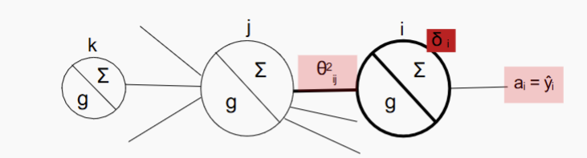

$$
\Delta \theta_{ij}^2 = \eta \, \delta_i \, a_j
$$

$$
\delta_i = (y - a_i) \, g'(z_i)
$$

- The weight update corresponds to an error term ($\delta_i$) scaled by the incoming activation

- The above $\delta_i$ can only be applied to **output units**, because it relies on the **target outputs** $y$

- Instead, we **backpropagate** the errors ($\delta$s) from right to left through the network

$$
\theta_{jk}^{1} \leftarrow \theta_{jk}^{1} + \Delta \theta_{jk}^{1}
$$

- Derivation of the update:

$$
\Delta \theta_{jk}^{1} = -\eta \frac{\partial E}{\partial \theta_{jk}^{1}}
= \eta (y - a_i) \frac{\partial a_i}{\partial \theta_{jk}^{1}}
= \eta (y - a_i) \frac{\partial g(z_i)}{\partial \theta_{jk}^{1}}
$$

$$
= \eta (y - a_i) g'(z_i) \frac{\partial z_i}{\partial \theta_{jk}^{1}}
= \eta \delta_i \frac{\partial z_i}{\partial \theta_{jk}^{1}}
$$

- Recall:

$$
\delta_i = (y - a_i) g'(z_i)
$$

- Continue with the chain rule:

$$
\frac{\partial z_i}{\partial \theta_{jk}^{1}} = \theta_{ij}^{2} g'(z_j)
$$

- Final form:

$$
\Delta \theta_{jk}^{1} = \eta \delta_i \theta_{ij}^{2} g'(z_j) \frac{\partial z_j}{\partial \theta_{jk}^{1}}
$$

- Where:

$$
z_i = \sum_j \theta_{ij}^{2} a_j = \sum_j \theta_{ij}^{2} g(z_j)
$$

### Back Propagation algorithm
- Forward passing
- Compute error
- Propagate back through the network 
$$
\Delta \theta_{ij}^{\ell} = -\eta \frac{\partial E}{\partial \theta_{ij}^{\ell}} = \eta \delta_i a_j
$$

- Update all parameter at once
$$
\theta_{ij}^{\ell} \leftarrow \theta_{ij}^{\ell} + \Delta \theta_{ij}^{\ell}
$$

## Summary Question
- Estimation of the MLP parameters
- How we use Gradient Descent to op:mize the parameters
- How Backpropaga:on is a special instance of gradient descent, which
allows us to efficiently compute the gradients of all weights wrt the
error (by reusing the δs)

---
<!-- pagebreak -->
## Generative

# Generative Probablistic Modelling

## Generative Probabilistic Modeling

### Train/Test Data Generation
- Assume dataset is generated with some unknown distribution of $P(x,y) = P(x|y)P(y)$
- Our goal is to mimic the
data generation process
and find parameters that
best recreate the data

- two broad approach to classification problem
    - Discriminative 
    - Generative

### Discriminative 
- Model = a set of classifiers  
- Choose $f$ that **classifies** training examples well  
- Label new inputs $x$ based on:  
  $$
  y = f(x)
  $$
### Generative
- Model = a set of distributions $P(x, y; \theta)$ for any $\theta$  
- Choose $P(x, y; \hat{\theta})$ such that training examples are likely samples from this distribution  
- Label new inputs $x$ as $y$ where $y$ **maximizes** the joint likelihood:  
  $$
  y = \arg\max_y P(x, y; \hat{\theta})
  $$

- We can use simple **spherical Gaussian models** for the class-conditional distributions:

$$
P(x \mid y; \theta) = \mathcal{N}(x; \mu_y, \sigma_y^2 I)
$$

This expands to:

$$
P(x \mid y; \theta) =
\frac{1}{(2\pi \sigma_y^2)^{d/2}} \exp\left\{
-\frac{1}{2\sigma_y^2} \| x - \mu_y \|^2
\right\}
$$

> Note: both $x$ and $\mu_y$ are $d$-dimensional vectors.

- We can also use **full Gaussian models** for the class-conditional distributions:

$$
P(x \mid y; \theta) = \mathcal{N}(x; \mu_y, \Sigma_y)
$$

Expanded form:

$$
P(x \mid y; \theta) = \frac{1}{(2\pi)^{d/2} |\Sigma_y|^{1/2}} 
\exp\left\{
-\frac{1}{2}(x - \mu_y)^T \Sigma_y^{-1} (x - \mu_y)
\right\}
$$

- The covariance matrix $\Sigma_y$ can be decomposed as:

$$
\Sigma_y = R
\begin{bmatrix}
\sigma_{y1}^2 & 0 \\
0 & \sigma_{y2}^2
\end{bmatrix}
R^T
$$

Where:

- $R$ is a **rotation matrix**  
- The diagonal elements $\sigma_{y1}^2, \sigma_{y2}^2$ represent **variances along the two principal axes**

- The contour plot on the right shows ellipses of constant probability for class $y = -1$

### Maximum Likelihood Estimation MLE
- Recall [lec4 MLE](Probs.md#maximum-likelihood-estimate-mle)
- Our parameterized Gaussian model is:

$$
P(x, y; \theta) = P(x \mid y; \theta) \, P(y; \theta)
= \mathcal{N}(x; \mu_y, \sigma_y^2 I) \cdot q^{\delta(y, 1)} (1 - q)^{\delta(y, -1)}
$$

- We find parameters:

$$
\theta = (\mu_{+1}, \mu_{-1}, \sigma_{+1}^2, \sigma_{-1}^2, q)
$$

that **maximize the log-likelihood** of the training data:

$$
\ell(\mathcal{D}; \theta) = \sum_{i=1}^n \log P(x_i, y_i; \theta)
= \sum_{i=1}^n \left[
    \log P(x_i \mid y_i; \theta) + \log P(y_i; \theta)
\right]
$$
$$
\sum_{i=1}^{n} \left[
    -\frac{d}{2} \log(2\pi \sigma_{y_i}^2)
    - \frac{1}{2\sigma_{y_i}^2} \| x_i - \mu_{y_i} \|^2
\right]
+
\sum_{i=1}^{n} \left[
    \delta(y_i, 1) \log q + \delta(y_i, -1) \log(1 - q)
\right]
$$

### Classification and Decision Boundary
- Decision Boundary
    - Given $x$, predict the label ($+1$ or $-1$) with highest probability

    - Predict label $y = +1$ if:

    $$
    P(y = 1 \mid x; \hat{\theta}) > P(y = -1 \mid x; \hat{\theta})
    $$

    - By conditional probability (Bayes' rule):

    $$
    \frac{P(x, y = 1; \hat{\theta})}{P(x; \hat{\theta})}
    >
    \frac{P(x, y = -1; \hat{\theta})}{P(x; \hat{\theta})}
    $$

    - Which is equivalent to:

    $$
    P(x, y = 1; \hat{\theta}) > P(x, y = -1; \hat{\theta})
    $$

- The decision boundary is the set of x for which we do not know what label (+1 or -1) to predict
$$
P(x, y = 1; \hat{\theta}) = P(x, y = -1; \hat{\theta})
$$

### Probability Predictions
- Model also allow us to evaluate probabilities over the possible class labels 
$$
P(y = 1 \mid x; \hat{\theta}) = \frac{P(x, y = 1; \hat{\theta})}
{\sum_{y' \in \{-1, 1\}} P(x, y'; \hat{\theta})}
$$

The denominator is:

$$
P(x; \hat{\theta}) = \sum_{y' \in \{-1, 1\}} P(x, y'; \hat{\theta})
$$
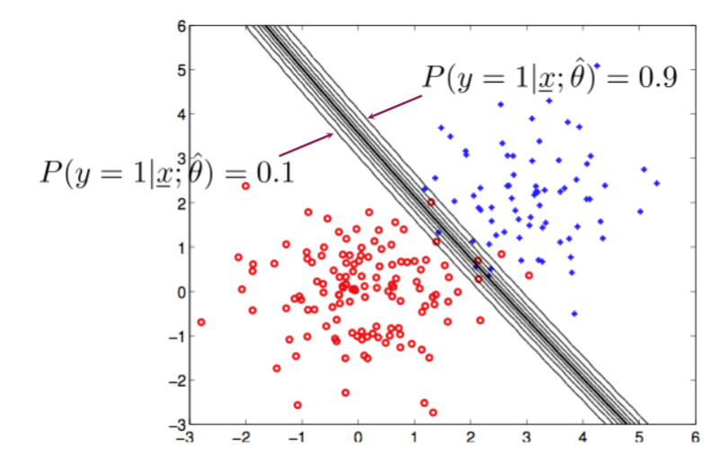
---
<!-- pagebreak -->
## Unsupervised

# Unsupervised
- fully unlabelled data
- some examples
    - PCA
    - Clustering
    - Anomaly detection
    - Associate rule mining

## Clustering
- learn the structure from the data alone
- But you usually bring your own assumptions about what kind of
    structure you expect in the data
    - Exclusive vs. Overlapping
        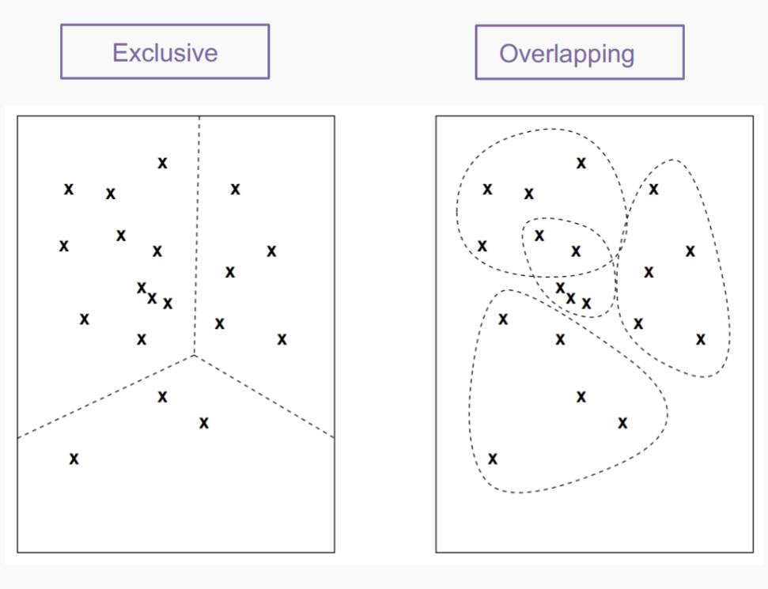
    - Deterministic vs. Probabilistic (Hard vs. Soft clustering)
    
    - Hierarchical vs. Partitioning
    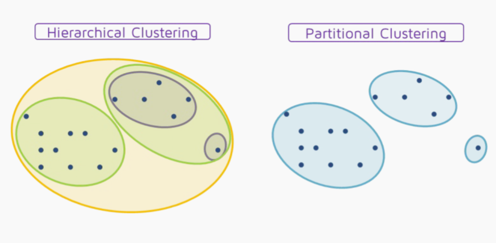
    - Partial vs. Complete
    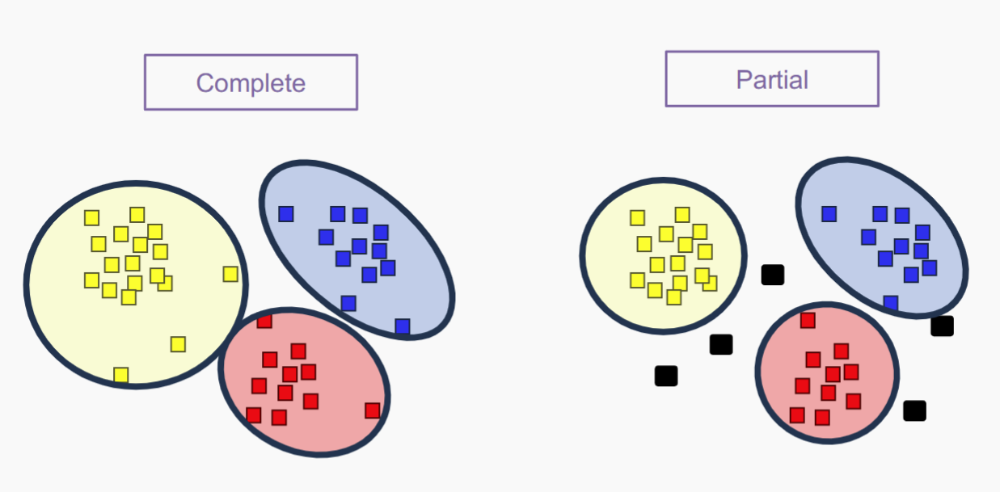
    - Heterogeneous vs Homogeneous
    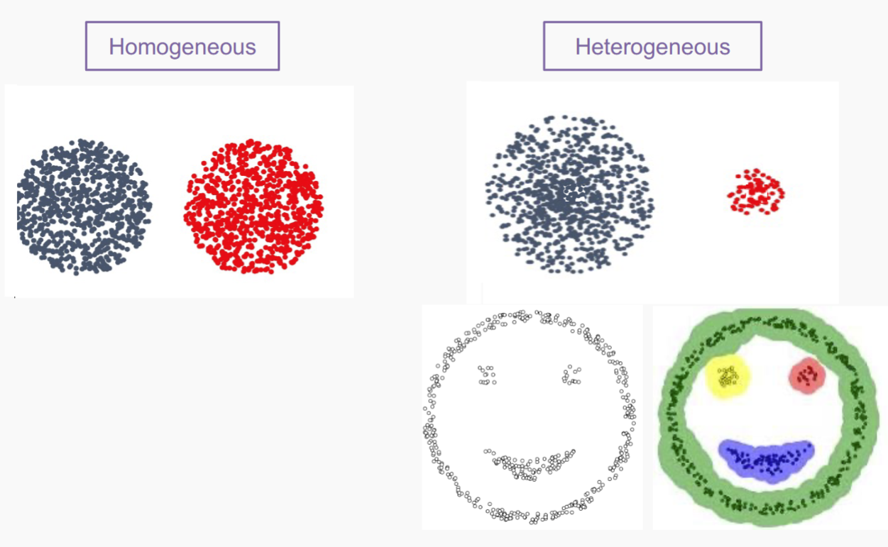

-**K-means** clustering
- **Agglomerative** clustering
- **Warn** Normalise attribute as most cluster are based on **distance**

### Good Clustering
- Cluster cohesion (compactness, tightness)
    - Intra-cluster distance: distances between instances inside each
    cluster
- Cluster separation (isolation, distinctiveness)
    - Inter-cluster distances: the degree to which clusters are distinct
    or well-separated from each other
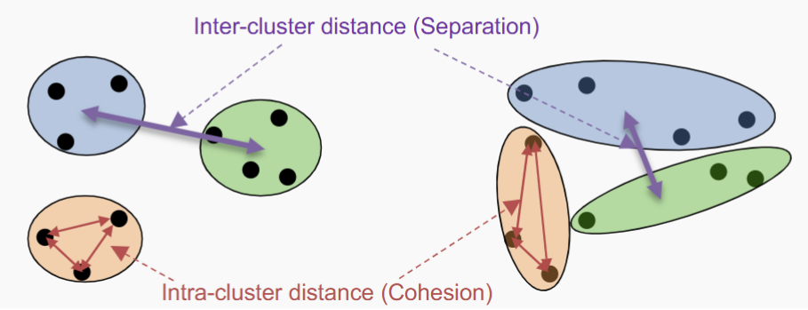

- A “good” cluster should have one or both of:
    - High cluster cohesion:
        - instances in a given cluster should be closely related to each
        other (Intra-cluster distances are minimized) aka **Within-cluster Sum of Squares** (WCSS)
    - High Cluster Separation:
        - instances in different clusters should be distinct from each
        other (Inter-cluster distances are maximized) aka **Between-cluster Sum of Squares (BCSS)**
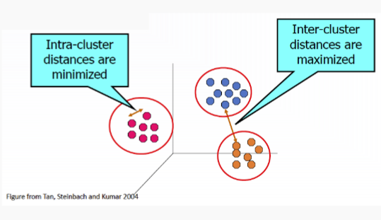

- Within-cluster Sum of Squares (WCSS): the sum of the squared
distance between each point and the centroid in a cluster (Cluster
Cohesion)
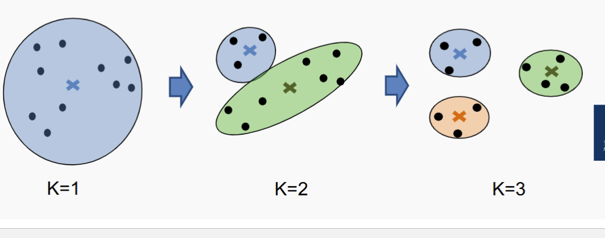

### K-means 
- K-Means is an exclusive, complete and partitioning
clustering method.
- It aims to create **compact** and **spherical** clusters.
K-means Clustering Algorithm
- Process
    - Randomly pick K points
    - Repeat 
        - Assign each instance to the cluster with the nearst **centroid**
        - Recompute the **centroid** of each cluster
    - Until the centroids don’t change (or until changes are smaller
    than a threshold, or until relatively few points change clusters)

- Limitations
    - “mean” is ill-defined for categorical attributes
    - Sensitive to outliers: outliers can significantly affect the
    position of cluster centroids and distort the clustering results.
    
    - Sensitive to Initial Centroids: Different initializations can result in
    different outcomes, prone to converging to suboptimal solutions.
    
    - Not able to handle non-spherical clusters
    
    - Not able to handle clusters of differing sizes
    
    - Not able to handle clusters with different densities
    
    - Requires Predefined Number of Clusters (K)
- Strength
    - Simplicity: straightforward and easy-to-understand algorithm.
    - Scalability: computationally efficient and can converge
    relatively quickly. Suitable for clustering tasks involving a large
    number of data points.
    - Interpretable Results: Clusters can be easily interpreted and
    visualised.
    - Applicability: K-means is applicable to a wide range of
    clustering tasks (often good enough).
    - It is effective in cases where the underlying clusters are
    spherical in shape and when the data points are well-separated.

- How to find K
    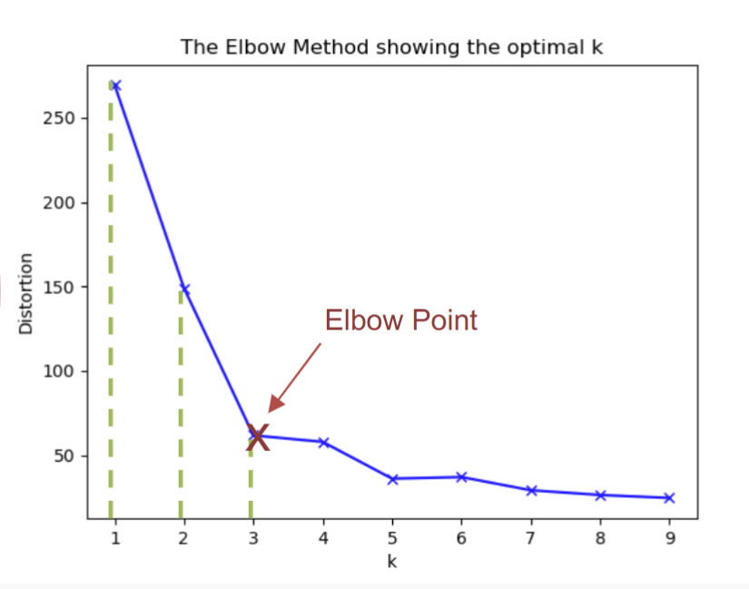
    - For each cluster, calc WCSS
    - plot the value
    - find elbow point
    - choose K
    

### Hierarchical Clustering
- Produces a set of nested clusters organized as a hierarchical tree
- Can be visualized as a dendrogram
    - A tree like diagram that records the sequences of merges
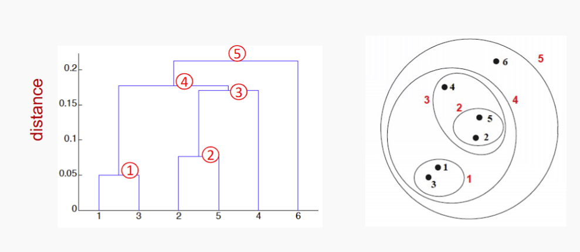

- Agglomerative (Bottom-up) clustering
    - Start with the points (instances) as individual clusters
    - At each step, merge the closest pair of clusters until
    only one cluster (or k clusters) left

- Divisive (Top-down) clustering:
    - Start with one, all-inclusive cluster
    - At each step, split a cluster until each cluster contains
    a point (or there are k clusters)

- These hierarchical algorithms use a **dis-similarity** or **distance matrix** or **proximity matrix** to merge or split **one cluster at a time**

### Agglomerative (Bottom-up) clustering
- Basic algorithm
    - compute dis-similarity matrix 
    - let each data point to be a cluster
    - Repeat
        - Merge two closest clusters
        - Update matrix
        - Until **Single** Cluster Remains

### Cluster Distance
- Single Linkage
    - Minimum distance
    - Distance between the closest members of the
    cluster
    

- Complete Linkage
    - Maximum distance
    - Distance between the furthest members of the
    cluster
    
- Average Linkage
    - Sum the distance of all pairs from both clusters
    - calculate the average
    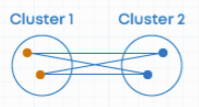
- Centroid Method
    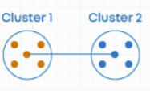

| Method               | Strength                                     | Weakness                                                 | Visual 1                        | Visual 2                      |
| -------------------- | -------------------------------------------- | -------------------------------------------------------- | ------------------------------- | ----------------------------- |
| **Single Linkage**   | - Can handle non-spherical shapes            | - Very sensitive to noise and outliers                   | 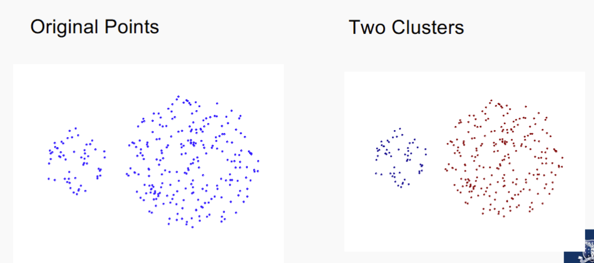   |    |
| **Complete Linkage** | - Less sensitive to noise and outliers       | - Tends to form spherical clusters and break large ones  |  |  |
| **Centroid Linkage** | - Balances shape sensitivity and compactness | - May give inconsistent merges due to drifting centroids |                                 |                               |

- Strength of Hierachical Clustering 
    - No assumption of any particular number of clusters
        - Any desired number of clusters can be obtained by ʻcuttingʼ
        the dendrogram at the appropriate level
    - No assumption of cluster shape
        - not assume specific shapes or distributions for the clusters.
        - can handle clusters of various shapes, sizes, and densities
    - They may correspond to meaningful taxonomies
        - Examples in biological sciences (e.g., animal kingdom,
        phylogeny reconstruction, ...)
- Weakness 
    - Once a decision is made to combine two clusters, it cannot be
    undone, i.e., an object that is in the wrong cluster will always
    stay there.
    - No objective function is directly minimised, i.e., no ‘relative’
    quality measure

### Clustering Metrics
- WCSS
$$
WCSS = \sum_{j=1}^{K} \sum_{x_i \in C_j} (x_i - \mu_j)^2
$$

    - **Where:**

    - $\mu_j$ = mean of data points in cluster $j$  
    - $K$ = number of clusters  
    - $x_i$ = data point assigned to cluster $j$

- WBSS
    $$
    BCSS = \sum_{j=1}^{K} n_j (\mu - \mu_j)^2
    $$

    - **Where:**

    - $\mu_j$ = mean of data points in cluster $j$  
    - $\mu$ = mean of all data points  
    - $n_j$ = number of instances in cluster $j$  
    - $K$ = number of clusters
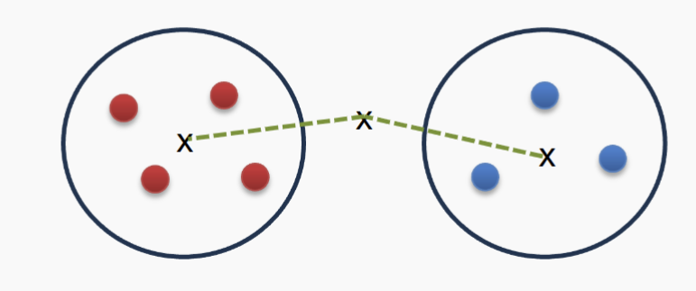

### Calinski-Harabasz Index (Variance Ratio Criterion)
- $CH = \frac{BCSS}{WCSS} * \frac{N-K}{K-1}$
- where N = instance K = Clusters 
- A high CH indicates a better clustering

## Supervised Clustering Metrics
- Measures the extent to which the clustering structure discovered by
a clustering algorithm matches the actual labels.
    - Homogeneity
    - Completeness
- Compare generated clusters to labels if provided

### Homogeneity 
- Whether each cluster contains only data points that are all from the
same class. Homogeneity checks if all the items in a cluster are the
same type.
$$
\text{homogeneity} = 1 - \frac{H(Y_{\text{true}} \mid Y_{\text{pred}})}{H(Y_{\text{true}})}
= 1 - \frac{H(C \mid K)}{H(C)}
$$
- Given a ground truth class C and a clustering K, homogeneity can
be defined as follows:
If the clustering is perfect and all points in one cluster have the
same class, $H(Y_{\text{pred}} \mid Y_{\text{true}})$ will be 0, and homogeneity will be 1

### Completeness

- Completeness measures whether **all data points of a particular class** are assigned to the same cluster.

- Given a ground truth class $C$ and a clustering $K$, completeness is defined as:

$$
\text{completeness} = 1 - \frac{H(K \mid C)}{H(K)}
= 1 - \frac{H(Y_{\text{pred}} \mid Y_{\text{true}})}{H(Y_{\text{pred}})}
$$

- If the clustering is perfect and all points from the same class are in the same cluster,  
then $H(Y_{\text{pred}} \mid Y_{\text{true}}) = 0$, and completeness will be **1**.

## Summary Question
- Unsupervised Learning
- Clustering
- K-Means
- Agglomerative
- Clustering Evaluation
    - Unsupervised evaluation metrics
    - Supervised evaluation metrics
---
<!-- pagebreak -->
## Semisupervise

# Semisupervised learning
- Self-training
- Active-learning
- Data Augmentation
- Pretraining and fine-tuning
  

- Semi-supervised learning is learning from both labelled and unlabelled
data
  - Semi-supervised classification:
  - L is the set of labelled training instances $\{x_i ,y_i\}_{i=1}^l$
  - U is the set of unlabelled training instances $\{x_i\}_{i=l+1}^{i+u}$
  
  - Often U ≫ L
  
  - Goal: learn a better classifier from L ∪ U than is possible from L
  alone
- For example, find clusters, choose a label for each (most
common label?) and apply it to the unlabelled cluster members

## Self-training (Bootstrapping)
- Assume you have L labelled and U unlabeled training instances
- Repeat
  - Train a model f on L using any supervised learning method
  - Apply f to predict the labels on each instance in U
  - Identify a subset of U with “high confidence” labels
  - Remove them from U and add them to L with the classifier
  predictions as the “ground-truth”
  - Until L does not change

### Self-Training Assumptions
- Propagating labels requires some assumptions about the distribution of labels
over instances:
  - Points that are nearby (similar) are likely to have the same label
- Classification errors can propagate
- Solution: Keep a kind of safety net...
  - Don’t add to the “labelled” pool if the classification confidence
    falls below a threshold
    In 1-NN, the nearest neighbour
    distance is less than $\gamma$

## Active Learning

- Active learning builds on the hypothesis that a classifier can achieve
higher accuracy with fewer training instances if it is allowed to have
some say in the selection of the training instances
- The underlying assumption is that labelling is a finite resource, which
should be used in a way that optimises machine learning effectiveness
- Active learners pose queries (unlabelled instances) for labelling by an
oracle (e.g. a human annotator)

### Query strategies:
1. Uncertainty Sampling
   - Least confidence
   - Margin Sampling
   - Entropy Sampling
2. Query by Committee (QBC)

- Uncertain Sampling:
    Select the instances for which the model is least confident in its predictions.
    - Least Confidence: Choose samples with the smallest predicted
    probability for the most likely class
    $$
    x = \arg\min_x \left( \max_y P(y \mid x) \right)
    $$
    - Margin Sampling: Choose samples where the difference
    between the top two predicted class probabilities is smallest:
    $$
    x = \arg\min_x \left( P(y_1 \mid x) - P(y_2 \mid x) \right)
    $$
    - Entropy sampling: Select the sample with the highest prediction
    entropy
    $$
    x = \arg\max_x \left( -\sum_y P(y \mid x) \log P(y \mid x) \right)
    $$

- Query by Committee (QBC)
  - If the committee disagrees on an instance, the model is uncertain and
    would benefit most from seeing the true label.
  - You maintain a committee (i.e. a set) of models, all trained on the same
  labelled data but in different ways.
  - For each unlabelled instance, the committee votes on the predicted
  label.
  - The instance with the most disagreement among the committee
  members is selected for labelling

- Vote Entropy

    Measures uncertainty based on how spread the votes are among labels:

    $$
    H_{\text{vote}}(x) = -\sum_y \frac{V_y(x)}{C} \log \left( \frac{V_y(x)}{C} \right)
    $$

    **Where:**

    - $V_y(x)$ = number of votes for label $y$
    - $C$ = total number of committee members

### Summary
- Active learning is used increasingly widely, but must be handled with some
care:
  - Empirically shown to be a robust strategy, but a theoretical justification
  has proven elusive
  - Active learning introduces bias: data with predicted labels no longer
  follows the true label distribution
  - Strategies like uncertainty sampling can select outliers or noise

## Data Augmentation
- There are various ways to expand a labelled training dataset
- General: re-sampling methods
- Dataset-specific: add artificial variation to each instance, without
changing ground truth label

### General Data Augmentation
- Bootstrap sampling: create “new” datasets by resampling existing data,
with or without replacement
- Cross validation / repeated random subsampling are based on the same
idea
- Each “batch” has a slightly different distribution of instances, forces
model to use different features and not get stuck in local minima
- Also, common in perceptron and neural network training
(“mini-batch”,“batch size”), methods that involve stochastic gradient
descent

### Problem-specific Data Augmentation
- add a small amount of “noise”
  - Images: adjust brightness, flip left-right, shift image up /down / left /
  right, resize, rotate
  - Audio: adjust volume, shift in time, adjust frequencies
  - Text: synonym substitution

### Pros
- More data nearly always improves learning
- Most learning algorithms have some robustness to noise

### Cons
- Biased training data
- May introduce features that don’t exist in the real world
- May propagate errors
- Increases problems with interpretability and transparency

## Unsupervised Pre-training
- Deep Learning 
  - Better models (recurrent models, convolutional, activation functions, ...)
  - Bags of tricks (dropout, mini-batching, layer normalization, ...)
  - More powerful machines (GPUs)
  - More data – but we cannot label it all!

    - Pre-train (reusable) parameters on some unsupervised (self-
    supervised) task
    - Use the pre-trained weights to initialise your model
    - Fine-tune the final model on a (usually) supervised target task.

### BERT 
- (Bidirectional Encoder Representations from
Transformers) is a pretrained language model
developed by Google that understands text by looking
at both left and right context simultaneously.
- BERT is trained with
  - Masked Language Modelling (MLM): Predict missing words in a
    sentence.
    "The cat [MASK] on the mat."
  - Next Sentence Prediction (NSP): Predict if one sentence follows another.
- Fine Tuning BERT
  - You take the pretrained BERT model.
  - You add a classification layer on top (e.g., softmax for
    positive/negative).
  - You fine-tune the whole model on a small labelled dataset (e.g.,
    movie reviews).
  - The model quickly adapts, since it already knows how to "read"

## Summary Question
- What is semi-supervised learning?
- What is self-training, and how does it operate?
- What is active learning?
- What are the main sampling / query strategies in active learning?
- Pre-training in modern deep learning
---
<!-- pagebreak -->
## Ensemble

# Ensemble

### Recall linear vs. non-linear classification
- Linear classifiers

    - Naive Bayes  
    - Logistic Regression  
    - Perceptron  
    - SVM (with linear kernel)  

... because their **decision boundary** is a linear function of the input **x**.

---

- Non-linear classifiers

  - K-Nearest Neighbors  
  - Decision Trees  
  - Multi-layer Perceptron (with non-linear activations)  
  - SVM (with non-linear kernel)  

... because their **decision boundary** is *not* a linear function of the input **x**.  
They can learn more complex decision boundaries.

### Recall Parametric vs. Non-parametric models
- Parametric Models

    - Naive Bayes, Logistic Regression, Multi-layer Perceptron, ...

    ... because they have a **constant number of parameters**, irrespective of the amount of training data.

    We can write down the model \( y = f(x; \theta) \), which holds true no matter what \( x \).  
    We fit parameters to a **given model**, and then apply it to each input \( x \):

    - **Logistic Regression**:  
    \( y = \sigma(\theta^T x) \)

    - **Naive Bayes**:  
    \( \log P(y \mid x) \propto \log p(y) + \sum_{i=1}^n \log P(x_i \mid y) \)

- Non-parametric Models

  - K-Nearest Neighbors, Decision Trees, ...

  ... because the **parameters grow with the training data** and are **possibly infinite**.  
  We **learn our model directly from the data**.

  Discussion points:
  - What’s 'non-parametric' about KNN?
  - What’s 'non-parametric' about Decision Trees?
  - What about things like "max depth" for Decision Trees?

## Intuition
- the combination of lots of weak classifiers can be at least as
good as one strong classifier
- the combination of a selection of strong classifiers is
(usually) at least as good as the best of the base classifiers

## When to work

- The classifiers should not make the same mistakes (not the same bias)
- The base classifiers are reasonably accurate (better than chance)

- Ensembles are effective when individual classifiers are slightly
better than random (error < 0.5).

### Simplest Ensemble Voting
- Classification -> run multiple base classifiers over the test data and
select the class predicted by most of base classifiers
    - 😊 😊 ☹ 😊 => 😊
- Regression -> average over the numeric predictions of our base
classifiers
  - 0.8, 0.7, 0.2, 0.9 => 0.65
  
### Approaches
- Instance manipulation (instance-based diversity)
    - generate
    multiple training datasets through sampling, and train a base
    classifier over each dataset
    - similar to
      - Bootstrapping
      - Cross-validation
      - Used in Bagging
- Feature manipulation (feature-based diversity)
  - generate
    multiple training datasets through different feature subsets, and
    train a base classifier over each dataset
    - Features: [‘age’, ‘experience’, ‘education’, ‘state’...]
    - Dataset 1: [‘age’, ‘state’, ...]
    - Dataset 2: [‘experience’, ‘education’...]
- Algorithm manipulation (model-based diversity): “tweak”
    internal parameters within a given algorithm to generate multiple
    base classifiers over a given dataset
    - Similar idea: Dropout regularisation in neural networks
- Class label manipulation (label-based diversity): generate
    multiple training datasets by manipulating the class labels in a
    reversible manner
    - Target classes: [A; B; C; D; E]
    - Dataset 1: [A; not A]
    - Dataset 2: [A or B; C or D or E]
### Three Main Algorithms
- Different classifiers (different models or the same model with
feature manipulation): Stacking
- Same classifier, instance manipulation: Bagging (primarily
targets variance reduction)
- Same classifier, algorithm manipulation: Boosting (primarily
targets bias reduction)

## Stacking 
- Stacking Different classifiers (different models or the same
model with feature manipulation)
- Intuition: “smooth” errors over a range of algorithms with different
biases
- Base Classifiers: train multiple classifiers (different model types,
or the same model over different feature subsets)
- Meta Classifier: train a classifier over the outputs of the base
classifiers
  - Train using nested cross-validation to reduce bias

### Meta Classifier 
- Level 0: Given training dataset (X, y ):
  - Train Neural Network
  - Train Naive Bayes
  - Train Decision Tree
  - ...
- Discard (or keep) X , add new attributes (output of level 0) for each test
instance:
  - Predictions of the classifiers above
  - [Optional] other data as available (e.g., NB confidence scores, etc.)
  - $X_{\text{New}} = [\hat{Y}_{C1}, \hat{Y}_{C2}, \hat{Y}_{C3}, \dots, X_{\text{Old}}]$
- Level 1: Train a meta-classifier. Typically, Logistic Regression
  

### Validation
- Use Nested Cross-validation to prevent L0 classifier see L1 test data
- 

## Bagging: Same classifier, instance manipulation

- **Intuition**:  
  The more data, the better the performance **(lower the variance)**,  
  so how can we get even more data out of a fixed training dataset?

- **Method**:  
  Construct “novel” datasets through a combination of **random sampling and replacement**:

  - Randomly sample the original dataset \( N \) times, **with replacement** (bootstrap)
  - This gives us a new dataset of the same size, where any individual instance is absent (out-of-bag) with probability:

    $$
    \left(1 - \frac{1}{N} \right)^N \approx 0.37
    $$

    (for a reasonably large training set)

  - Construct \( k \) random datasets for \( k \) base classifiers, and aggregate predictions via **voting**
- Use case
    

- User case 2
  - Simple method based on sampling and voting
  - Possibility to parallelise the computation of individual base classifiers
  - Highly effective over noisy datasets (outliers may vanish)
  - Performance is generally significantly better than the base classifiers
  and only occasionally substantially worse

### Bagging - random forest
- Random Tree -> A DT where 
  - At each node, only some of the possible attributes are considered
  - For example, a fixed proportion τ of all of the attributes, except
  the ones used earlier in the tree
  - Attempts to control for unhelpful attributes in the feature set
  - Much faster to build than a “deterministic” Decision Tree, but
  increases model variance
- This is an instance of **Feature Manipulation**
- Random Forest -> Aim to decrease the correlation between each random tree
  - An ensemble of Random Trees (many trees = forest)
  - Each tree is built using a different Bagged training dataset
  - As with Bagging the combined classification is via voting
  - The idea behind them is to minimise overall model variance,
  without introducing (combined) model bias
- Hyperparameters:
  - Number of trees B, which can be tuned based on “out-of-bag” error
  - Like validation set: An instance is only involved in training of
  about 63% of classifiers, for the rest of the classifiers that
  instance will be an out-of-bag (OOB) sample
  - Feature sub-sample size: as it increases, both the strength and the
  correlation increase $(\lfloor \log_2 |F|  + 1\rfloor)$
- Interpretation:
  - The logic behind the prediction of one individual instance can be
  tediously followed through the various trees
  - Logic behind overall model: ???
- Practical Properties of Random Forests:
  - Generally, a very strong performer
  - Parallelisable
  - Surprisingly efficient
  - Robust to overfitting
  - Interpretability sacrificed

## Boosting
- Intuition: tune base classifiers to focus on the “hard to classify”
instances
- Approach: iteratively change the distribution and weights of training
instances to reflect the performance of the classifier on the previous
iteration
  - Start with each training instance having a probability of %
  !
  being included in the sample
  - Over T iterations, train a classifier and update the weight
  of each instance according to whether it is correctly
  classified
  - Combine the base classifiers via weighted voting
## AdaBoost (Adaptive Boosting)

A sequential ensembling method that improves classifier performance by adjusting instance weights.

---

### 🔹 Basic Idea

- Use **base classifiers**: e.g., decision stumps \( C_0 \)
- Training data: \((x_j, y_j)\) for \(j = 1, 2, ..., N\)
- Initialize instance weights:  
  $$
  w_j^{(1)} = \frac{1}{N}
  $$
- Iterate over \(i = 1, 2, ..., T\):

---

### 🔹 Step 1: Build classifier \( C_i \) and compute error

$$
\varepsilon_i = \sum_{j=1}^N w_j^{(i)} \delta(C_i(x_j) \neq y_j)
$$

Where:
- \(\delta(\cdot)\) is the indicator function:  
  - 1 if condition true (misclassified),  
  - 0 otherwise (correctly classified)

---

### 🔹 Step 2: Compute classifier weight \( \alpha_i \)

$$
\alpha_i = \frac{1}{2} \ln \left( \frac{1 - \varepsilon_i}{\varepsilon_i} \right)
$$

- Classifiers with lower error \( \varepsilon_i \) get **higher** \( \alpha_i \)
- Trust only classifiers with \( \varepsilon_i < 0.5 \) (better than random)

---

### 🔹 Step 3: Update instance weights for iteration \( i + 1 \)

$$
w_j^{(i+1)} = \frac{w_j^{(i)}}{Z^{(i)}} \times
\begin{cases}
e^{-\alpha_i} & \text{if } C_i(x_j) = y_j \\
e^{\alpha_i} & \text{if } C_i(x_j) \neq y_j
\end{cases}
$$

- \( Z^{(i)} \) is a normalization factor so weights sum to 1
- Intuition:
  - Misclassified → weight **increases**
  - Correctly classified → weight **decreases**

---

### 🔹 Final Output & Prediction

- Final ensemble:
  $$
  \{(\alpha_1, C_1), (\alpha_2, C_2), ..., (\alpha_T, C_T)\}
  $$

- Final prediction:
  $$
  C^*(x) = \arg\max_y \sum_{i=1}^T \alpha_i \delta(C_i(x) = y)
  $$

✅ If each classifier is better than random, ensemble convergence is guaranteed.

### Boost Summary 
- Base classifiers: decision stumps (OneR) or decision trees
- Mathematically complicated but computationally cheap method
based on iterative sampling and weighted voting
- More computationally expensive than bagging (sequential)
- The method has guaranteed performance in the form of error
bounds
over the training data
- Interesting effect with convergence of the error rate over the
training vs. test data
- In practical applications, boosting has the tendency to overfit

### Bagging vs. Boosting
- Bagging
  - Parallel sampling
  - Simple voting
  - Single classification algorithm
  - Minimise variance
  - Not prone to overfitting
- Boosting
  - Iterative sampling
  - Weighted voting
  - Single classification algorithm
  - Minimise (instance) bias
  - Prone to overfitting

## Summary Question
- What is classifier combination?
- What is bagging and what is the basic thinking behind it?
- What is boosting and what is the basic thinking behind it?
- What is stacking and what is the basic thinking behind it?
- How do bagging and boosting compare?

---
<!-- pagebreak -->
## Anomaly

# Anomaly Detection
- Anomaly: 
  - A data object that deviates significantly from the normal
  objects as if it were generated by a different mechanism
  - Ex.: Unusual credit card purchase, ...
- Anomalies are different from noise
  - Noise is random error or variance in a measured variable
  - Noise should be removed before anomaly detection
- Anomalies are interesting:
  - They violate the mechanism that generates the normal data
  - Translate to significant (often critical) real-life problems
  - Cyber intrusions
  - Credit card fraud

## Variety of Anomaly Detection
- Greater than some threshold
- Top-N largest anomaly score
- test point and anomaly score

## Types of Anomaly
### Global Anomaly
- significantly deviates from the rest of the data
### Contextual (conditional) Anomaly
- deviates significantly based on a selected
    context
    - Contextual attributes: define the context, e.g., time &
    location
    - Behavioural attributes: characteristics of the object, used
    in anomaly evaluation, e.g., temperature
    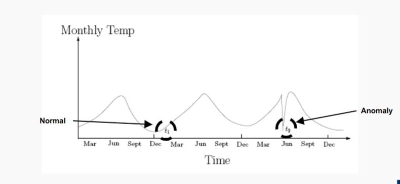
### Collective Anomaly
- A **subset** of data objects that **collectively deviate** significantly from
    the whole data set, even if the individual data objects may not be
    anomalies
    - Detection -> consider a group of objects
    - Requires relationship among data instances
      - sequential
      - spatial
      - graph
    

## Anomaly Detection Paradigms
### Supervised anomaly detection
  - Labels are available for both normal data and anomalies
  - Samples examined by domain experts used for training & testing
- Challenges
  - Require labels from both the normal and anomaly classes
  - Imbalanced classes, i.e., anomalies, are rare.
    -    Boost the anomaly class and make up some artificial
        anomalies
  - Cannot detect unknown and emerging anomalies
  - Accuracy is misleading. We try to catch as many outliers as
  possible, i.e., increase the recall
    - Optimising for recall can lead to a high rate of false
    positives - normal cases detected as anomalies.

### Semi-Supervised Anomaly Detection
  - Labels are available only for normal data
  - We used only the labelled data to train a classifier (the model
    learns what ‘normal’ looks like)
  - We apply the trained model to both unlabelled and labelled data
  - Any instance that falls outside the learned decision boundary is
    marked as a potential anomaly
- Challenges
  - Require labels from the normal class
  - Possible high false alarm rate - previously unseen (yet
  legitimate) data records may be recognised as anomalies

## Unsupervised anomaly detection
- Assume the normal objects are somewhat "clustered" into multiple
groups, each having some distinct features
- An outlier is expected to be far away from any groups of normal
objects
- General steps
  - Build a profile of “normal” behaviour
  - Summary statistics for the overall population
  - Model of multivariate data distribution
  - Use the “normal” profile to detect anomalies
  - Anomalies are observations whose characteristics
  differ significantly from the normal profile
-  Challenges
   - Normal objects may not share any strong patterns, but the
   collective outliers may share high similarity in a small area
   Ex. In intrusion detection, normal activities are diverse
   - Unsupervised methods may have a high false positive rate but
   still miss many real outliers
- Approaches
  -  Statistical (model-based)
     - Assume that normal data follow some statistical model
  - Proximity-based
    - An object is an outlier if the nearest neighbours of the
  object are far away
  - Density-based
    - Outliers are objects in regions of low density
  - Clustering-based
    - Normal data belong to large and dense clusters

### Statistical (model-based) -> quick reference (p<0.05)
Anomalies are objects that are poorly fit by a statistical model.
- Idea: learn a model fitting the given data set, and then identify the
objects in low probability regions of the model as anomalies
- Assumption: Normal data is generated by a parametric
distribution with parameter θ
  - The probability density function of the parametric distribution
  f(x, θ) gives the probability that object x is generated by the
  distribution
  - The smaller this value, the more likely x is an outlier
- Challenges of Statistical Testing:
  - highly depends on whether the assumption of the statistical
  model holds in the real data

#### multivariate normal distribution
- data points have multiple features that are
normally distributed and potentially correlated
- mean $\mu$ and covariance matrix $\sum$
- use Mahalanobis Distance (MD) to measure the distribution of
the sample instances.
  - how far a point is from the **mean**
    $$
    D_M(x) = \sqrt{(x - \mu)^T \Sigma^{-1} (x - \mu)}
    $$
  - large MD indicates potential outlier
- Use Grubbs’ Test on the Distances to detect a single
univariate outlier
    $$
    G = \frac{\max |x_i - \mu|}{\sigma}
    $$

- Mahalanobis Distance is primarily useful for detecting **global**
anomalies, and is less effective for identifying **local**,
**contextual**, or **collective** anomalies.

#### Pros and Cons
- Pros
  - Statistical tests are well-understood and well-validated.
  - Quantitative measure of the degree to which an object is an
  outlier.
- Cons
  - Data may be hard to model parametrically.
    - Multiple modes
    - Variable density
  - In high dimensions, data may be insufficient to estimate the
  true distribution.

### Proximity-based
- An object is an outlier if the nearest neighbours of the
    object are far away
    - An object is an anomaly if the nearest neighbours of the object
    are far away, i.e., the proximity of the object significantly
    deviates from the proximity of most of the other objects in the
    same data set
    - Common approach:
    - The outlier score is the distance to the k-th nearest
    neighbour.
    - Score sensitive to the choice of k

#### Pros and Cons
- Pros
  - Easier to define a proximity measure for a dataset than to
  determine its statistical distribution.
  - Quantitative measure of the degree to which an object is an
  outlier.
  - Deals naturally with multiple modes.
- Cons
  - O($n^2$ ) complexity.
  - Score sensitive to choice of k.
  - Does not work well if the data has widely variable density.

### Density-based
- Outliers are objects in regions of low density

- How it works
  - The outlier score increases as the density
  around a point decreases.
- Example Density scores:
  - Count the points within a fixed radius d
  - Inverse of average distance to k nearest neighbours:
    $$
    \text{density}(\mathbf{x}, k) = \left( \frac{1}{k} \sum_{\mathbf{y} \in N(\mathbf{x}, k)} \text{distance}(\mathbf{x}, \mathbf{y}) \right)^{-1}
    $$

- Limitation
  - Tend to work **poorly** if the data has **variable density**, as they
  use **absolute density** and cannot adapt to local variations
  
#### Local Density-based outlier detection
- Key Idea:
  - Identifies outliers by comparing local density to
  that of nearby points.
- How it works
  - Calculates the relative density of a point compared
  to the average density of its k-nearest neighbours.
  - A point is considered an outlier if it is in a significantly lower-
  density area than its neighbours, even if that area is not low-
  density globally.
- LOF scores = 
   $$
  \text{relative density}(\mathbf{x}, k) = \left( \frac{\text{density}(\mathbf{x}, k)}{\frac{1}{k} \sum_{\mathbf{y} \in N(\mathbf{x}, k)} \text{density}(\mathbf{y}, k)} \right)^{-1}
  $$

#### Pros and Cons
- Pros
    - Quantitative measure of the degree to which an object is an
    outlier.
    - It can work well even if the data has variable density.
- Cons
    - O(n2 ) complexity
    - Must choose parameters
    - k for nearest neighbours
    - d for distance threshold

### Clustering-based
- Normal data belong to large and dense clusters
Unsupervised Anomaly Detection: Approaches

- Approaches:
    - Assess the degree to which an object belongs to any cluster.
- Issue:
    - Outliers may affect the initial formation of clusters.
- CBLOF Procedure

1. **Cluster the data**:  
   Apply a clustering algorithm (e.g., k-means) based on a similarity metric (e.g., Euclidean Distance).

2. **Label clusters as large or small**:  
   Sort clusters by size. Use parameters:  
   - **α**: cumulative size threshold (e.g., 90% of points)  
   - **β**: minimum size ratio (e.g., 5×)

   To identify:
   - **Large clusters (LC)**: contain most of the data  
   - **Small clusters (SC)**: contain few points (potential anomalies)

3. **Compute CBOF for each point** $t$:

   $$
   \text{CBOF}(t) =
   \begin{cases}
   |C_i| \cdot \text{distance}(t, C_i) & \text{if } C_i \in LC \\
   |C_i| \cdot \min\limits_{C_i \in LC} \text{distance}(t, C_i) & \text{if } C_i \in SC
   \end{cases}
   $$

4. **High CBLOF score → High anomaly likelihood**

   - Points from **small, isolated clusters** or **distant points in large clusters** are flagged as potential anomalies.

Cluster-based anomaly detection uses the **structure of clusters** to
detect anomalies.
A common two-phase approach includes:
- Point-Level Filtering:
    - Iteratively remove points that significantly reduce clustering
    quality — these are treated as individual anomalies.
- Cluster-Level Filtering:
  - Discard small clusters that are far from others — these likely
  represent group anomalies.
- For the example above
  - cluster 2 and (525.2), (564.1) are obvious anomaly
#### Pros and Cons
- Pros:
  - Some clustering techniques have O(n) complexity.
  - Extends the concept of outlier from single objects to
  groups of objects.
- Cons:
  - Requires thresholds for large and small clusters.
  - Sensitive to the number of clusters chosen.
  - Outliers may affect the initial formation of clusters.

## Summary Question
- Anomalies – what are they and why are they important?
- Supervised, semi-supervised, or unsupervised anomaly detection
- Statistical, proximity, density and clustering-based anomaly
detection
---
<!-- pagebreak -->
# Ethics and Bias

## Human are Biased
- **Out-group homogeneity** bias (Stereotypes/Prejudice)
  - Humans tend to perceive out-group members as less nuanced than in-group
  members
- Correlation Fallacy
    - Humans have a tendency to mistake correlation (two co-incidentally
co-occurring events) with causation.

## Data is Biased
- Historical Bias
  - A randomly sampled data set, reflects the world as it was
    including existing biases which should not be carried forward
- Representation bias / Reporting bias
  - The data sets do not faithfully represent the whole population
  - Minority groups are underrepresented
  - Obvious facts are underrepresented. Anomalies are overemphasized
- Measurement bias
  1. Noisy measurement → errors or missing data points which are not
  randomly distributed
     - e.g., records of police arrests differ in level of detail across postcode
  areas
  1. Mistaking a (noisy) proxy for a label of interest
     - e.g., ‘hiring decision’ as a proxy for ‘applicant quality’.
  2. Oversimplification of the quantity of interest
     - e.g., classifying political leaning into: ‘Democrat’ vs. ‘Republican’
  (USA)

## Model is Biased
- Model Fit
  - Weak models: high bias – low variance
  - Unjustified model assumptions
- Biased Loss Function
  - Blind to certain types of errors
  - E.g., 0/1 loss will tend to tolerate errors in the minority class for highly
  imbalanced data

## Evaluation bias
- Test set not representative of target population
- Overfit to a test set. Widely used benchmark data sets can reinforce the
problem.
- Evaluation metrics may not capture all quantities of interest (disregard
minority groups or average effects). E.g.,
  - Accuracy
  - Face recognition models largely trained/evaluated on images of
  ethnically white people

## Deployment bias
- Use of systems in ways they were not intended to use. Lack
of education of end-users.

## Machine Learning Pipeline

### Measure 
- Define your variables of interests
- Define your target variable
- Especially critical, if target variable is not measured explicitly.
E.g., hiring decision→applicant quality or income→creditworthiness
### Learn
- We learn models from data
- Data contains “knowledge” (smoking causes cancer)
- Data contains “Stereotypes” (boys like blue, girls like pink)
- What’s the difference? Based on social norms, no clear line!
### Action
- ML concept: regression, classification, information retrieval, ...
- Resulting action: Class prediction (Spam, credit granted), search results,
hotel recommendation, ...
### Feedback
- Approximated from user behavior
- Ex: click-rates

## Quantifying bias
- X non-sensitive features
- A sensitive attributes with discrete labels (male/female, old/young, ...)
- Y true labels
- $\hat{y}$ predicted labels
- Very often instances have a mix of useful, uncontroversial attributes, and
sensitive attributes based on which we do not want to make classification
decisions.
Different attributes lead to different demographic groups of the population
It is rarely clear which attributes are sensitive and which are not. Choice can
have profound impact

## Fairness 
- Approach
    - Hide all sensitive features from the classifier. Only train on X and
remove A
    $$
    P(\hat{Y}_n \mid X_n, A_n) \approx P(\hat{Y}_n \mid X_n)
    $$
## Formal Fairness Criteria
- [Quick recap of metrics](Evaluation.md#evaluation-metrics)

|         | $\hat{y} = 1$       | $\hat{y} = 0$       |
| ------- | ------------------- | ------------------- |
| $y = 1$ | true positive (TP)  | false negative (FN) |
| $y = 0$ | false positive (FP) | true negative (TN)  |

### **Positive Predictive Value (PPV)** (also: precision):

$$
\text{PPV} = \frac{TP}{TP + FP}
$$

### **True Positive Rate (TPR)** (also: Recall):

$$
\text{TPR} = \frac{TP}{TP + FN}
$$

### **False Negative Rate (FNR)**:

$$
\text{FNR} = \frac{FN}{TP + FN} = 1 - \text{TPR}
$$

### Fairness Criteria

-  Fairness Criterion I: Group Fairness (Demographic Parity)

    - **Definition**: Prediction \( \hat{Y} \) is statistically independent of the sensitive attribute \( A \).
    - **Formula**:  
    $$
    P(\hat{Y} = 1 \mid A = m) = P(\hat{Y} = 1 \mid A = h)
    $$
    - **Goal**: Equal chance for positive prediction across all groups.
    - **Limitation**: Ignores ground truth \( Y \); can reward classifiers that produce more false positives for minority groups.

---

-  Fairness Criterion II: Predictive Parity

  - **Definition**: Positive predictive value (PPV) should be the same across groups.
  - **Formula**:  
    $$
    P(Y = 1 \mid \hat{Y} = 1, A = m) = P(Y = 1 \mid \hat{Y} = 1, A = h)
    $$
  - **Goal**: When the classifier says "yes", it should be equally likely to be correct for any group.
  - **Limitation**: If ground truth is biased, this measure may reinforce that bias.

---

-  Fairness Criterion III: Equal Opportunity

  - **Definition**: Equal true positive rate (TPR) across groups.
  - **Formula**:  
    $$
    P(\hat{Y} = 1 \mid Y = 1, A = m) = P(\hat{Y} = 1 \mid Y = 1, A = h)
    $$
  - **Goal**: Individuals who deserve positive predictions should have equal opportunity regardless of group.
  - **Limitation**: Still depends on the fairness of ground truth labels.

---

-  Fairness Criterion IV: Individual Fairness

    - **Definition**: Similar individuals should be treated similarly.
    - **Formula**:  
    $$
    \text{If } \text{sim}(x_i, x_j) > \theta,\ \text{then } P(\hat{Y}_i = 1) \approx P(\hat{Y}_j = 1)
    $$
    - **Goal**: Focuses on fair treatment at the individual level.
    - **Challenges**:  
    - How to define a good similarity metric  
    - Choosing an appropriate threshold \( \theta \)

- No fair free lunch!
    - Our “Fair” predictions were different under the different fairness criteria
    - It is difficult (and in some cases provably impossible) to satisfy them all
    - Often, there is also a trade-off between fairness and overall performance

### Creating Fairer Classifiers

#### preprocess
- Balancing the data set
    - Up-sample the minority group (martians)
    - Down-sample the majority group (humans)
- Re-weighting data instances

  - Expected distribution (if \( A $\perp$ Y \)):

$$
P_{\text{exp}}(A = a, Y = 1) = P(A = a) \times P(Y = 1) = \frac{\#(A = a)}{|D|} \times \frac{\#(Y = 1)}{|D|}
$$

  - Observed distribution:

$$
P_{\text{obs}}(A = a, Y = 1) = \frac{\#(Y = 1, A = a)}{|D|}
$$

  - Weigh each instance by:

$$
W(X_i = \{x_i, a_i, y_i\}) = \frac{P_{\text{exp}}(A = a_i, Y = y_i)}{P_{\text{obs}}(A = a_i, Y = y_i)}
$$

#### Model training/optimization

- Fairness criteria can be used during model training.

- For example, let \( \mathcal{L}(\theta) \) be the loss function of logistic regression.
- Without fairness:
- We solve the basic optimization:
    minimize  
    $$\mathcal{L}(\theta)$$
- Assume we want to enforce group fairness (demographic parity).
Then we solve this optimization problem:
$$\mathcal{L}(\theta)$$
subject to 
$$P(\hat{Y} = 1 \mid A = m) = P(\hat{Y} = 1 \mid A = h)$$

- Pros
  - Fairness is directly added to the training procedure
- Cons
  - The optimization problem becomes more complex

#### Postprocessing
- Modify the classifier predictions (labels $\hat{y}$)
  - E.g., decide on threshold $\theta$ to change PPV, TPR, FNR:
  $$
  \hat{y}_i = 
  \begin{cases}
  1 & \text{if } \mathbf{w} \cdot \mathbf{x}_i > \theta \\
  0 & \text{if } \mathbf{w} \cdot \mathbf{x}_i \leq \theta
  \end{cases}
  $$
- Pros
    - Model-independent
    - Even works with proprietary / black-box models

- Cons
    - Needs access to protected attribute at test time

---
Hooray!! End of Subject 
